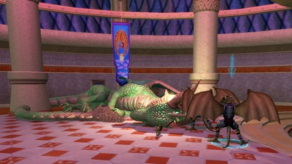

Back to: [West Karana](/posts/westkarana.md) > [2012](/posts/2012/westkarana.md) > [November](./westkarana.md)
# EQ2: Mercenary Life

*Posted by Tipa on 2012-11-12 08:07:09*

[caption id="attachment\_10417" align="aligncenter" width="480"] Me + Merc = Dead Dragon[/caption]

I've been dancing around the whole EverQuest 2 mercenary thing for awhile. I was killing things solo fine -- MORE than fine -- and the thought of hiring an NPC to take half the dropped coin and half the experience for something I could do myself... wasn't a fan. Not at all.

I was working on completing the deity quest line for Mithanial Marr, though, and the game wanted me to go into the Estate of Unrest, a challenging zone for level 70 groups, and kill a named. I'd already peeked into some Bonemire dungeons, and things had not gone well for me, solo.

The opinions on the general chat (level 1-9 chat on Antonia Bayle server) was to go with a shadowknight mercenary, that being the best according to scuttlebutt. They didn't have any of those in Qeynos. I snuck into Freeport, but they had none there, either. EQ2i said Neriak would have one, but the bright red aggro mobs just inside zone in prevented me from getting there. I returned to Freeport and got an Inquisitor mercenary, a ratonga.

[caption id="attachment\_10418" align="aligncenter" width="480"] My ratonga inquisitor mercenary[/caption]

We went to Unrest and it was easy. I headed to Barren Skies and finished my Hooloh hat. Easy. Did Vaults, Sanctum of the Scaleborn and Hall of Fate to advance my two weapon quests, Fabled Wurmslayer and Qeynos Claymore.

Working on my crafting now so I can do the next couple steps on the Wurmslayer. Next weekend I'll head back into the Sanctum and finish up those steps of the Claymore and get the next part for the Wurmslayer.

Both these weapons end in raids -- Deathtoll for the Claymore and the Labs for the Wurmslayer. I can't do those alone, obviously, but I've been offered help and will gratefully accept it, but I have to do all the preceding steps first. There's a couple more Halls of Fate runs in my future.

[caption id="attachment\_10419" align="aligncenter" width="480"] Dead Emperor Crush[/caption]

Best thing about having a healer/DPS mercenary who has all the best spells at the best levels is trying to keep him alive. He's actually really resilient and hasn't died yet, but if I accidentally overpull, sometimes he'll lose his nerve and start cringing and stop healing/curing/killing. I finally get to use my taunts and rescues, giving me valuable experience in being a main tank should I ever group. I'd LIKE to group, but I'd also like to be more valuable than a mercenary if I do.

Also, a bit of luck, I was on my previous main, Tipa the Troubadour, trying to figure out what she used to sell on the broker, and noticed all her attuned items had been de-attuned and unequipped. All through her bank, too.

Her chain armor wouldn't be much use to a plate-wearing berserker, but her weapons... she has raid weapons from Kingdom of Sky and Kunark, including some nice drops from Veeshan's Peak. Those which ended up with good fighter stats in the Great Stat Balancing, I passed on to Scatter. She is now wielding two awesome daggers, one of which is the poisonous fang of Lord Vyemm himself.

The stat balancing, by the way, decreased the number of stats important for each class from two to one -- all melee used to have to raise both strength and agility, now fighters only use strength and scouts only use agility. Intelligence used to tie to spell damage for troubadours, now it's just agility. Similar to what WoW did a few years back with spell power and healing power.

So things are simpler.

I'm adventuring in Kunark, when I'm not working on KoS quest lines. I can kill everything, so far, solo easily enough, but sometimes I summon my mercenary just to speed things along. I have to admit that I am really looking forward to heading into Karnor's Castle. I always did like that place, both in EQ1 and EQ2. It was pretty easy to get a group in KC in EQ1, but EQ2 made the drolvarg SO much more dangerous that most people got their quests done and got out of there. I'd like to see if that's changed.

73 Berserker, 28 Carpenter. I need to get to level 50 in a trade skill to scribe and craft the Oak-Shafted Wurmslayer. Leveling is going quickly, and I think there's a good chance I'll be level 80 before I get to the final outdoor zone in Kunark, the Kunzar Jungle, and the final open dungeon, Sebilis. There's a place with a lot of memories from EQ1. I've been through there in EQ2 before, of course, and it's not really that exciting, but we'll see. There were lots of quests I never finished because it was hard to get groups. And the best thing: I'll still get XP for them, since the level cap as of tomorrow is 95.

I have 148 AAs out of 300-something. General chat advises people to slow down leveling and put more toward AA, but I am happy with my AA progression. I know I will need to fill out the last row in the TSO AAs before I can queue for the instanced dungeons, but there may not be a need to do that just yet. It's pretty clear that Velious armor is the stuff to get, for now.

## Comments!

**[bhagpuss](http://bhagpuss.blogspot.co.uk/)** writes: Good old Stamper Jeralf! He was the very first mercenary I hired all the way back in the AoD beta. Several of my characters have used him since because he's just a great character, but he's more than a little of a loose cannon. In the end I let him go and replaced him with a much steadier Defiler from Gorowyn, good old Blurt Grasplung, who I highly recommend.

---

**[An EverQuest II Chains of Eternity First Impression &laquo; The Ancient Gaming Noob](http://tagn.wordpress.com/2012/11/20/an-everquest-ii-chains-of-eternity-first-impression/)** writes: [...] EverQuest.  I probably wouldn’t have considered one, except that I have been reading about Tipa’s adventures with her merc in EQII and decided to give it a [...]

---

