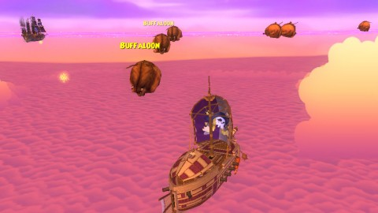
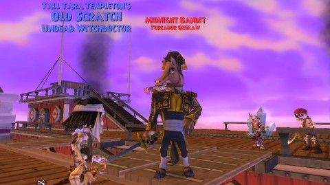

Back to: [West Karana](/posts/westkarana.md) > [2012](/posts/2012/westkarana.md) > [November](./westkarana.md)
# Pirate101: Buffaloon Hiding

*Posted by Tipa on 2012-11-15 07:44:05*

[caption id="attachment\_10423" align="aligncenter" width="480"] Do any of these wild buffaloons have skins?[/caption]

Every MMO has points where they actively appear to be driving players away. Pirate101 had the buffaloon scandal. Buffaloons are hybrid buffalo/balloon creatures who float peacefully about just off the skyways in Cool Ranch. Their hides are used for all sorts of useful items, but the roosters, chickens and toads of Cool Ranch have a problem: They are entirely unable to hunt buffaloons for themselves, and are entirely dependent upon player pirates to fill their workshops with raw materials.

It soon became clear WHY the natives had given up the hunt: they had other things to do with their lives, and players will do ANYTHING.

Up to a point. After two nights of several hours each play, only getting two hides of the eight I needed, and hearing from other players that this grind would pale compared to a future hunt for WHITE buffaloon hides, I figured there were other ways of spending an evening and just quietly stopped playing.

[caption id="attachment\_10424" align="aligncenter" width="480"] OMG! Buffaloons put some skin in the game![/caption]

Then I heard that the drop rate had been looked at and fixed, both for normal hides and the white hides, so after a quick D3 Whimsyshire run and a couple crafting levels on EQ2, I loaded of P101 and went brutal on buffaloon. After four fights, I got the remaining six hides I needed and was able to continue on. I got the mercury from the nearby Red Sash ships as well in short order.

I \_get\_ grinds, I know why MMOs have them. As long as I can see progress to a goal, I don't mind so much. It's when progress stalls for a long period of time that I start getting antsy. I don't like feeling that my time is being wasted. I don't know if the drop rate was a bug, or what. I'd gotten the first two hides in the first two fights, and then nothing at all for easily a dozen battles. I'd moved on and done other quests, sure, but when I'd come back -- nothing. Kinda demoralizing. Talking with friends in game just showed this was a problem that happened to everyone, though it seemed I had particularly bad luck with the drops.

Anyway, fixed now. Yay!

[caption id="attachment\_10425" align="aligncenter" width="480"] Midnight Bandit[/caption]

So anyway, I had to track done and slaughter the Midnight Bandit. Well, the game said I'd brought him into custody, but all my melee were slicing and dicing him while my witchdoctor loaded him down with deadly curses... This isn't the kind of stuff you \_survive\_.

I felt no guilt, because this guy was a \_matador\_. Which means he cruelly kills bulls for public spectacle. Bulls, in both Wizard101 and Pirate101, are sentient citizens of MooShu. I took out a deadly assassin, and I refuse to apologize for this public service. My character grew up in MooShu, after all. She loves the cattle people.

Pirate level 21, nautical level 16.

