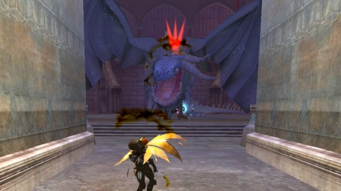
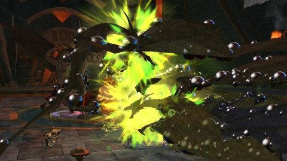
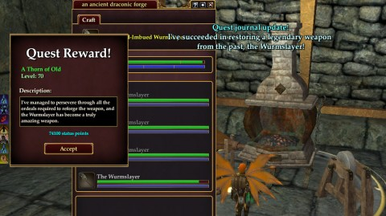
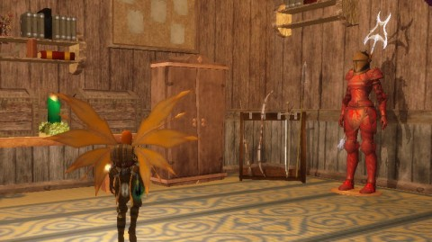
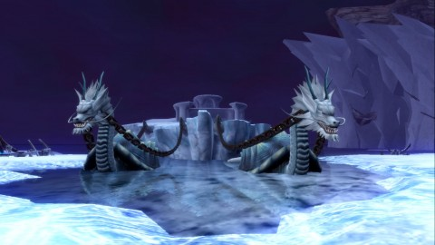

Back to: [West Karana](/posts/westkarana.md) > [2012](/posts/2012/westkarana.md) > [November](./westkarana.md)
# EQ2: Wurmslayered!

*Posted by Tipa on 2012-11-19 20:27:37*

Take that, dragons!

Problem with the epic weapon quests, the old ones from previous expansions, is that try as you might, you're not gonna use that thing. Scatterfall was in her early sixties when I started it, crafting level 10. The adventuring level would be fine, if I were doing all this in a group. You're kinda meant to do this quest, along with the Qeynos Claymore and others, while grouping up in the Kingdom of Sky. These quests all end at the final KoS raids, a much-anticipated cap to ten levels of work -- KoS was the expansion that raised the level cap from 60 to 70.

Instead, it was just me (and later, me and a mercenary) running around and doing tasks, all the time slowly gaining levels. Sanctum of the Scaleborn slowly went from yellow to white to blue to green and finally, today, gray to me, as I worked on the steps. Halls of Fate, I visited many times. I spent nights at the woodworking table raising my tradeskill level to 65. How did people ever grind tradeskill levels without guild harvesters? (Answer: lots of harvesting, lots of buying of stacks of components on the broker. Did you know, being a harvester could bring in good money once upon?)

Leveled tailoring and jewelcrafting the hard way back in the day...

[caption id="" align="aligncenter" width="480"]Way WAY back in the day...[/caption]

This wasn't the first time I'd done the Wurmslayer quest. I did it WAY back in the day for my halfling warrior on the original EverQuest, where the two knights who started the quest in the Kingdom of Sky also started it outside the Outpost of Firiona Vie in Kunark. It wasn't an epic quest back then. The final weapon was so darned heavy, though, that you'd grow exhausted using it for long (weapon weight and endurance are two of the many things that didn't make it to EQ2 in order to make the game ~~easier~~ more accessible).

Nina, who was a twink, I fully admit, looks wonderful in the crafted warrior armor I quested for on my then-main druid, Etha. I bought that Short Sword of the Ykesha for about 1,200 gold from a guildmate because druids couldn't get groups to camp it in Lower Guk. Truth be told, druids (back then, 2001-ish) didn't get many groups for much of anything, which was instrumental in me switching mains to Nina and then, shortly after a disastrous Fear raid I led, to Tipa the Rogue. And it's been smiles and sunshine since then. Except that time when I restarted as a cleric on a new server...........

Distracted!

[caption id="attachment\_10431" align="aligncenter" width="480"] The Krewe[/caption]

I'd done all the parts I could do alone -- got my crafting squared away, made all the preliminary less-uber Wurmslayers, got the blood of the Halls of Fate dragon, Sothis -- and that's where it would have stayed if not for the help of [Stargrace](http://mmoquests.com/) and her friend ~~Icantthinkofanameformycharacter~~ Ibeogur. I kid, he was wonderful, and as a fellow beserker, an inspiration! I couldn't help notice he was \_not\_ wielding a Wurmslayer. Sigh. Neither would I at his level. Neither would I at \_my\_ level. The Great Unattuning of 20-- had allowed me to take Tipa/Dina's KoS weapons, an instant upgrade that put me far ahead of the Wurmslayer. Notwithstanding that it was a weapon meant for level 70s, and I was 77. 78 by the end of the raids.

I dinged both level 14 and level 78 in the Laboratory of Lord Vyemm and man, how long has that been? I was in the family-style raiding guild Revolution back then, which had the common problem faced by all family-style raiding guilds in that people leave for hardcore raiding guilds because progression is too slow.

Anyway, the picture above gives credit where credit is due. Blesse is Stargrace's priest, Ibeogur is the friendly giant, my character, Scatterfall, is next to the sokokar I had out trying to figure out why I can't get any of the sokokar posts in Jarsath Wastes to work for me and forgot to dismiss. Krivix Honorclaw is the Chains of Eternity Collector's Edition paladin mercenary who I was told didn't need to come, but I summoned him anyway, and for the rest of the raid, tried to figure out follow/protect/assist settings that wouldn't leave him battling the boss that Ibeogur was trying to pull. Nobody said anything, but I felt pretty embarrassed by him. Not embarrassed enough to suspend him. Almost.

[caption id="attachment\_10432" align="aligncenter" width="480"] Lord Vyemm[/caption]

First dragon was Lord Vyemm; he and his aide come as a pair. There was some trick to pulling these guys; I remember, back in Revolution, that even when the rest of the raid was a cakewalk, we could still wipe on the Vyemm pull. I helpfully sent Krivix out to solo Vyemm when Ibeogur was out pulling. Well, I didn't send him on purpose, but he went scampering away, anyway, so I told him to come home and soon, Ib. brought the mobs home.

This, btw, is the kind of sloppy behavior that would have gotten me kicked out of Clan of Shadows on raids, if they hadn't already voted me out because too many troubs. But I can just imagine the loud yelling in the Torrent Knight's voice chat over all this. I BARELY remember this raid!

Anyway, I pelted Vyemm with papercuts while Krivix did his more useful DPS and Ibe and Blesse did the actual killing and soon came away with a vial of dragon blood and Vyemm's head in a box. Not sure what to do with that. Torrent Knights has one, if I remember right, and so does my current guild, Lunar Wolves. I can't set it up at home, guild hall only. Can't sell it on the broker. I can give it away, but who'd want a trophy for a dragon they didn't kill? I left it in the bank, for now. Bankers are probably going "sniff... sniff... WHAT the FRAK is that SMELL????"

Other loot was the Warrior class helmet and a non-set BP upgrade and a ring. So actually a pretty good haul. LOTS of Bard stuff dropped. Where were you when I was raiding? Though I actually got most of the Nightchord stuff before we stopped Labs runs. Got a couple Relic armor drops for the quest armors, but I didn't win any of the plate. Not sure there was any. Didn't paying huge attention to the loot until I got home and could look it over.

[caption id="attachment\_10433" align="aligncenter" width="480"] Harla Dar[/caption]

We didn't kill Harla Dar much in Revolution. We'd farm her instance for stuff, like the Ring of Reykjavik (not its real name; ring of something-long-that-begins-with-"R"). Every fighter wanted that ring, so we'd go back again and again, I get it on my first (and only) try with this character. Two ring upgrades. Two ring slots. Win. Anyway, sometimes we'd kill her, sometimes no, more often after they made her guarantee to drop a master spell for a class that was actually on the raid. I don't remember if that still holds true today. I can attest that no berserker masters dropped, and 2/3rds of the PCs in the group were berserkers.

My ding in the Labs turned much of the Temple of Scale gray (as everyone was mentored to me, I indirectly controlled the group level). As usual, Krivix would helpfully taunt mobs off of Ibeogur and leave them out of pull. Yeah, this is me, the zerk who absolutely has no idea how to play in a group.

I've grouped before; back in the forties or maybe low fifties, I organized a group for the Steamfont instances. I thought I was leading the group, but everyone there was on Alt #one meeeeelion (as was I, of course). Mines of Meldrath went easily enough, but the Clockwork King instance kept killing people because they did not understand about getting up to the top of the entrance and turning off the nonstop killer robots before everyone died.

It's not that tough to understand, is it? People so shocked that their twinks could take damage. Of course, these days with mercenaries, could probably get them to do the whole instance themselves by remote control.

But that was the past. This is the future now, the future of me being such a soloer that I didn't even realize people were trying to talk to me in group chat. The box wasn't selected in my chat window. Tells and guild chat were. Group, nope, because, who groups? I hear people in level chat in a panic because they're in an instance that requires a character of every archetype (fighter, priest, scout, mage) and they CAN'T PROCEED!

[caption id="attachment\_10434" align="aligncenter" width="480"] Wurmslayer crafted![/caption]

So, with Harla Dar dead and the last vial of blood soaked from her scaly hide, it was only left to profusely thank Blesse and Ibeogur for their much-appreciated help, and hunt down the quest giver for the last recipe book, the one that would finish the transformation of the Wurmslayer from a forgotten, rusted weapon centuries old, to a new, shiny weapon of draconic devastation.

Back down Sanctum of the Scaleborn one last time, until I feel like finishing the Qeynos Claymore. I'd been stalled until I learned Draconic, a really boring quest only made tolerable because once you've done it on another character, you can skip the tedious searching throughout Norrath for runes. After which the Sage of Stupid has enough understanding of the language in order to teach it to me.

Remember, this is a world where lots of inhabitants speak Draconic; like all the Droags, for instance. Not to mention all the dragons. But Sage here can't teach it to me unless I find 26 runes, one for each letter of the English alphabet because WHY? That makes no sense!

I studied Japanese in college, and I couldn't figure out why Japanese had seven-day weeks, and more confusingly, why many of the day names were the same as their English counterparts. MONTHS -- months are universal. Everybody can understand a lunar calendar. Days are equally obvious. Weeks are arbitrary divisions and have nothing to do with the length of a month or the length of a year. 7 doesn't go evenly into 365. But here we have seven day weeks, and Sunday is nichiyoubi -- literally, sun day -- and Monday is getsuyoubi -- "moon" day. Moon in quotes because it comes from the Chinese word for the Moon -- the Japanese version is "tsuki". Japanese is a great borrower of words. But China uses the lunar calendar! CONFUSING! I can only imagine Japan borrowed the Western calendar along with the wholesale embracing of Western culture during the Meiji Reformation, which also brought the end of the era of the samurai and the birth of the plots to a hundred samurai movies.

Anyway, it makes as much sense for Draconic to use an English alphabet as it would be for Japanese to use an English alphabet (but they have fifty kana, not twenty-six, and there are variations for many of them).

Oh right. Finished that quest. Learned Draconic. Next step is a timed wall-climbing session in the depths of SoS that I didn't want to do until SoS was gray to me because it's annoying to fight all these trash mobs for little xp and worthless loot. Now that it's gray, I suppose I could continue with it. It ends with a long raid through Deathtoll, the ultimate Kingdom of Sky raid. It took us in Revolution a long time to master that raid. I'd entirely given up on the Claymore quest on Dina/Tipa (changed names from Dina to Tipa when I moved to Antonia Bayle from Befallen server) by the time we were doing Deathtoll, and there wasn't much there I wanted except lower repair bills.

Time for another picture.

[caption id="attachment\_10435" align="aligncenter" width="480"] Wurmslayer at home[/caption]

It's really sad that, after all that work, I won't be using the Wurmslayer. Well, I'll find a use for it. EverQuest 2 lets you swap weapon appearances at will, so my Wurmslayer will be the visible appearance for whatever weapon I'm holding in my main hand. Not as cool running around as back in EQ1 where your weapons were in your hands at all times for everyone to see all the time. 

Sample conversation:

"Hi, I am Generic Aleseller, how can I help you?"

"Hi! I'm thirsty, and in my left hand is my Wicked Bartenderslicer, and in my right hand is my Scimitar of Server Slicing."

"I... I can see that. Right away sir! Madam! Whatever! OMG WHY ARE THEY GLOWING DEAR GOD MAKE THEM STOP!"

I also stuck the Wurmslayer on the back of my armor dummy. I didn't make that, but I made nearly everything else in that picture. I could have chosen to raise any trade skill to sixty five for the quest. I chose Carpentry because I wanted to make my home beautiful. I had to go get a larger home so I could decorate. Plus I still have all the stuff from when Stargrace decorated Dina/Tipa's Gorowyn home, and all the stuff I was using to do EQ2 comics.

I'll probably need an even BIGGER home. I have the Mistmoore Crag Estates veteran reward, but that place is too large and too much of a design influence. Maybe I'll shell out for the island, build my own castle, Minecraft-like.

So: Wurmslayer. Obtained. Level 78. I keep treating level 80 like it's some kind of limit -- it's where my troubadour and inquisitor are, but it's not. I think I'm supposed to go to Velious at 80? I've already skipped most of Kunark. I skipped the Highton part of Kylong Plains, all but the first part of Fens of Nathsar, and all of Kunzar Jungle, because working on the Wurmslayer and Claymore and Hoo'loh hat and all those necessary dungeon runs has powered me through the 70s. I might find myself leveling out of Jarsath Wastes before I even start on Skyfire, and I'm not even bothering to work on the Worker's Sledgehammer with this character because why?

Anyway, EQ2i helpfully suggests Moors of Ykesha and Sundered Frontier prior to attempting Velious, which is good, because I went to Velious (included with the CoE expansion) and everything was really red there.

[caption id="attachment\_10436" align="aligncenter" width="480"] Invasion of the Order of the Rime[/caption]

Reason I went to Velious at all was because I was exploring the edges of the Field of Bone and suddenly this cut-scene started, with a barge pulled by twin dragon turtles invading Kunark, something I didn't remember from EQ1. It was the Order of Rime, a group of troublemakers that feature in quite a few Fens quests, and I wondered if this meant I should head to Velious.

Short answer: No. I did go to Thurgadin, a place where I spent many months in EverQuest 1, but things were in different places.
## Comments!

**[Cassaendra](http://cassaendra.blogspot.com/)** writes: Hi Tipa, I'm totally confused, and yet I am not. Your description reminded me of how I left in German - similar to English and yet so different (some words didn't mean what I they sounded like in English). I would mix the games up, I'd be hopelessly lost. Love this post!

---

**[bhagpuss](http://bhagpuss.blogspot.co.uk/)** writes: Brilliant post! I did eventually do the Wurmslayer quest in EQ1, like you in EQ2 far too late for it to be of any use. When I walk past the guy that starts the EQ2 version I turn my head the other way.

When playing EQ2, which I'm not at the moment but wish I was only, not enough time for too many great MMOs, I do my own gathering still. I have the pack pony and the storage bin and all that but really, why would you contract out some of the most relaxing gameplay ever invented? It'd be like employing someone to have a long, hot bath and a snooze by the fire for you! 

I read last week that far from being one of the hardest languages for an English speaker to get by on, as you'd expect, it's actually one of the easier ones because around 20% of the vocabulary is English loan-words. Sounded suspect to me but I've never attempted to learn Japanese, I just sell the books to those that do.

Don't even think of going to Velious until level 86, by the way. Not only will the mobs eat you and your merc in one bite before then but all the quests are capped to start at or above 86. The flying mount quest has both crafting and adventuring versions and it's a lot easier to get your crafting to 86 and do that one than it is to do the adventuring one at the same level.

As I'm sure you know, there is a huge choice of where to level at all ranges in EQ2. Until the very recent changes, which I have read about not experienced myself yet, so take this as untested advice, by far the fastest (and most enjoyable, in my opinion) way to level through the 80s was in Kunark dungeons, particularly Sebilis, Chardok and Chelsith. Mentored down, xp simply flooded in. Supposedly they have now changed that to deter 95s from grinding their Prestige Points there but it may still be the optimum for actual leveling.

Other than that, Moors of Ykesha is a great zone with some really amusing questlines and full crafting quests all the way to 90. Jarsath Wastes in Kunark will also see you well into the mid-80s and I personally can spend vast amounts of time in any of the Kunark zones. That's just scratching the surface, really. So many choices!

---

**[Tipa](https://chasingdings.com)** writes: @Cass -- German was the language I studied in high school. I joked back then that I should really also learn Italian, get all the Axis languages.

@Bhag -- Japanese has a lot of loan words, and not only from English. Most of them from Chinese actually. The ones they do take from English come over weird, since the Japanese kana don't correspond well to English phonemes. Similarly, it bugs me when people pronounce Japanese words like carry-okie and care-ah-tay wrong. 

Thing about Jarsath Wastes is I've done it before, so I moved to Moors of Ykesha last night for something new. I'm not really looking to level quickly; there's nobody I'm joining at max level or anything, but with the CoE AA booster awaiting me at 90, I've stopped my AAs at 174 and will just use the boost to 280 AA in twelve levels. Leveling speed won't be a problem.

I did the initial series of crafting quests, but I didn't receive any follow-ups. Maybe I need to get my crafting to 70 first? (68 now).

---

**[An EverQuest II Chains of Eternity First Impression &laquo; The Ancient Gaming Noob](http://tagn.wordpress.com/2012/11/20/an-everquest-ii-chains-of-eternity-first-impression/)** writes: [...] have considered one, except that I have been reading about Tipa’s adventures with her merc in EQII and decided to give it a [...]

---

