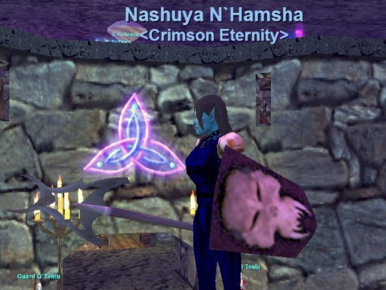

Back to: [West Karana](/posts/westkarana.md) > [2012](/posts/2012/westkarana.md) > [November](./westkarana.md)
# EQ1: Where is that Wurmslayer, 11 years later?

*Posted by Tipa on 2012-11-20 02:26:55*

[caption id="attachment\_10442" align="aligncenter" width="480"] Nashuya + Wurmslayer + Shield of Shadows[/caption]

After posting that ancient picture of my warrior, Nina, with the old EQ1 Wurmslayer, I got to wondering how it would look on her in new EQ, with the new(er) Luclin character models. Problem was EQ1 broke on me a couple years back and I uninstalled it.

So, downloaded the free to play version. Nina was still in the Plane of Justice. Now, it's been a long time, but I think she was doing the PoJ trials in a group seven or eight years ago, and I've only had her out for screen shots since. Anyway, she didn't have WS on her, so I popped out to the bank in the Plane of Tranquility (still remembering how to get through the PoJ maze ftw) and nope, wasn't there.

I did receive a magical tome that, when checked, would tell me what were the good quests for my level, and the zones where I might adventure. Unsurprisingly, the Serpent's Spine zones were top of the list. Going to Serpent's Spine is almost \_cheating\_, the xp is so good.

Camped to Tipa. She was in the Guild Lobby, one of the few zones where you can find a crowd of people still. Someone said HI! to me in /ooc. I said HI! back, but I didn't recognize the name -- probably an alt. I love my old server. Anyway, I had a wide selection of uber daggers in Tipa's bank, but no sign of Wurmslayer. It'd have been weird if she had it; it's not a rogue weapon, and she was created AFTER Nina. The line of gifting stretches the other way. I was hoping the weapon wasn't on Etha, as she's on a non-subscribed account.

Last try: my shadow knight, Nashuya. I didn't actually name her after the New Hampshire city, Nashua. The random name generator spit that one out. But of course, when it did, I had to have it, and made her last name N'Hamsha when she hit 20. Once in a blue moon, someone would "get" it, and ask me if I came from New Hampshire. I do, but was living in California at the time. It was always a great conversation starter.

Anyway, she was wielding Narandi's Lance. I'd gotten that by helping someone with the Tenth Ring quest in Velious. Always wanted that. Grabbed it for Nashuya.

Nashuya had been camped out in East Freeport. I don't know if the person who redesigned Freeport for the Prophecy of Ro expansion was just new to game design or what. Whoever it was, they took a compact city that was easy to navigate, easy to find things in, and made it a maze of impossibly dreary passages. Even a map doesn't help all that much. By then, people were already using PoK mostly for everything, but there are people who enjoy the old home cities, Rivervale, Neriak, Ak'Anon and such and prefer to use them when they can.

Nobody ever uses Freeport. For anything. I very much doubt people even do Prophecy of Ro content at all, any more. That was the last EQ expansion I bought for a very long time. If they were just going to go around ruining stuff, I didn't need to be there, urging them on with my dollars. The steam rollers moved through Misty Thicket, but stopped just short of destroying Rivervale.

Anyway. After ten minutes or so trying to get out of Freeport and having a bad encounter with a paladin at the Temple of Marr, I used the vet AA Throne of Heroes to return to the Guild Lobby, zoned out to PoK and used the Neriak Stone to return home.

Got to the bank... THERE'S the Wurmslayer!

And here it is, for you, twice in a day but eleven years later.

## Comments!

**[bhagpuss](http://bhagpuss.blogspot.co.uk/)** writes: Don't get me started on Freeport. Most of the zone revamps I can live with and I actually prefer the updated Oasis/Desert of Ro, but there's no forgiving Freeport.

---

**[Tipa](https://chasingdings.com)** writes: I think it's like a honey trap for player characters. Once you accidentally get drawn inside, every turn brings you deeper into the center; or in my case, back to East Freeport.

---

**[Egat](http://orcpawn.com)** writes: I still grind my teeth when I move through the new version of Freeport. 

Hang on to that Wurmslayer Tipa! When they changed Firiona Vie to the evil side a few years ago it broke the Wurmslayer quest. You will not be able to get a new one unless Sony either fixes the NPC or restores the zone (both unlikely).

Also, your unsubscribed account is totally accessible now with F2P, it will just have the annoying silver status limitations. It still works as a suitable bank mule account as long as you don't intend to store your platinum there.

---

**[Tipa](https://chasingdings.com)** writes: Heh :) I guess it's a bit of a collector's item now, isn't it? I imagine there's a Fabled Wurmslayer that all the kids have these days. Do they still do the Fableds every spring?

Hmmm.... I don't see a The Fabled Wurmslayer anywhere in the Kunark fabled drops...

---

**[Egat](http://orcpawn.com)** writes: They still give us a month of Fabled content every year. :)

---

