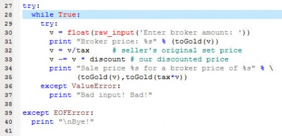
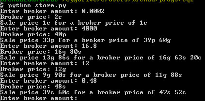

Back to: [West Karana](/posts/westkarana.md) > [2012](/posts/2012/westkarana.md) > [November](./westkarana.md)
# EQ2: Not gonna fight.

*Posted by Tipa on 2012-11-21 15:04:28*

[caption id="attachment\_10446" align="aligncenter" width="480"] Haunted Diorama[/caption]

I just got this great idea for how to fix my "Haunted Diorama", a display section of my Qeynos inn home that has a scarecrow and some spooky trees all waving back and forth, looking for a way out. I spent a good half hour last night trying to figure out how to make a wall with a window in it without using one of those custom home editors. I was making jigs to set things in the right place, then taking the jigs away, but positioning was still a bother.

I've been on vacation this week and have been spending time in a way I haven't for years -- in an MMO. Straight combat bores me. There's so much more to do in MMOs. Interior decoration is not one of my strong areas; Stargrace made me an incredible dinner theater in my troub's Gorowyn home and there was not one part of it I could have come up with.

Doing my best with this character, but the in-game editor is great for plopping stuff on the floor or a wall, less good and making new things from other things. Here's the house so far (the video is very short):

Working on stuff. I could have been any kind of crafter for the Wurmslayer; I chose carpenter because I wanted to learn to decorate. There's so much you can decorate -- you can even decorate your own dungeons.

[caption id="attachment\_10447" align="aligncenter" width="480"] Broker helper[/caption]

I'm also making money through the broker. This is something that takes a good amount of time. Everyone gets a lot of loot through normal gameplay, most of it not really worth the time to put on the broker, given you have to figure out how much it's worth and how much of a bite the broker and your display arrangements are going to take from the profit. In some cases, it makes more sense just to sell the loot to a merchant.

Nobody is going to buy your thing on the broker unless it's the cheapest, but you also don't want to undercut potential profit, so there's a very specific calculation that needs to be done. I wrote a little Python script (above) to give me what I need to set my price at in order to beat the cheapest existing price on something by a discount I set (currently 1%).

If the current prices are way out of line (like four plat for a level 72 adept), I'll just sell it at my normal max rate for such things (25 gold for a 70-79 adept) because nobody is going to buy that for 4p, and listing one for 3p 96g won't get it sold. The whole purpose is to move inventory, not to try and catch the occasional sucker.

[caption id="attachment\_10448" align="aligncenter" width="423"] A run of the script[/caption]

Between crafting, decorating, working on harvesting quests, and pricing stuff on the broker, I can go a full game session having gotten a lot done but not one monster killed.

Monster slaying has gotten significantly less interesting now that I have a merc, anyway. I'm trying to get my old Inquisitor moved from my dead account to my live one because keeping the merc alive with a healer would be a great training to get back into group play. Healing takes some skill, but tanking -- tanking well -- takes more. More than I have, anyway.

## Comments!

**[bhagpuss](http://bhagpuss.blogspot.co.uk/)** writes: For years I've just put all mundane stuff on the Broker at 3x vendor. Most of it sells and if it doesn't at least it's out of the way. 

Stuff with real value I sell at half to two thirds of the highest non-insane price. 

Back in EQ1 I took broker pricing very seriously and spent an inordinate amount of time on it, to the point that when I finally moved to EQ2 in 2004 I swore I'd never do that again, and I haven't. Mostly I only sell anything at all because I've run out of space to store it, in any game.

---

**[Tipa](https://chasingdings.com)** writes: EQ1's Bazaar was... bizarre. I understand they've recently changed it so you don't have to be online 24/7 to sell your stuff.

I make good coin on the EQ2 auction house, and with my new script, it doesn't take long to decide upon the best pricing for anything in particular. I definitely wouldn't have kept up for it if I had to price things by trial and error.

Aside from quest rewards, broker money is the only money I have coming IN...

---

**[West Karana » EQ2: Going Mobile](https://chasingdings.com/index.php/2012/11/29/eq2-going-mobile/)** writes: [...] few days ago, I blogged about a little script I wrote that helped me price things for selling from the EverQuest 2 broker. It’s been invaluable in [...]

---

