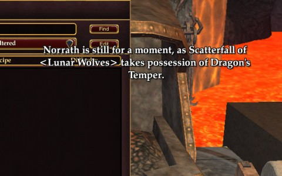

Back to: [West Karana](/posts/westkarana.md) > [2012](/posts/2012/westkarana.md) > [November](./westkarana.md)
# EQ2: Myth me?

*Posted by Tipa on 2012-11-27 07:03:35*

[caption id="attachment\_10457" align="aligncenter" width="480"] Fully myth'd[/caption]

It was a whirlwind holiday weekend. And the holiday to which I refer is Thanksgiving, NOT "Black Friday" or "Cyber Monday". Thanksgiving, a time for family to come together, which mine did, and a time to eat a lot of food, which I did. The piggery continues with leftovers to this day.

Since I obtained the Wurmslayer, I'd been working on the quest for my next weapon of note, my fabled epic weapon. The Ruins of Kunark expansion to the original EverQuest brought epic quests for powerful class-defining weapons, which received more powerful upgrades in the Omens of War expansion. Similarly, the EQ2 expansion Rise of Kunark gave two class weapon quests, a Fabled version that could be done by a single group, and a Mythical version that would need several raids to complete.

Which translates today to the Fabled version requiring a single character with a mercenary, and a couple of high level characters for the Mythical.

At level 80, I started the work on the Fabled. I was literally waiting for the mob in Skyfire for the second to last fight when a friend, Said from the old EQ Nostalgia guild, and briefly Sirhyl from the EQ2 incarnation (and now on two or three new characters) offered to help with his max leveled necromancer. I accepted, and shortly had my Fabled, which was, honestly, only a slight upgrade over the Labs dagger I was wielding.

[caption id="attachment\_10458" align="aligncenter" width="480"] Norrath was still for a moment, for me![/caption]

But, Sirhyl had a willing friend. Over the next few days, we did the Tombs of Thuuga, Veeshan's Peak and the Crypt of the Leviathan and, after a long trip to the forge deep in Solusek's Eye, had my "myth".

I owe him quite a debt.

Getting my myth had a nice side effect; my guild wondered who this mystery person was, who was raiding VP and getting mythicals and all that. My guild is super casual, but the high level people know each other in real life, I think, and are always running dungeons together. The old Kunark raids aren't something they really do. But having a tiny (literally) level 83 berserker get her myth when the guild's level 95 berserker didn't have his just wasn't right, so I was invited to come along with the high level folks back to Veeshan's Peak to show them how we did it.

[caption id="attachment\_10459" align="aligncenter" width="480"] The Freeing of Dera[/caption]

Scatterfall was still locked to her instance of VP, I couldn't go. When the guild leader asked if I had any alts, though, I admitted to having a troubadour and an inquisitor, of who much has been written on this blog. Bingo. The guild has too many troubs already (story of my life), so I unpacked Dera from her mothballed inn room and got her guilded.

The guild crafters showered me with fruits of super rare advanced recipes; these are crafted items of extreme power. My tradeskill apprentice is researching one of those recipes for me right now. Anyway, these boosted Dera's abilities by quite a lot, far above what even a raid cleric would have had back in the Kunark days. Since I'd played Dera frequently in dungeon groups back when I was playing, she already had the "Master" versions of all her vital spells.

My only issue: remembering how to play a cleric. In this day and age, though, healer mercenaries exist, so I wouldn't have to be the main healer. Or the main DPS. All I had to do was be a warm body and try to remember how Clan of Shadows took on these mobs.

I remembered the strats for about half of them, but mostly, we were too few to do the original strats, so we did our best to just burn down all the mobs, which worked pretty well. We stayed in VP MUCH longer than I expected. We didn't just kill the dragon for the berserker epic; we cleared the first and second wings and a portion of the third, until we came to Silverwing, third to last dragon. All I remembered was that this was a really elaborate fight. I remembered having to click a switch a lot.

In fact, there are two switches that need to be constantly switched, plus a requirement for every member of the raid to be able to leave off doing their job and run to a specific place and click something when required, which means an offtank is needed to take over in case the tank needs to do some running.

Anyway, that's where we ended, too late to head over to Diablo 3, where the rest of the Sunday group was busy working their way through Hell mode.... Oops. Lesson learned: don't join a raid on group night. Even if it should be over hours before the group.

Anyway, I've been mythed, guild now knows who I am, and I've had a few more accomplishments since then that I'll get to in the next few days.
## Comments!

**Gripper** writes: Great article, I enjoyed the read!

---

