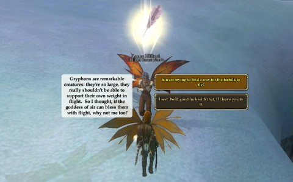
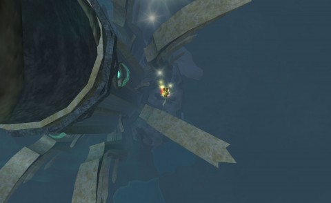

Back to: [West Karana](/posts/westkarana.md) > [2012](/posts/2012/westkarana.md) > [November](./westkarana.md)
# EQ2: A Wish for Wings that Work

*Posted by Tipa on 2012-11-28 08:17:54*

The very first creature Scatterfall talked to on her very first trip to the Overrealm was an annoying owl creature named Jabber who admonished her for her lack of wings, a real impediment in the Kingdom of Sky.

But, I immediately protested, Scatterfall DOES have wings!

They aren't working wings, though. All they can do is let her hover slightly and glide a little.

In this pass through EverQuest 2, I took the path of a crafter. It just made sense, since I had to train up a skill for the Wurmslayer and, soon, for the Coldain Prayer Shawl. (Scatterfall became a level 90 carpenter last night). At level 85, all Fae and Arasai can do a quest, starting in the Great Divide, for the power to make faerie wings work and give the gift of true flight.

[caption id="attachment\_10465" align="aligncenter" width="480"] If gryphons fly, why can't I?[/caption]

The Fae researcher in the Great Divide had been making a study of air elementals, trying to divine their means of movement. Sure, Faefolk wings are too small for their bodies, but griffons can fly, dragons can fly, these creatures are much larger and have no trouble staying aloft. Why are Fae different?

Talking with a priestess of Xegony in Barren Sky revealed a comedy of divine error. When the Shattering drove the elves and others of Tunare's (Tunare = Nature) creations off of Faydwer, she uplifted some small faerie creatures into sentience. Made them larger, more intelligent -- too big for their wings. The Goddess of Air, Xegony (= Oxygen), saw this as a refusal of her gift of flight, and declined to grant the gift to the new breed of Fae.

Once a sufficient offering is made to Xegony, she is willing to grant her gift of flight once more to deserving faefolk... but her blessing brings with it a bit of a curse as well. A return to the smaller size of the ancestral faerie. Norrath's smallest player race shrinks to half its size.

[caption id="attachment\_10466" align="aligncenter" width="480"] Paineel[/caption]

It's a small price to pay for flight. Why deal with the teleporters around Paineel when you can just fly from place to place? Moving aggro-free wherever you want, just dashing in from the skies to harvest that node or take on that named?

[caption id="attachment\_10467" align="aligncenter" width="480"] Dive bombing the Tower of Frozen Shadow[/caption]

Freedom to go where you really should not be, like the Tower of Frozen Shadow in Great Divide. I darted through its defenses and flew inside; the bottom level, from what I could see without going all the way inside, looks so much as it did in EQ1. Much nostalgia.

Hitting level 85 crafter meant I could also use the free mount that came with the Velious expansion, but why? When Fae ride flying mounts, their wings beat in time with the wings of the mount, as if aching to take flight on their own.

Seems a rotten shame not to use her own wings.

## Comments!

**[pkudude99](http://nomadicgamer.wordpress.com)** writes: But where's the penguin who's helping Santa?

---

**Ian A. Ralph** writes: Looking forward to doing the flight quest for my Freeblood, when I get one high enough. Good to see Crafter level counts.

---

**Tipa** writes: @PK - I was wondering if anyone would get that :)

---

**bhagpuss** writes: the bat wings I got for my ratings (making him a batonga, naturally) might be the single best item I ever got in eq2. Flying under your own power is intoxicating.

---

**[bhagpuss](http://bhagpuss.blogspot.co.uk)** writes: Grr. Stupid auto-correct- ratonga not ratings!

---

**[Tipa](https://chasingdings.com)** writes: @Ian -- I started a Freeblood partially for just that reason ;)

---

**[Tipa](https://chasingdings.com)** writes: @bhagpus - "Batonga", heh :)

---

**Ian A. Ralph** writes: @bhagpuss Which wings did you use for your Batonga? I got my ratonga down to the size of the actual in-game rats, and was thinking about wings for the same reason.

---

**Ian A. Ralph** writes: @Tipa Yeah, that was one of my motivations as well, as I am not into the little winged folk.

---

**[Appreciating My Fellow Bloggers |](http://www.gamebynight.com/?p=3591)** writes: [...] Spinksville – Kickstarter, Older Games, and The Packaging Up of Gaming Nostalgia West Karana – EQ2: A Wish For Things That Work Be Sociable, Share! Tweet This entry was posted in i. MMORPG, iii. PC Gaming, iv. [...]

---

