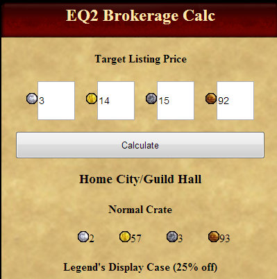

Back to: [West Karana](/posts/westkarana.md) > [2012](/posts/2012/westkarana.md) > [November](./westkarana.md)
# EQ2: Going Mobile

*Posted by Tipa on 2012-11-29 07:22:01*

[caption id="attachment\_10471" align="aligncenter" width="319"] Still to come: The lost art of smartphone photography[/caption]

A few days ago, I blogged about [a little script I wrote](../../../index.php/2012/11/21/eq2-not-gonna-fight/) that helped me price things for selling from the EverQuest 2 broker. It's been invaluable in letting me wring the absolute best price out of the things I don't need, especially, since I've been working on the gathering quests, all the hundreds of harvests I need to dispose of. For money.

[Belghast](https://plus.google.com/103824420081860414200/posts) at [Tales of the Aggronaut](http://aggronaut.com/) was inspired enough by this to write [a little browser app](http://aggronaut.com/eq2brokeragecalc/index.php) that did everything my script did, extended it quite a lot, and was conveniently sized to work within EQ2's in-game browser for total convenience:

[caption id="attachment\_10472" align="aligncenter" width="399"] Belghast's EQ2 Brokerage Calc[/caption]

Click on the picture or the link above to go to this excellent app.

So, I was playing around with Belghast's app and thought that this would make a wonderful mobile app. Also, it's supposed to be trivial to use HTML5 and JavaScript libraries like [jQuery](http://jquery.com/) and [jQTouch](http://www.jqtouch.com/) to make cross-platform mobile apps incredibly easily.

The company I work for has finally made a decision as to which JavaScript DOM framework library to go with. We've been using the [Prototype framework](http://prototypejs.org/) in our little group. Over the past few years, though, jQuery has become the industry standard. We're slowly converting our stuff over. One thing we haven't yet done is to bring our stuff into the mobile realm.

[caption id="attachment\_10473" align="aligncenter" width="480"] Some JavaScript and jQuery for you.[/caption]

This was a perfect opportunity to bring my day job and my night gaming hobby together. I threw together the absolutely most basic layout possible (it uses a TABLE, omg!), put that into a jQTouch template and hooked everything up with jQuery, *et voila*!

You can get the full source by loading up the app in a browser and viewing the source :) Be kind.

If you're reading this on a smartphone, then [click here to run the app](http://chasingdings.com/eq2/store.html) and let me know how it looks on your phone. 

I used it last night to do my broker stuff -- on my phone so I didn't have to keep tabbing out to the shell running my script! So that was cool.

Anyway, the best thing about all this is, Belghast took my basic work and made it so much better, and then I was inspired by his work to turn my original "good enough" script into something I can put on my frickin' **résumé**. 

People inspiring people to innovate. Through video games. This is why I'm a gamer :)

## Comments!

**Michael** writes: Works great on iPhone 4s. Thanks for this!

---

**[MrrX](http://togameforlife.wordpress.com)** writes: "People inspiring people to innovate. Through video games. This is why I’m a gamer :)"

I'm stealing that one!

---

