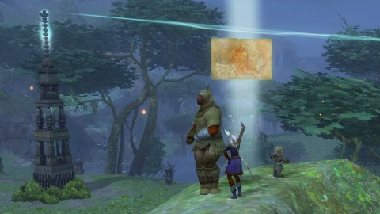
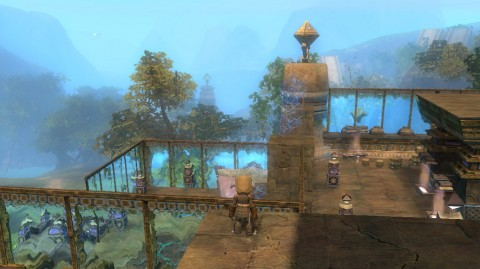
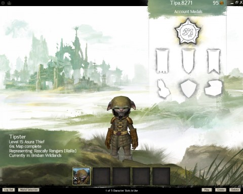

Back to: [West Karana](/posts/westkarana.md) > [2012](/posts/2012/westkarana.md) > [October](./westkarana.md)
# Game Log: Guild Wars 2

*Posted by Tipa on 2012-10-07 14:58:48*

[caption id="attachment\_10283" align="aligncenter" width="480"] Tipster, level 15 Asura thief[/caption]

I've been in my Guild Wars 2 guild a couple of days, and I've come to appreciate just how ironically named the game \_is\_. Sure, it's just a spam invite guild -- Ranger Rabble or something like that, even though I'm not a ranger -- and (not for lack of trying) haven't spoken to anyone else in the guild and am really just in it because otherwise, my game time isn't contributing to any larger effort. Ironic because this is a game that really doesn't need guilds (lampshaded perhaps by GW2 allowing you to be a member of multiple guilds, changing between them at will).

Instead, this is a game that celebrates the solo player. Aside from a personal story that you can complete at your leisure, this game is for those who like to wander. In that ESAK spectrum, GW2 comes in high on the Explorer, places reasonably in Achiever and Killer, but Social -- that's not even on the table.

[caption id="attachment\_10284" align="aligncenter" width="480"] Maybe charge up my gadget, maybe end all life everywhere instantly.[/caption]

Every class is pretty self-sufficient, with tanking, healing, ranged and melee combat all present in varying amounts. Makework tasks bring you to new areas to explore, and while there, events happen around you. The more people who join in, the better the reward, so everyone within range of the announcement pours in to repel an invasion, or guard a scientist, or get the power grid running again. Successfully completing one event often starts another, which, like the public quests in Warhammer Online, usually end in a boss battle too difficult for anyone to solo, but by then everyone with any interest is there helping out. No need for grouping or strategy. Everyone gets a reward based on their participation, and as importantly, fame with their faction. You can use that fame to buy goods at faction merchants.

I'm told there are dungeons once you reach level 40, or at least one dungeon, but dungeon crawling is not the focus of Guild Wars 2.

Pointing your character toward an empty area of the map and seeing what you can find is the focus of Guild Wars 2.

[caption id="attachment\_10285" align="aligncenter" width="480"] Discovering a vista[/caption]

Obvious question being, what happens when there are no empty areas on the map?

First, GW2 isn't going to make it easy to complete the map. Each map has several things to find -- hard-to-reach Vistas, like the one in the picture above. Points of interest need to be uncovered, hearts need to be filled in (indicating completion of the area faction task), all the different kinds of native critters need to be killed for the kill count and kill variety daily quests, and once you've done all those in your native country, you need to travel to the native lands of other races and do all theirs. You'll be deleveled to an appropriate level for the zone, so nearly everything you can do will be appropriate and give experience.

If you just like running around and killing stuff and occasionally having a go at a big baddie without too much stress or risk, it's hard to see how any game could be better at that than GW2 -- at least up to my still low level.

[caption id="attachment\_10286" align="aligncenter" width="480"] Out of the newbie zone[/caption]

This utter lack of urgency is what kept me from really getting into the game. With nothing that particularly needs doing, no risk, and nobody to talk to, it's always easier to just not log in. But then I started putting some time into figuring out what skills support other skills, which weapons support my play-style best.... oh, word about that.

Your skills are half determined by you class and chosen weapons. Everyone can wield every kind of weapon, though some weapons and armor are still class restricted. Still, if you want to have a dual pistol wielding mage, who's going to tell you no? You'll get some appropriate skills for your weapons depending on your class. Right now, I'm deciding between a dagger/pistol and sword/pistol arrangement for my Asura thief (Asura are basically a society of Stitch of Lilo &, which is why I love them). Both options allow me to jump into battle and mix stuff up with some ranged ability. Sword/pistol is more tanky, Dagger/pistol more stabby. Can change between them with a keystroke.

The other half of your abilities comes from skills and traits. You earn skill points by leveling and by completing skill challenges (you'll see those on the map as well). You can slot these skills in any order you like. Traits are more general ability and bonus unlocks which, I believe, are the same for all characters of all races and classes.

[caption id="attachment\_10287" align="aligncenter" width="480"] Not quite alt city, here[/caption]

Anyway, now that I have kinda figured out what I'm doing and am (finally!) out of the newbie zone, I'm beginning to have a bit more fun. For me, it's the kind of game you can just be playing while watching a movie or something.

Things would probably be a bit more exciting in PvP, but I admit to not having tried that, yet. Those who have say it's wildly fun, reminiscent of the best instanced battlefields of Dark Age of Camelot and World of Warcraft. I enjoyed the battlegrounds in Rift, I'm sure I'll like the ones in GW2 once I get to them, but I feel I should really get a handle on the character and fill out the four skill/trait slots before I try myself out against other players. Come on -- I'm a thief. Thieves die first in PvP.

Someday, maybe even today, I'll try out a character of another race, maybe the plant people. Each race has a storyline; that was the secret sauce that kept me in Dragon Age: Origins for six months, that's the innovation that kept me in EQ, DAoC and WoW, and that's the lack of innovation that eventually turned me off from Rift. 

I really do enjoy the stories.

Please don't search through the archives to point out where I said the opposite ;-)

## Comments!

**[Cassaendra](http://cassaendra.blogspot.com/)** writes: Thanks for this! I've been looking for something similar from someone I trust (for Szel). The game sounds better than the previous. I may have questions later, if you don't mind. :)

---

**[Tipa](https://chasingdings.com)** writes: If I can answer them, I will -- but I haven't done PvP or crafting yet.

---

