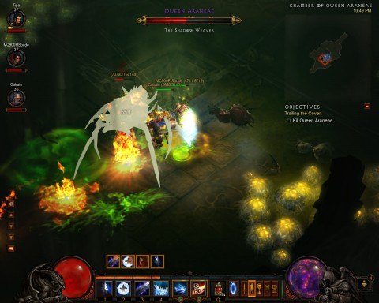

Back to: [West Karana](/posts/westkarana.md) > [2012](/posts/2012/westkarana.md) > [October](./westkarana.md)
# Diablo 3: Act I Nightmare

*Posted by Tipa on 2012-10-08 06:27:24*

[caption id="attachment\_10290" align="aligncenter" width="480"] Spider Queen[/caption]

We were down a monk last night. Not sure why, yet, but I'm pretty sure it has something with [his GAME launching today](https://www.pirate101.com/ "Pirate101"). Anyway, the rest of us were there, so we jumped in for another run in our softcore playground of destruction, where we steamrolled over most everything and brought the boom to the Butcher, finishing Act I for us.

I think we all ended the night at level 38. There were a couple of times where one or the other of us needed a heal potion, so the going was as tense as it gets.

If "Normal" difficulty is the extended Diablo 3 tutorial, "Nightmare" is the introduction to the actual game. I've seen again and again how "Hell" mode is the first difficulty level where you really have to pay attention to what you're doing. I've lost one level 52 hardcore character in hell, and I have a level 50 hardcore character sitting on the Hell threshold because I'm sure I'll lose her if I continue.

So I really want to get through Nightmare as quickly as possible.

Now that the actual grouping is done for the week, I'm starting the traditional meta-game; the daily searching through the auction house for upgrades and bargains. This last week saw my bank go from nearly 900,000 gold to 250,000 gold as I bought upgrades. I'm sitting at about 750K now, and the one bit of salable loot that dropped last night is sitting on the AH right now.

The price for gear is insane in softcore mode, but it's the "stacks of copper" from WoW all over again. People with too much money will pay too much money for your gear for their alts so they don't have to farm it themselves. Classic trade of money for time.
