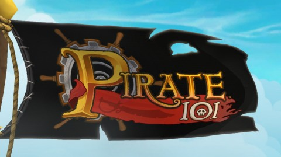
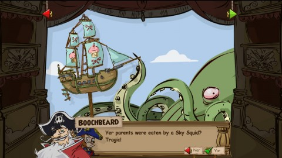
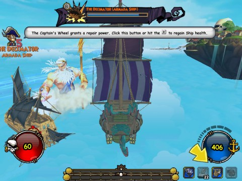
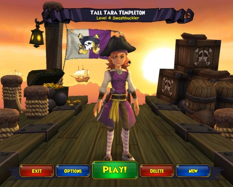

Back to: [West Karana](/posts/westkarana.md) > [2012](/posts/2012/westkarana.md) > [October](./westkarana.md)
# Pirate101: Yo ho ho, a Pirate's Life for Me

*Posted by Tipa on 2012-10-08 22:45:52*

.yarr {
padding: 5px;
float: left;
}

"Oh, ship ahoy, and where do you steer?" 
Blow high, blow low, and so sailed we; 
"Are you man-of-war, or privateer?" 
On the bonny coasts of Barbary. 

"I am neither one of the two," said she, 
Blow high, blow low, and so sailed we; 
"I'm a pirate, looking for my fee," 
On the bonny coasts of Barbary. 

  

[Pirate101](https://www.pirate101.com/ "Pirate101"), the new free-to-play, family-friendly fantasy pirate game from the makers of the popular Wizard101, went live today. If you ever played Wizard101, you'll remember the Spiral, a linked set of island worlds hanging in the void. What ships ply that void?

Pirate ships. And today, millions of swashbucklers, marksmen, witch doctors, buccaneers and so on set sail to rid the Spiral of evil creatures and ---

(insert loud record scratch sound here)

Wait, RID the land of evil creatures? Like pirates?

Yes, well, you play one of the good pirates. At least in this game, you play an adult. Wizard101, you remember, featured thousands of Harry Potters and Hermiones struggling to find dates for a quiet rendezvous in some deserted tree. Here, you're a pirate in a world of pirates, guiding your own pirate ship through treacherous pirate shoals with your own pirate crew.

And if you're very lucky, a pirate parrot :)

[caption id="attachment\_10300" align="aligncenter" width="480"] Eaten by a sky squid! Yuk![/caption]

Character creation will be familiar to any Ravenwood student. You come into the world of Pirate101 an orphan child (and of course, [orphans have a special place in the hearts of pirates everywhere](http://youtu.be/6Xuq7kdNaOk "An Orphan Boy")).

Forced, you are, to relive the terrible events of your life. Your parents died how? Oh my, a storm? Pirates? Devastating dropsy? A SKY SQUID? Man, your life just started off sucky, and got suckier when you fell into the criminal life of a buccaneer? Marksman? Witch doctor? A swashbuckler? My gosh, and you say you grew up in Marleybone? Wizard City? Krokotopia? Moo shu? With the ninja pigs?

What a life! And somehow you managed to avoid being turned into a frog by some wizardling and escaped only to wash up on our fair shores and [be immediately tossed into jail for your crimes](http://youtu.be/OpVbBH9Ip8I "A Policeman's Life is Not a Happy One").

I guess what I'm saying is, you should [go see the Pirates of Penzance](http://nygasp.org/current_season/on_tour "NY Gilbert and Sullivan Players").

The details of your wicked past and craven future determine the companions you will find on your journey and the quests you will be asked to complete -- well, perhaps just the reasoning behind the quests. Nonetheless, companions. You gotta have friends. Because there are no spell cards or decks in Pirate101. You fight your landward fights on the ~~game~~ battle grid.

Pirate101, you see, is at its heart a tactical battle game, and the companions you meet along the way are your army.

[caption id="attachment\_10306" align="aligncenter" width="480"] Pirate101 battle screen[/caption]

Each fight, your companions are chosen at random from among your crew. You can influence which are chosen more often, but the final selection, and the placement on the battle grid, are not under your control.

As in Wizard101, fighting with others increases the challenge -- in the picture above, I'm fighting a boss with two other pirates and our crews. My pirate, Tall Tara Templeton, is the circled portrait on the left side of the map, surrounded by my crew, my pet flying snake (bought at the cash shop), and another player (a marksman) surrounded by her crew. To the south end of the map is a witch doctor player and her crew.

Yes, all our crews are anthropomorphic animal pirates. So are all the enemies. You're sending farmyard animals in to kill other animals for your enjoyment and pleasure. And you call yourself civilized :)

The objectives change from map to map. Usually you kill everything you see, but sometimes you target a specific enemy, or complete some objective on the map while trying to keep alive, or get onto the enemies ship.... because ship battles? That's a thing.

[caption id="attachment\_10307" align="aligncenter" width="480"] Ship to ship battles[/caption]

If you get bored with island life, you can take to the sky streams in your customizable and upgradeable sky ship, there to pursue enemy ships, get broadsides to them, and pelt them with cannons until they are weak enough to be boarded, at which point the battle moves onto the battle grid and continues conventionally.

Battling ship to ship earns you nautical levels, levels which improve your survivability and power in ship to ship combat. You'll need these levels, without which combat is tedious and dangerous. So don't neglect them.

After each battle, you can drop out of ship view into deck view and make furious repairs to the deck of your ship. Enemy ships will drop various conditions onto your deck, and if not cleared, will become obstacles for your next battle.

[caption id="attachment\_10308" align="aligncenter" width="480"] Tall Tara Templeton[/caption]

This is just the briefest overview of Pirate101. I'm not going to call it a review, because it's not a review. I leveled to the middle levels in Alpha, but the game has changed substantially since then (ship-to-ship combat wasn't in, in Alpha, for instance), and I'll reserve a final judgement to maybe never.

Like Wizard101, Pirate101 has a cash shop where you can buy things that can help you in the game (like mounts, houses, companions, pets, outfits and so on), but are by no means necessary to play the game. Wizard101's F2P model locked zones behind paywalls, so only a certain portion of the game was truly free. I don't know if Pirate101 has the same restrictions, but the world of Pirate101 is broken up into zones as you level up, so I imagine you can expect to pay for each new area as you play, or just stay in the Skull Island area and hang out with your friends for free.

You get a free hovel in which to store your booty, but can upgrade to various palatial private pirate islands if you like. I've opted to do so. I had a lot of Crowns left over from Wizard101 (and thankfully they are usable in both games!)

So, going forward, I will be writing about my pirate adventures along with every other game I play in my game log. If you're a fellow cloud corsair, let me know, we'll friend up, kill animals, sail so high only a sky whale could follow.

