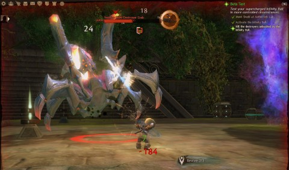

Back to: [West Karana](/posts/westkarana.md) > [2012](/posts/2012/westkarana.md) > [October](./westkarana.md)
# Game Log: Guild Wars 2, Pirate101, Diablo 3

*Posted by Tipa on 2012-10-09 23:38:18*

[caption id="attachment\_10314" align="aligncenter" width="480"] Guild Wars 2[/caption]

I didn't get to all my games today, but I made good progress on the ones I did play.

I've been having some troubling continuing my personal story on Guild Wars 2. My character is trying to get glimpses into possible futures by supercharging a gadget called an Infinity Ball. It has basically never worked. She and her partner keep feeding it more and ever more power, and it just becomes ever more dangerous. Considering just charging it up on the Megahydrocollider (or whatever) ran a risk of destroying all life on Tyria.

The Infinity Ball opens portals to the future and out come mean nasties -- first off, miniature killer robots. Then a FLYING killer robot.

This is what I never could survive before. I left the instance alone for awhile, spent some time in the Norn lands playing with the events, earning skill points, looking out on frozen wastelands and etcetera until I reached level 16, and returned to try my luck with the Infinity Ball once more.

I had stuns ready, but more importantly, I wasn't watching Hulu at the same time and could hear when the flying robot was readying its killer napalm attack and could dash out of the way. Easy kill.

I kinda thought maybe that would be the end of the fight, but nope. ANOTHER killer robot came out, a huge, crab-like mechanism. I did fairly well against it, but I didn't know the "tell" for its killer attack, and before I could strike the killing blow, it had me on the ground, rallying for my life. My partner had already been killed. It was low on health, though, and I just managed to toss enough knives at it before I died to kill it.

So close. But done with that bit.

The problem? We're guessing not enough power.

[caption id="attachment\_10315" align="aligncenter" width="480"] Pirate101[/caption]

Still adventuring through the first zone in Pirate101, but I'm soon to meet the Frogfather. Once he's defeated, it's off to the Spanish-themed monkey zone. But we're not there yet.

Today's adventures were mostly nautical in nature, with a lot of ship to ship battles. I was kinda surprised to find that other players can't help you shell ships (maybe they could if they were grouped). However, once one side or the other tries to board the less-airworthy ship, the swarm of players who were circling every fight could pile in.

What would usually happen next is some player would get out in front, and with the huge number of enemies gathered there, quickly die. I found it handy to spend the first round moving my more expendable companions forward while I doused a fire or two, then move up when the odds were good. As a swashbuckler, I can vanish once a fight, which makes my chances a little better.

Pirate level 7, Nautical level 2. I had more companions at this point in alpha; I think KingsIsle wants players to buy a couple from the Crowns store. In particular, I'm missing a witch doctor companion. Hoping to come across one soon.

A lot of players had bought the "Boochbeard Bundle", a $90 deal which gives a year membership, headstart access, a mount, a pet and a cat companion. I guess that's not too bad. I prefer to get my stuff through game cards usually.

In Wizard101, I typically ran two players at once, and sometimes three. I don't think multi-boxing is going to be as viable on Pirate101. In Wizard101, no matter how many characters you brought to a fight, you were only going to get a max of four enemies. Here, you could get a dozen. Enemy power grows faster than player power. That's where tactics comes in, to even things up.

Haven't found the auction house yet, and I have something I need to auction, too. Probably passed it a hundred times and just not seen it.

[caption id="attachment\_10313" align="aligncenter" width="480"] Diablo 3[/caption]

When I logged in to Diablo 3, Spode was farming gold to pay for repairs to his high level character's armor. His high level character is stuck in Act II of Inferno, unable to get past the Khule fight. He might have been better off going back to Act I Inferno to farm, but whatever. I couldn't join in, as my group character is already perilously close to level 39, and I might want to do a Whimsyshire run this week.

I was in D3 largely for the auction house. You can see that the vast majority of things I bid on, I lose, but that's okay. I got some sweet boots, a nice upgrade, for a very reasonable price. I sold my old boots for a nice profit over THEIR purchase price, and even with the original purchase price subtracted, still made more from the old boots than the new boots cost. An upgrade where I made money is nice.

Still haven't managed to pass the million gold boundary; occasionally an upgrade that is so much better comes around, and sometimes they cost a lot -- the legendary Chaingmail I'm wearing cost me $300K. I'll sell it for $500K when I upgrade. When I started this character, I had about $20K in the bank from my demon hunter. All this cash is from the auction house.

So, Torchlight 2 and FTL will have to wait for another day. I'm kinda wanting to get in Pirate101 past where I left off in Alpha before I back off on the pace.

[caption id="attachment\_10316" align="aligncenter" width="480"] Monquista[/caption]
## Comments!

**João Carlos** writes: Welcome to the mad scientist asura thinking. They all are mad scientists and think like one: teh infinity ball need more power!!!!

You had to take the hint when taht asura was runing around saying "Eureka!" and that other asura was shouting "It is alive! it is alive!"

Asura are crazy...

---

**[StarsongKY](http://thegunnersdaughter.blogspot.com)** writes: You haven't missed the Pirate 101 auction house - there isn't one, at least not yet. They've mentioned that it's in the works but they haven't said how soon.

---

**[Tipa](https://chasingdings.com)** writes: @João Carlos -- lovably crazy :)

@StarsongKY -- I'm getting stuff that can't be auctioned :P

---

