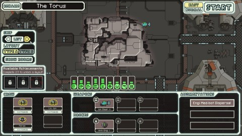

Back to: [West Karana](/posts/westkarana.md) > [2012](/posts/2012/westkarana.md) > [October](./westkarana.md)
# Game Log: Pirate101, FTL

*Posted by Tipa on 2012-10-12 06:21:15*

[caption id="attachment\_10328" align="aligncenter" width="480"] Armada[/caption]

I met up with [Friendly Thomas](http://thefriendlynecromancer.blogspot.com/) and [Eccentric Austin Ornsley](http://throughtheeyesofasorcerer.blogspot.com/) last night for a little soiree on the decks of Austin's galleon. On [the POOP deck](http://en.wikipedia.org/wiki/Poop_deck), mind you. Just needed for you all to know that. Poop deck.

Well, we'd cracked open a new barrel of yum (with my head) (it was an accident, I swear), and before long, the companions were all muttering to themselves about the sorry state of their pirate masters, and somebody, not sure who, said we should go out and hunt us some cutthroats.

We unbottled our ships and went a-reaving. 

Turns out my conceptions about ship-to-ship battles were wrong on a couple of vital points. First, you can definitely fire upon a ship already engaged by another pirate. It wouldn't automatically be selected -- that only happens when they aggro on you, and they can only aggro on one ship -- but you can click on the ship (NOT tab to the ship) and fire away. And you don't have to board the ship, you can just destroy it entirely, blast it from the skies, at which point it falls through the void forever, a fate worse than death for the poor lost souls.

Which asks the question, what keeps the ships flying in the first place, and how is it lost? Because I see shipwrecks in the skyways all the time. The island of Flotsam is MADE from shipwrecks.

[caption id="attachment\_10332" align="aligncenter" width="480"] Dog pirates![/caption]

Anyway, with three ships -- and then a fourth, someone I didn't know got into the act -- pounding away at the cutthroat ship, I soon dinged Nautical Level 4. The xp per ship kill vastly outstrips the very small amount awarded for killing an enemy on the ground.

I took the advantage of having two higher level friends available to move a bit further with the main story quest, finally getting Old Scratch, the Witchdoctor companion I'd been missing from Alpha, after an epic battle against dozens of zombies.

Many thanks to Austin and Thomas for all the timely help last night :) Ended the night at Pirate Level 9 and Nautical Level 4.

[caption id="attachment\_10329" align="aligncenter" width="480"] FTL[/caption]

I believe the last time I talked about FTL, it was a Kickstarter project with a simple hook: bring "roguelike" mechanics to a space battle game. I took an issue with their definition of "roguelike", which they took to only mean permadeath and a map that changes with every play. There's a bit more to it than that. But nonetheless, the game itself sounded exciting, so I installed OnLive to play the demo while it was on that service, backed it, and got a beta copy about a month ago -- it's since gone live.

In FTL, you are, or rather start out as, the crew of an old Kestrel-type Federation scout, rushing through space ahead of a rebel juggernaut that is enslaving the galaxy. The only possible means to survival is to join the remnants of the Federation fleet eight sectors away, and make one last, desperate strike at the very heart of the rebellion.

Your ship is nowhere near up to that task. You will have to nurse it through each fight, strike bargains with pirates, pursue slavers for crew, find and manage ship upgrades, know when to fight and when to run, hide in nebulae for safety while making desperate repairs before the rebel tide sweeps over you -- until, at the end, after surviving the worst the galaxy can throw at you, you meet this:

[caption id="attachment\_10330" align="aligncenter" width="480"] Rebel flagship[/caption]

The Rebel flagship. Bristling with guns. Shields strong as steel. A full crew to keep things running (and I'd lost one of mine to asphyxiation when the O2 generator got breached while I was making repairs). Drones. Teleporters. I'd been forced to put off needed upgrades to get the fuel and repairs to even make it this far, but even outgunned and outmaneuvered, I managed to give good account. I was able to take some of their systems offline for a time, but in the end, my shields -- even manned by my two best engineers -- weren't able to keep enemy fire from eroding my hull and sending us all into the airless black.

How the Federation fared after that, I do not know. However, by making it to the fifth sector, I unlocked a second ship, the Engi ship.

[caption id="attachment\_10331" align="aligncenter" width="480"] Engi ship[/caption]

The Engi ship is a drone boat, mostly. Haven't taken it into space yet. We'll have to see how it does in battle. I think it's supposed to work by letting the drone erase the enemy shields, then the ion gun takes over for hull damage.

## Comments!

**Mbp** writes: I have been hopelessly hooked on FTL for the last two weeks and I don't normally play Rogue games so I share your confusion over the term.

In addition to permadeath the game can be brutally unfair. After many games I have learned a lot of tricks but I still lose ships to unfortunate encounters on the first level.

By the way you have it backwards. The ion cannon does no damage but is one of the best weapons in the game for removing shields. My first victory over the end boss was in that ship.

---

**[Tipa](https://chasingdings.com)** writes: oooh even better. I was so focused on trying to keep the flagship shields down that my beam weapons could never outstrip their repair. I'd have liked to kill the flagship with the starter ship because, hey, easy mode, but the last couple sectors I was just sprinting to the end sector before I got blowed up, running from losing battles.

---

