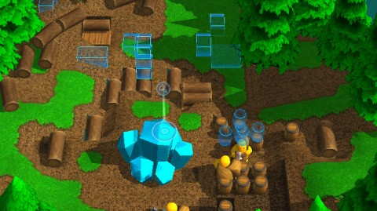

Back to: [West Karana](/posts/westkarana.md) > [2012](/posts/2012/westkarana.md) > [October](./westkarana.md)
# Game Log: Castle Story, Diablo 3

*Posted by Tipa on 2012-10-17 23:43:44*

[caption id="attachment\_10346" align="aligncenter" width="480"] Castle Story Prototype[/caption]

When Sauropod was hawking their [Kickstarter for RTS/Minecraft hybrid Castle Story](http://www.kickstarter.com/projects/902505202/castle-story), they promised that backers past a certain tier would get access to the very prototype they were using in the demo. Today they sent out the prototype, with the warning that the game probably wouldn't be really playable or anything in this primal state.

Well, it's hard to argue with that. I couldn't really get the game to do anything or build anything. I figured out how to do logging, and after I did something, the little critters built some barrels and log pits, and eventually some mining, but getting them to fill resource caches with stone bricks and then go on to make a castle from them (which I'd sketched out with their wireframe maker tools) did nothing.

I don't think I'm going to be putting too many hours into the prototype. They said they would send it out, and they did, and now I have it, and yay. I could probably watch their videos as a tutorial, maybe, but I think I'll wait for the beta when it's a bit more functional.

Nice to see things are still going ahead, there. Though with all the expanding they're doing, I wonder if they'll finish. See, I'm a programmer, and one thing I've learned over the years is that bringing in new people doesn't always make things faster. What usually happens is the scope increases vastly as new people bring their input, the vision and especially the momentum is lost, and you end up with some sort of weird chimera of a program that doesn't do anything well.

Hoping Sauropod doesn't fall into that trap. I hope, for all the Kickstarter games I've funded, that they would just finish the game and then work on an expansion for all the cool things they thought of during development but were outside the original scope.

Finish. The. Game.

So yesterday, I couldn't find the Monster Power drop down, even though I looked where they said. Rereading the patch notes, I should be able to set monster power no matter what level I am. So I did some poking around and found out I had to turn the feature on in options. Which I did. 

Raising the Monster Power -- you can't lower it -- increases the experience you get, the loot you get, and the number and ferocity of the monsters you face. I don't typically have much trouble soloing, even in Nightmare mode, so I pushed the monster power to 5 (of 10) and went out for some fun.

This gave me 100% bonus xp and +50% gold/magic find. It also got me killed pretty darn quick. Okay, I honestly felt a monster power of 10 would be a good challenge, and set it to 5 just to get my feet wet with something easy.

Oh, no. I was challenged. I had to be careful, move slowly, be a lot more ruthless with my crowd control. I soon had the Desolate Sands cleared and dinged 44 (sorry guys) (I say sorry because we're supposed to be holding our characters at 42). The loot was better, got a few yellows (which were nonetheless trash), bunches of blues, and plenty of XP.

Suddenly, D3 became \_fun\_ again. It was weird. Usually, in a group, D3 is a faceroll. I can barely get a shot off.

We're about to meet Zoltan Khuul and Belial. I think they would be more fun with Monster Power 5.

Or 10.

Missed a guild romp in Guild Wars 2 tonight. But hey, Alphas and Warehouse 13. If I'd remembered, though, I'd have headed into GW2. I need to play that.

## Comments!

**[pasmith](http://dragonchasers.com)** writes: You've stated perfectly my concern with "stretch goals" in Kickstarter campaigns. My guess is that once a bunch of these 'stretched' projects fail, either future Kickstarter campaigners will get smarter, or Kickstarter will become "that service we messed around with back in 2012."

And thanks for the info on Diablo 3. Maybe I'll give it another go now!

---

**[Genda](http://thegroucygamer.squarespace.com)** writes: I've funded exactly one Kickstarter campaign, and it was for a card game. I'm not willing to fund electronic games there because a) what Brenda said, b) some of these groups don't have a manager or project manager among them, and c) a local kickstarter guy here is driving around in a $100k sports car, asking for 7k for artwork and getting 10x that. I'm not on kickstarter to fund lifestyles.

If your game/project/widget happens to be successful, enjoy your money paper hats. More power to you. If your partner in the kickstarter is a national brand with existing manufacturing and distribution and you're funded like that then it indicates to me that there is abuse inherent in the system.

Like anything else, there is worthwhile stuff on there, but I worry that it's going to be too hard to ferret it out.

---

**[Tipa](https://chasingdings.com)** writes: @pasmith I have no idea why I like D3 better than T2. I really shouldn't. But I do.

@Genda I have helped fund a lot of games, but I really do need to restrain myself. One game I helped fund, College Ruled Shooter or something like that, was based on a Flash game with a distinct art style I really liked. He seemed pretty close, had a playable demo, so I was happy to give him my money in return for a simple, fun game. He decided to rewrite the thing from scratch in a newer version of Action Script, hired a programmer apparently, then went off someplace for awhile, and is now apparently hawking the thing on Steam Greenlight. I have not seen my game. It was supposed to be nearly complete.

So that money is gone. Wasn't much, luckily.

But yeah. If all I'm really doing is pre-ordering a game, I'll just wait until there's a game to pre-order.

---

