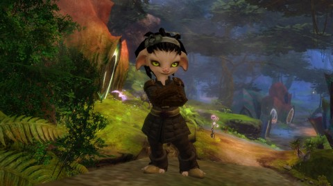

Back to: [West Karana](/posts/westkarana.md) > [2012](/posts/2012/westkarana.md) > [October](./westkarana.md)
# Game Log: Guild Wars 2, Diablo 3

*Posted by Tipa on 2012-10-18 23:14:25*

[caption id="attachment\_10351" align="aligncenter" width="480"] The Tipster in Brisban Highlands[/caption]

I may have missed the Combat Wombat romp through the Brisban Highlands last night, but that doesn't mean I couldn't run through it solo tonight! I was 16, going on 17... fellows will fall in line. Eager young lads, and grueways and cads, will offer me food and wine...

Well, okay, that didn't happen, Baron von Trapp. Instead I fell into the clutches of the villainous Nightmare Court, a faction of evil Silvari, apparently. What would turn a plant evil, I wonder? And what constitutes evil among plants? Stealing sunlight? Hogging the fertilizer? Hosting pungent varieties of fungus? Wearing your lichen on the south side of your body?

Anyway, they were keeping some folks prisoner. The Nightmare Court guards were NOT very friendly, and would quickly debuff and kill me. I lurked around the edges taking on Nightmare Hounds and unwary Nightmare Courtiers until some other folks -- Silvari all -- came by, and then we killed the guards, freed the prisoners and finished up the event.

I also did some other exploration. There was a heart I couldn't fill in because I could not FIND what they were talking about. Color something red and then lure it to something? I couldn't find these things or where to lure them if I did, a clear sign I was in the wrong area entirely. I'll go back. One day.

Still kinda weak in a fight. I like dagger/pistol, but might have to rethink that combo, get a little more survivability. I did change to a better heal with a longer cool-down. But my power does not seem to be scaling with my level. I should probably head back to the city and see if I can find any upgrades on the auction house.

[caption id="attachment\_10352" align="aligncenter" width="480"] Uber Zard[/caption]

SPEAKING OF UPGRADES ON THE AUCTION HOUSE... someone wasn't watching the AH as closely as they ought to have been, because I got such a bargain. See, we're coming into the level range where level 60 items can have the attribute of reduced level requirements. So I snagged myself a sword with hundreds of INT and oodles of DPS for very little gold; I think it increased my DPS from 1800 to 8600.

So, that happened. There was truly only one possible thing I could do.

And that was to up the Monster Power to 10 -- the max -- and head to Desolate Sands on Nightmare mode and kill EVERYTHING. Every. Thing.

What was a struggle at Monster Power 5 was a faceroll at Monster Power 10 now. I've moved from Ice Armor to Storm Armor. Storm Armor randomly shoots mobs in the area. And with my new DPS and my insane damage modifier from such high INT, I could just walk slowly through an area and things would just die.

Got another chance at the Ancient Device, just need eight more variations to get the achievement. Also found a random dungeon I hadn't seen before, it appeared after I defeated an elite rockworm. So I went down there, walked around, stuff would die, occasionally I'd blast a disintegrate.

Sure, as I approach 60, my edge in DPS will narrow, but that's many levels away.

I really pushed to get into Puerto Mico before headstart ended in Pirate101, probably push some more into that tomorrow. Thinking about getting Skyrim running again and start exploring the DLC for that game. And I really need to finish Torchlight 2 at least once.

I don't dislike T2. It just hasn't got any pull for me. Probably because the over-arching plot is really lame (so far). I get it, I'll meet the Alchemist at the end. But would it kill ya to make the road to the Alchemist a little more memorable?
