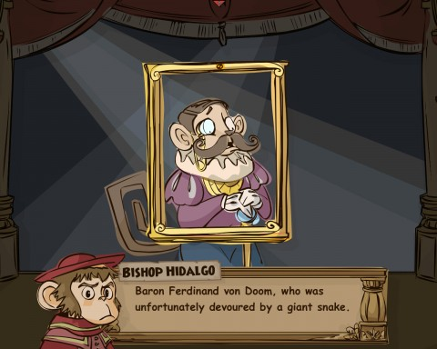

Back to: [West Karana](/posts/westkarana.md) > [2012](/posts/2012/westkarana.md) > [October](./westkarana.md)
# Game Log: Pirate101, Diablo3

*Posted by Tipa on 2012-10-20 07:18:51*

[caption id="attachment\_10356" align="aligncenter" width="480"] Who built those mysterious ruins, anyway?[/caption]

From the moment I first saw them, I've been blown away by Pirate101's cinematics. These aren't 3D rendered with lots of dramatic camera angles and explosions. They're little puppet shows. HILARIOUS puppet shows, as in this one, where the monkey prelate Bishop Hidalgo is telling the story of how the gorilla Gortez went all Lord Jim/Heart of Darkness in these mysterious ruins and is now using a giant golden statue as his seat of power.

If you're getting a "Planet of the Apes" vibe from this place, you're not wrong, because it turned out that this island was settled originally not by monkeys or gorillas, but by humans. They don't call it the Island of Doom for nothing, you know.

[caption id="attachment\_10357" align="aligncenter" width="480"] Doom of Doom Island[/caption]

It was named after Baron Ferdinand von Doom.

Too bad about the snake.

Significantly, it is one of the first times we see humans in the game from before the current pirate invasion. Where do humans come from? Nobody knows. Why did they disappear? Giant snakes. Why have they -- we -- returned?

**Oops. From closer examination of the picture, Baron Ferdinand von Doom is, in fact, a likely monkey. Sorry, humans.**

Heck, that's easy. To do stuff for NPCs that can't be bothered to move from their spots. It's an MMO!

Anyway. First quest was to go out on the skyways in the Puerto Mico vicinity and kill some ships for silk. Yeah. That didn't go well. I was forced to return to port and purchase the medium frigate. I had to sell my raft and my parent's ship and everything I wasn't wearing in order to afford the fittings. I immediately set sail to return to my task and ended up in a loose armada of ships that quickly depleted the supply of House Garman's marauding marauders. So I needn't have upgraded anyway.

After that, it's been ground battles. I haven't met Gortex yet, but I'm getting close. I can SMELL him. I have a couple thousand gold in the bank, and I'm assured I'll be getting a galleon when I finish up in Puerto Mico.

That might not be all that soon; I have a dozen side quests that I've put on hold, hoping to get that uber boat ASAP.

Now pirate level 11, nautical level 6.

[caption id="attachment\_10358" align="aligncenter" width="439"] One meeeeelion gold[/caption]

Not much to report on the Diablo 3 side, but I have got my first million in the bank. It would be more, of course, if I didn't keep buying upgrades. DPS over 9K now, which, for a level 45 character, doth not sucketh.

