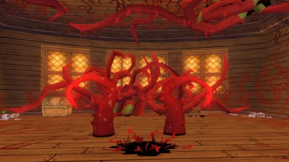
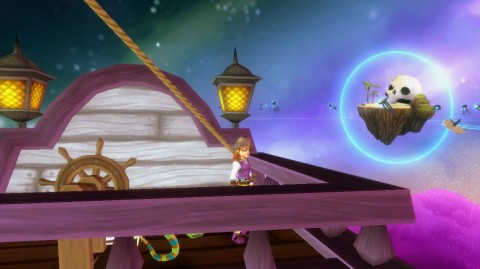

Back to: [West Karana](/posts/westkarana.md) > [2012](/posts/2012/westkarana.md) > [October](./westkarana.md)
# Pirate101: Two week review

*Posted by Tipa on 2012-10-22 07:36:03*

[caption id="attachment\_10363" align="aligncenter" width="480"] Weed Whacking[/caption]

Two weeks in to Pirate101's launch, my character is level 15 (swashbuckler) and has completed the Skull Island Skyway, the Flotsam Skyway, most of the Tradewinds Skyway and most of the Tierra Primata Skyway. The Skyways are the individual zones of Pirate101.

Along the way, we've attracted the notice of the pirate hierarchy, downed many other pirates, helped along the administration of the monkey colony in Puerto Mico (which has a different governor each time you visit), been to the monkey homeland and saved the royalty-in-exile, and started investigating El Dorado, the City of Gold, hidden somewhere on the Spiral. The Spiral we've seen firsthand for the first time, with the Wizard101 worlds of Krokotopia, Dragonspyre and others just tantalizingly out of reach of our sky-ships.

There's also been hundreds of tactical battles and dozens of ship to ship battles.

[caption id="attachment\_10364" align="aligncenter" width="480"] Seeking the Monkey's Paw[/caption]

Pirate101 shares quite a lot with its predecessor, Wizard101. Slow, turn-based battles. Colorful worlds, characters and animations. Strong story. A little bit grindy.

It also has a few only partially implemented features, like player housing. There is player housing, but you won't find much stuff to put in it. The auction house is promised but still not available.

For players of other MMOs, including Wizard101, it is less clear from the start exactly what role in a battle your class fills.

I can help clear that up, maybe:

Privateer -- buffs and heals (ie, cleric)
Buccaneer -- tanking (ie, warrior)
Swashbuckler -- melee damage (ie, rogue)
Musketeer -- ranged damage (ie, ranger)
Witchdoctor -- magical damage (ie, wizard)

No matter what your role, though, you'll be able to choose from a wide roster of companions who will fill all the other roles in a group, so you'll typically be able to handle most fights and dungeon crawls solo. Player characters, though, will always have far more powers and flexibility than NPC companions, so it will always be a better deal to group with another player than to go it alone.

It's important to choose your class wisely, and maybe give two or three a try before settling on one. Since Pirate101 is so strongly story based, and it's the same story for everyone, there's likely a limit to how many times people will want to experience the story. KingsIsle is pretty good at coming out with new content to keep you busy as well, if Wizard101 is any guide.

[caption id="attachment\_10365" align="aligncenter" width="480"] Ship ahoy![/caption]

Pirate101's most distinctive feature has got to be your ship. You'll get several in the course of your adventures, and you'll be able to fit it out with unique figureheads, anchors, sails and such to make it your own.

When you're on land, you can look out into the harbor and see your ship docked there among the ships of other players. Pity the people still in their first rafts. Envy the people in their huge heavy galleons.

When sailing on the skyways, you can even drop out of ship view back to your deck and run around, invite other players over, do repairs if needed, or just watch the islands slip by in perfect safety from the poop deck.

[caption id="attachment\_10366" align="aligncenter" width="480"] Sailing the Spiral[/caption]

Pirate101 is a "free to play" game. It's actually free to play... if you don't plan on doing much in the game. You won't be able to venture outside of the Skull Island skyway without forking over some cash, or subscribing. A pet which will randomly follow you into battle and provide both extra damage and a non-perishable combatant to absorb enemy damage, is something you'll find yourself needing. With all the running around, a mount can speed things up some.

KI is eager to sell you these things, as well as custom homes, ships, weapons, clothing and everything else you might need. This is how they make their money, and it's possibly to limit what you pay to unlocking each new skyway as you come to it. Once unlocked, it's unlocked for all your characters forever. Everything else is optional.

But, as with any free to play game, expect to spend money -- and expect to be presented with many opportunities to buy things you don't really need, like elite companions; some of the bosses you defeat will join your crew, for a price.

Although, when you think about it, you DID defeat them. You should FORCE them, in chains, below decks. Pirate, right? No problem with press gangs and ransom? Some will offer to join your crew on their own, but you might want to think carefully about whom you invite. The more companions in your crew, the less chance any particular one will be available in battle (aside from your first mate, who always accompanies you), and the more training points you'll need to spend in order to keep them near your level.

[caption id="attachment\_10367" align="aligncenter" width="480"] Companion management[/caption]

If I had the power to make one change to Pirate101, I'd get rid of the houses and let your ship be your house, let you decorate that, make it your own. People can already board your ship when it is docked, seems a shame there's nothing for them to see when they do.

I won't be able to really compare Pirate101 to Wizard101 until I've reached the end, but I imagine the end games will be similar; farming high level zones for rare gear and helping out friends. Wizard101's linear storyline widened with the addition of parallel stories (like Grizzleheim and the rival magic school that was definitely not Hogwart's) in a way that Pirate101 will eventually copy, making replayability a possibility.

So far, there's not been one obvious end goal to pull you through the game. When you log in, spokescharacters Boochbay and his monquistador will remind you where you stand on the main story quest and what you're expected to do next so you will never get too lost, but still, what's the goal? In the original Wizard101, the goal was to defeat Malistaire, the renegade death school professor who, grief-stricken by the death of his life wizard wife, destroys Wizard City and leads a trail of destruction behind him through all the worlds of the Spiral as he seeks a way to return his wife back to the land of the living -- whether she wants to return or not.

Powerful story. In Pirate101, you just keep helping out, gaining companions and ships, and in the end... what? A Game Over, Please Restart sign?

I'm still just past the beginning of the game, and maybe this becomes clear soon, or perhaps I'm just not seeing the story (though judging by the puppet show cinematics thus far, the story would be about following rumors of legendary gold).

Also, I have issues with the background of your character. In Wizard101, you were ripped away from your family by Merle Ambrose and never saw them again. In Pirate101, your parents are dead or at the very least, imprisoned, and you are set on a life of piracy by a Captain Avery after being rescued from imprisonment by Boochbeard.

As a parent, that's always made me uncomfortable. Forcing a kid to choose how their parents died is an odd way to open a kid's game. Rather dark, actually, but I managed to get over Wizard101's child abduction storyline.

Still, once past that questionable opening, the game is fun enough, proving a lot of direction, tactical battles without too much choice at first, simple ship-to-ship combat, and easy grouping with friends and strangers to take on more difficult foes.

Aside from zone unlocks, most of the items for sale in the P101 cash shop are not game-breaking but instead, hurry you along by giving you slightly better gear, xp and so on, typical of the genre. It won't cost you a huge amount to play the game, and once the game is fully unlocked, it truly is free to play from that point on... until the next expansion, anyway.

If you liked Wizard101, you'll probably like Pirate101. If you're looking for a tactical, turn-based battle MMO, there aren't a huge number of other choices. Wakfu, Atlantica Online, those are the two I can think of off the top of my head. Having played neither, I really can't compare them to P101, but KingsIsle has a lot of room to grow the genre with their newest game.

## Comments!

**[Green Armadillo](http://playervsdeveloper.blogspot.com)** writes: Personally, I would rather do business with companies that are in the business of being paid when they make content for you than with companies that are in the business of making a game experience that you feel compelled to pay to improve. One place where it looks like KI has improved is that they are now disclosing the pricing for crowns on the respective games' websites. The last time I checked (a few years back), you had to create an account, provide an email address, and even roll up a character before they would let you know what crowns cost. This felt especially predatory in the context of a game marketed for kids.

I'm curious, how long does a "chapter" seem to last you? The prices don't look bad on paper at about $1.50 to $6, but that number is a bit lacking in context on its own.

---

**[Pai](http://pensiveharpy.blogspot.com/)** writes: I'm level 13 right now in P101, but so far it seems the main plot is to figure out and stop the evil plans of the Clockwork Armada. Not sure exactly -what- those plans are yet, myself, as I'm not far enough along in the game.

KI has said that the full story isn't in the game yet -- similar to how the final chapter of Wizard101's initial story (Dragonspyre) wasn't in the game at launch, the resolution to the main plot in Pirate101 won't be added til a little ways in the future.

---

