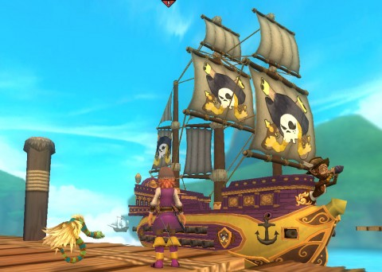

Back to: [West Karana](/posts/westkarana.md) > [2012](/posts/2012/westkarana.md) > [October](./westkarana.md)
# Pirate101: A Mysterious Map

*Posted by Tipa on 2012-10-23 06:58:46*

[caption id="attachment\_10372" align="aligncenter" width="480"] The Map to El Dorado[/caption]

So I picked up my mail -- paper mail that comes in a box you open with a key in real life -- yesterday, and was surprised to find a folded up bit of cardboard from KingsIsle that popped up into a map torn into seven parts and painstakingly re-assembled.

Given that I'm looking for pieces of the map, this same map, in game right now was a nice bit of synergy. It was a map of the Spiral, with worlds known and unknown on it, and some of them had numbers and letters next to them.

Following the clues, I figured out the code, typed it in to the Pirate101 website, and got my reward:

[caption id="attachment\_10373" align="aligncenter" width="317"] Ninja Pig companion![/caption]

A ninja pig? I had a "thing" for ninja pigs back in the day. I once built a wizard that used ninja pigs as main attacks, had a ninja pig pet and wore a ninja pig costume.

So yeah. Mr. Pig became my immediate first mate, and I went out to hunt and slay and in every battle, a teammate would mutter, "Some pig!"

Actually, they'd ask where I got it.

I went to the Pirate101 forums to try and discover the origins of the mysterious map and it turned out to have been sent to all Wizard101 players who live in the United States and have given their real mailing address to KingsIsle.

This angers non-W101 players who don't live in the US and never gave their address to KI anyway, for instance, free players who redeemed game cards for access.

Naturally, the forums are in an uproar.

But, there is a solution for those who don't get their own map! Each code can be used four times... and that means those with pigs have three to give away.

I don't know if they are all Swashbucklers, though. I really have enough swashbucklers and buccaneers on my crew. I could really use a privateer; don't have any of those. And some of my crew would be happier keeping my ship, er, ship-shape than coming into battle.

Anyway, was planning on playing GW2 last night but had to take the pig out for some battles. I learned that the next world isn't El Dorado, and in fact that fabled city of gold may never be on the agenda. My next destination is the world of Valencia, in keeping with the Spanish theme of the game, I guess, and almost certainly full of puns about oranges.

[caption id="attachment\_10374" align="aligncenter" width="480"] The Dona Sofia[/caption]

Since my current ship, bought on the docks of Puerto Mico, wouldn't be seaworthy enough to navigate the haunted realm of the Avernus Skyway and make it whole through the storms that shroud the Valencia stormgate, I was given the Dona Sophia, a light Monquistador skiff.

I'd saved all my pieces of eight to buy the Scrimshaw galleon, but had been holding off on it because I'd heard there would be an equivalent ship given to me. I was able to transfer some gear from my old ship, and buy new gear at the Monquistador Ship Parts vendor in Puerto Mico... except for a new set of anchors. Couldn't buy one that fit in Puerto Mico. Couldn't find any that fit in Scrimshaw. Maybe they'll have a set in Monquista; I have to finish up the Tierra Primata sidequests before I head to the orchard, anyway.

[caption id="attachment\_10375" align="aligncenter" width="480"] The origins of the Clockwork Armada[/caption]

Captain Avery treated me to another puppet show cinematic describing the creation and rise of the clockwork soldiers and the terrifying Clockwork Armada, from which all Pirate101 players escape at the beginning of the game.

I won't meet the Armada quite yet -- the route I'll be taking into Valencia is not guarded by the Armada -- but for the first time, the plot of the game is being told. I and all the other pirates must come together and form a fleet as powerful as the Clockwork Armada. And I will be shocked if I don't meet the Clockwork commander, Commander Kane, at some point.

[caption id="attachment\_10376" align="aligncenter" width="480"] The Elite Court of Commander Kane[/caption]

While on the forums last night, for the first time, I found the complete list (so far) of Pirate101 worlds. They are: Skull Island, Monquista, Valencia, Cool Ranch, and ... MooShu.

Significantly, there is no El Dorado on that list.

## Comments!

**[Eddie Moore (The Marvel Seer)](http://Pirate101Loot.com)** writes: I run a pirate101 Fansite and would love to know if you would share your code. You can use it up to 3 more times. 
If yes please drop me a mail. 
Thanks
Edward

---

**dead-eye dylan** writes: is there any chance that i might be able to get one of the codes off of you?

---

**[dylan webb](http://pirate101)** writes: well my pig is a swashbuckler and i am kinda happy about that because its my first and i have way to many buccaneers and musketeers but i thought that since it said a powerful ally i misunderstood because my friend got one and i thought he would get a different companion

---

**TrainerConnor** writes: do you have any more codes? :D

---

**Hamza** writes: Can i please Have a code man?? I will do anything for one, just email me
hamzasayyid@gmail.com THANKS

---

**[Tipa](https://chasingdings.com)** writes: I don't know if all the codes were used, but read this --> https://chasingdings.com/index.php/2012/10/26/pirate101-ninja-pig-codes-omg/ and maybe you'll be lucky :)

---

