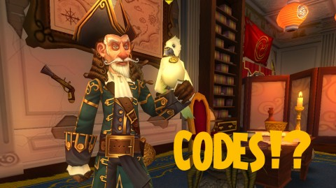

Back to: [West Karana](/posts/westkarana.md) > [2012](/posts/2012/westkarana.md) > [October](./westkarana.md)
# Pirate101 Ninja Pig codes? OMG!

*Posted by Tipa on 2012-10-26 08:18:33*

[caption id="attachment\_10380" align="aligncenter" width="480"] But only three![/caption]

This week, KingsIsle sent a mysterious map to all of its US-based Wizard101 players for whom they had valid mailing addresses. Those maps had a puzzle that revealed a code for a ninja pig companion (swashbuckler) that could be used four times -- but only once per account.

Well, I used my code, got my pig, and now I have three codes left. And I'm going to give them away.

Now, I may occasionally get codes, and how to give them away fairly is always a big issue. So here's the deal. I'm just going to give these and all others that may arrive in the future, the same way.

I'm just going to give them away on Twitter.

My Twitter handle is [tipadaknife](http://twitter.com/tipadaknife "TipaDaKnife's Twitter").

I'm going to go right now and post the codes in Twitter in the five groups from the map -- except BACKWARD.

So the last group would be the first group and so on. So if the code in Twitter were AAAA BBBB CCCC DDDD EEEE, enter EEEE DDDD CCCC BBBB AAAA. Got it?

Anyway, the code only has three uses, so good luck!

## Comments!

**[Winged Nazgul](http://wingednazgul.blogspot.com/)** writes: TYVM for the code!

---

**[Tipa](https://chasingdings.com)** writes: No problem!!!

---

**Adam** writes: Did you ever find a sail for yer Monquistador Skiff?! I can't find one to save the life of me LOL

---

**[Tipa](https://chasingdings.com)** writes: I think I found mine on the Puerto Mico docks. It was the anchor I had trouble finding.

---

