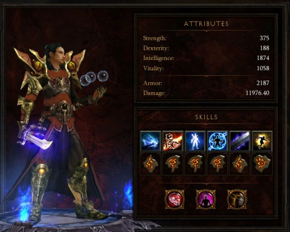

Back to: [West Karana](/posts/westkarana.md) > [2012](/posts/2012/westkarana.md) > [October](./westkarana.md)
# Game Log: Diablo 3

*Posted by Tipa on 2012-10-26 09:04:52*

[caption id="attachment\_10384" align="aligncenter" width="480"] Shoulderpads![/caption]

I tell ya, Blizzard loves shoulder pads [more than Joan Crawford](http://allaboardforskinkersswamp.files.wordpress.com/2012/07/joan-crawford-mildred-pierce.jpg). I knew it would be only a matter of time before my Diablo 3 wizard grew a pair. Of shoulder pads.

Started off small, buds almost, and now they're as proud as deer antlers. I can only imagine Typhus clashing shoulders with other young wizards out on the tundra somewhere when I'm not having him kill demon lords in some lost dungeon.

Anyway, DPS now just under 12K. I finally got rid of his "Chiangmail" robes. They were legendary, which meant I couldn't dye them (they just \_would not dye\_!), and they were this hideous shade of fluorescent green that not only was ugly, but couldn't be matched by any of the dyes I could find.

From the moment I first put it on, I'd been looking for an upgrade. I've had my eye on some iLevel 60+ robes with reduced level requirements that come on the AH and occasionally are affordable, but it was only today, a day I'm taking off work, that I could play the AH well enough to actually find new robes that were better than the legendary and, most important, able to be dyed. I matched them up with new shoulder pads and new bracers for a substantial boost in DPS and very fashionable looks.

Sunday we'll probably finish Act III and maybe even Act IV, bringing us to the Hell difficulty. We totally ruled at Monster Power 5 last Sunday, with lots of levels and loot for everyone. If I'm starting the party again this week, gonna notch it up to Monster Power 6.

Everyone ended the group at level 49 I think, or close enough, and we should be pretty overleveled for Diablo when we meet her at this rate. Which is all good; I would prefer to be closer to 55 than 50 when we start Hell mode so we can keep using Monster Power. I think this was the first week in a long time that people were actually finding upgrades in the loot that dropped.

