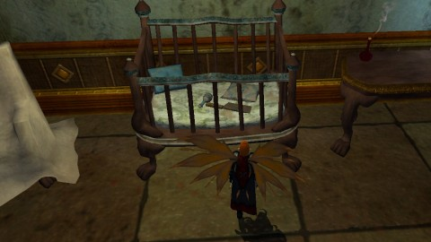
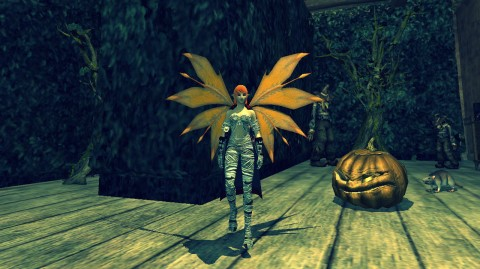

Back to: [West Karana](/posts/westkarana.md) > [2012](/posts/2012/westkarana.md) > [October](./westkarana.md)
# EQ2: Nights of the Dead

*Posted by Tipa on 2012-10-29 22:46:10*

[caption id="attachment\_10401" align="aligncenter" width="480"] Plants vs Zombies.[/caption]

I enjoyed the Guild Wars 2 Halloween celebration, what I saw of it. I might as well have just stayed hidden at the side of the fight and just watched, because I was too low level to contribute (even though artificially leveled to 80 for the event). Folks were reminiscing about the Halloween celebrations in GW1 and EQ2 and I started thinking, hey, I really liked the Halloween celebrations in EQ2, too... why am I not over there \_doing\_ them?

And that's what I did. Patched up EQ2 and headed to Loping Plains for that haunted house.

[caption id="attachment\_10402" align="aligncenter" width="480"] A bone saw for every crib[/caption]

I'd done this one before with various characters. It was a lot easier for the berserker. I'm thinking maybe focusing on the troubadour and the defiler weren't the best choices for success in soloing. Berserker SMASH.

Hey, while I was getting lost in the new Qeynos, I found where you can hire mercenaries to follow you around and help you stay alive. Mercs were a (literal!) game changer for EverQuest, but EQ2 supported some level of soloing for all classes, so it would seem a little too much of a good thing, I'd think, but... I saw lots of people with them. I don't have any, I don't have the necessary expansion. But if I did return to EQ2, I would probably get a cleric because in non-Halloween events, stuff hits hard. Sinking Sands (is that right?) and the tougher bits of Lesser Faydark are the places for level 60 characters to level, and I could handle those, but at 65 comes Kunark and Loping Plains and those places HURT.

[caption id="attachment\_10403" align="aligncenter" width="480"] Aaaaaaaagh![/caption]

Yeah, I jumped when that screamed onto the screen. I ALWAYS jump. There was some random item that used to spawn that jumping zombie when you'd enter your home. I placed it unawares, and had to deal with that thing again and again until I figured out which item triggered it.

I was scared to go \_home\_. That's just not right.

So that was the Loping Plains vampire house and the Antonica haunted house. Next up was the hedge maze.

[caption id="attachment\_10404" align="aligncenter" width="480"] That's going to leave a mark[/caption]

As usual, I used a map to get through the hedge maze. I wanted to get on with my life, especially since the next (and last) event, was new to me -- had never done it before. That was the Plants vs Zombies event above.

You enter an abandoned beach-side village. A lost girl had run in upon hearing the screams of the dying... this little girl has absolutely no survival instinct. Her parent on the beach wouldn't think of trying to rescue her him or herself, wants you to do it. There could be loot.

Oh. Loot. BRB.

Inside, the girl is cowering in the middle of a ring of scary cottages. She said she tried to use the weapons at the houses, but they were too heavy. And the odd plants were fighting zombies!

Running around the circle of houses, there's the weapons (appearance weapons: splintered planks, frying pans, brooms, etc). And there's the plants. They can be picked up and moved. So I picked them up and made a field of them near the girl, then asked her to start the event.

All I had to do was run out, taunt some zombies, pull them back, then help the plants kill them. It was so much like EQ. Eventually the girl's doll (that she had lost) came to terrifying life and tried to kill us all. Don't usually see that kind of behavior in dolls from QUALITY shops.

[caption id="attachment\_10406" align="aligncenter" width="480"] Mummy![/caption]

Total rewards: a "sexy mummy" outfit, a jack-o-lantern pet, several plushies, another section to my homegrown hedge maze, some random banners, tapestries and furniture, lots of appearance armor, and the starter for the Headless Horseman raid. Who was up, by the way.

So, who had the better Halloween event? Well, for my money, EQ2 has to win over GW2. EQ2 events scaled to my level; GW2 scaled me up but made me useless, and the game crashed a couple times.

I think level 80s in GW2 would have a far better time.

Would I go back to EQ2? That, I don't know. EQ2 does a lot of things right, but once at max level, you have to deal with the same sort of overachieving minmaxers who make life hell for the newbs in WoW. (Though if you tell someone in WoW that you have no high level characters and your level 72 rogue is, in fact, your high level character, they will not believe you and assume you are hoping to get more loot with a fake sob story).

That said, I loved seeing my home again with all my Fortune League trophies and pets and the full bar and my horror room, and I liked my leaping lizard mount. Boing. I'd love to join a group except a group would expect me to know how to tank or do dps :P I haven't done the RESEARCH.

## Comments!

**Zygwen** writes: I like the sexy mummy outfit but I found that instance to be a bit too long so I only did it once. Not sure which toon will use the outfit though.

---

**[Tipa](https://chasingdings.com)** writes: The Plants vs Zombies one? Yeah, I didn't mind it too much -- it was new to me -- but given that I did all the other Nights of the Dead quests for the title, it was the end of a long play session :) Especially since the joke of the zone, that's PvZ, and all you have to do is place the plants and pretty much go AFK except for the final boss, meant they drew it out a little long. Though I suppose for more challenge, people could opt not to use the plants.

The Hedge Maze is the one I hate. I always get lost, always takes forever, and having to retrace the entire maze for the Train to Zone quest means yes, I am going to use a map.

---

**Sirhyl** writes: What server are you on? I started playing again recently on AB. also you said the events scale to your level? I may have to go check them out, I assumed they were all max levelish things.

---

**[Tipa](https://chasingdings.com)** writes: Still on AB myself :) Look me up, playing Scatterfall.

---

