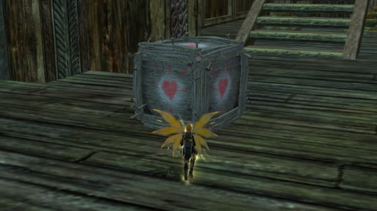

Back to: [West Karana](/posts/westkarana.md) > [2013](/posts/2013/westkarana.md) > [April](./westkarana.md)
# Game Dump: DCUO, EQ2, GW2

*Posted by Tipa on 2013-04-02 06:17:08*

[caption id="attachment\_10813" align="aligncenter" width="480"] Brainiac dailies[/caption]

Didn't take any good screen shots in our Sunday game of DC Universe Online, which was kind of a downer, because it was a really good night. Kaptain KY said he was going to be a little late, so instead of starting with missions, we went to the Brainiac Incursion zone in Gotham City to try and find some Sub-Avatars to kill. I think Spode or Sting hadn't yet done the dailies, so we just started killing everything we saw.

Kaptain KY logged in, and we did his dailies, killed a couple more Sub-Avatars, and queued up for the daily double T1 mission, Watchtower Containment Facility. There's a jailbreak in the Watchtower's prison, gorillas everywhere, and Brainiac drones have subverted the guard droids and are turning the reactor core into a monster.

So, we killed them all, then spent a quarter of an hour finding all the green and blue discoveries.

We had more time, so we queued up for T1 Area 51 and did that no problem. We're overgeared for T1. At the end of the night, KY had the marks to finish up his T1 armor set, getting him a CR of 44 and opening T2 missions for us. 

My CR had been 48, but when I socketed my gloves, it dropped to 46. I'd have thought that would be impossible, especially since I had a socket affinity and it raised the level of the gloves by six. My first piece of T2 raised my CR to 47, but I'm still way behind Spode and Sting.

[caption id="attachment\_10814" align="aligncenter" width="480"] Loot is your only friend[/caption]

EQ2's God of Mischief is back in Norrath, and aside from the regular quests of the season, his influence is spreading throughout the entirety of the game -- even to replacing the treasure chests in the Daily Dreadcutter with friendly little boxes that love you.

I did the quests for the house items; the quest for this cube as a house item is really simple, if you can track shinies. Still my favorite tradeskill ability!

[caption id="attachment\_10815" align="aligncenter" width="480"] So blocky![/caption]

ArenaNet's taken a ride on the 16-bit train by opening a retro-looking platformer within the game, just for the month of April. So, that got me to patch up and log in again :) Found out pretty quick that I wasn't very good at retro platformers, even at "Infantile Baby Cannot Feed Self Here Let Me Help You" mode. Nothing like a little humiliation to put you in your place, right?

In "Infantile" mode, you're told exactly where to go, and all the difficult jumps have rainbow bridges to make things easy, and the gates to the next section light up to show you which button to press.

The game is split into worlds, and within worlds, into sections, similar to Super Mario. I made it to the end of the second world before I lost all my lives and had to exit. I bet there is a way to not get burned by the pools of acid....

Am I caught up now? Yup.

## Comments!

**[Egat](http://www.orcpawn.com)** writes: I've never started playing an MMO that was already using the F2P method, rather I've always been a subscriber when they re-launch the game as F2P. I'm downloading the DCUO client as I post this with an eye to trying it out. I've never given much attention to superheroes before but they are the popular theme in my new office. Let's see where this takes us.

---

**[Tipa](https://chasingdings.com)** writes: Let me know what you end up with :) DCUO is a far deeper game than it appears at the start.

---

