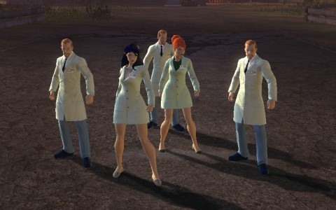

Back to: [West Karana](/posts/westkarana.md) > [2013](/posts/2013/westkarana.md) > [April](./westkarana.md)
# DCUO: Outer Caverns and Smallville

*Posted by Tipa on 2013-04-15 06:50:53*

[caption id="attachment\_10819" align="aligncenter" width="480"] Beating up the Bats[/caption]

After last week's very narrow defeat by the Scion of Fear in the STAR Labs Research Facility, we were all kinda hoping that STAR Labs would be, again, the daily double. Spode and Sting have in the last week both ascended to Tier Threedom and are sporting new armors and higher combat ratings, while Kaptain KY and I still suffer in Tier 2.

No such luck; last night's daily double was Batcave: Outer Caverns. A bit of a backstory -- bat-story? Batman, distrusting the godlike powers of meta-humans, created the semi-sentient satellite Brother Eye to collect data on all Earth's superhumans, and their weaknesses. What could possibly go wrong? Well, pretty much everything. Now, Brother Eye is devoted to turning supers and civilians both into cyborg-like OMACs and using them to destroy all humans.

THANKS, BATMAN!

In the Outer Caverns, Brother Eye has compromised the Batcave defense systems. Batman thoughtfully constructed these defenses using the same tech he used to create Brother Eye, and thus were as easily corrupted and controlled by Brainiac as the Brother Eye satellite was.

Batman is nowhere to be found. Nightwing, Batwoman, the Huntress and Robin v2 are trapped inside. Oracle insists that we, Team Spode, must go in and do the saving.

We had a couple wipes, but the boss mechanics weren't that hard to figure out. Once we guessed the script, the bosses died. We came eventually to the room where Nightwing was trying to get through the shield surrounding an EMP device which would overload the Brainiac-controlled defense systems and allow access to the Batcave. He wasn't having much luck. Since our powers come from exobytes, that (for some reason) makes us immune to the OMAC virus. No such luck for the Bat family. (Still to answer: why the usual DC heroes and villains cannot themselves get exobyte powers? None of the four heroes here are meta-humans).

Brother Eye transforms the heroes into OMACs BW-01, NW-01, R-01 and HT-01, so now we have four heroes with cyborg powers attacking us. We knew the moment we set eyes on these guys anyway that we'd be fighting them, so shocked, we were not. The trick here, we eventually figured out, was to defeat all four of them simultaneously. This would send them to their respective shield generators, where they could regenerate safely without being attacked by us. Using the generators in this way weakened the shield around the EMP device, so with all four down, the EMP would become unshielded, and we could trigger it to end the fight.

This, we did. First try, even, but it took awhile to figure out what was happening.

[caption id="attachment\_10820" align="aligncenter" width="480"] Here's your lab coat and your PhD, now go do science.[/caption]

Must be nice to be an engineer or a scientist in the DC Universe. Your mechanism or virus or whatever may go horribly wrong, but it's never going to be caught in a null pointer error and just stop working entirely five minutes after start-up. No, it's gonna take Superman to install a breakpoint in THAT code.

Since we had extra time after Outer Caverns to do a T1 alert, and the T1 daily double being one we'd never done before, Smallville, in we went.

In Smallville, LexCorp has been testing a virus built from Doomsday's (the guy wot killed Superman once) DNA on the hapless citizens, turning them into mini-Doomsdays. Superman couldn't do anything because he might get infected by the virus and spread it elsewhere. Once again, Team Spode's puzzling immunity to these things meant we were the supers best suited for the job of clearing out Supes' home town.

First we defended data analysis devices from...... Wait. Stop.

Ya know, I want just rant for a second. Why is Lex Luthor, a known criminal whose very existence puts the world at risk, allowed free reign to experiment on people? LexCorp didn't just set up shop yesterday. They have a big presence here. And after we finished the instance (with a little help from Black Canary, Green Arrow, the Tornado and someone I can't remember), Lex wasn't arrested or anything. The Joker, the Penguin and every other supervillain and their minions are allowed to kill whomever they want, any time they want, and are never called to account.

Even, in the comics, when they are arrested, they are just let free to kill and kill again. What good are the superheroes if they can't even permanently deal with these very real threats? The USA went to war against the Middle East for a dozen years because terrorists killed three thousand Americans, but against these villains who would call three thousand deaths "a decent Monday", nothing. Slap on the wrist. Revolving door back to the street to kill again.

At least stick these guys in the Phantom Zone. Sure, people get out occasionally, but it's tougher.

Anyway. So yeah, eventually we confront the scientists performing the experiments, who all apparently have no problem with killing off a Kansas town. Team Spode donned lab coats to get in close and... relieve them of their responsibilities. Eighty times. Eventually we were all infected by the Doomsday virus and became mini-Doomsdays and beat the crap out of the lead scientist.

Record scratch -- weren't we sent in BECAUSE we could not be infected? Sigh.

With that done, we found an old Doomsday in a barn. Since we'd defeated the scientists, the JLA felt safe in sending in some help. We had to lure Doomsday near some reactors, we'd drop the shields on those, reducing DD's defenses, and then we'd move in for the kill. And that was it, that was the instance.

I think I ended the night at 158 marks and CR 50. It'll take some Brainiac dailies this week to get enough marks for another piece of T2, but I don't know if that will get me to 53 and the free marks from Central City. I'll probably end up having to run more T2 solo instances, even though some of them take frickin' FOREVER.

And I STILL haven't defeated the Penguin.

