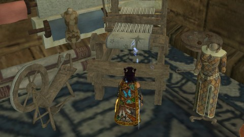
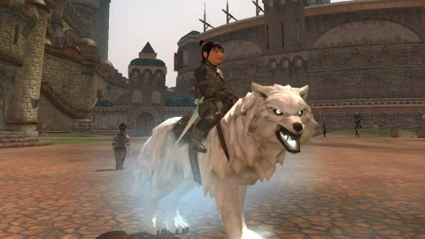

Back to: [West Karana](/posts/westkarana.md) > [2013](/posts/2013/westkarana.md) > [April](./westkarana.md)
# EQ2: Norrath (and I) prepare for GU 66.

*Posted by Tipa on 2013-04-19 07:50:49*

[caption id="attachment\_10824" align="aligncenter" width="480"] WoW Invaders in Darklight Woods[/caption]

The mood in EverQuest 2 is one of quiet anticipation as the world waits for Game Update 66 on April 30, which brings with it the modern rethinkings of the original EverQuest zones of Cobalt Scar and Siren's Grotto. Cobalt Scar will be an open-world adventure zone with a strong story line, while Siren's Grotto appears to be a series of instanced dungeons, likely in the quest/solo/heroic/raid variations we've come to expect.

Quiet anticipation? More a sense of quivering rage, at least if you listen to the public chat channels. GU66 will apparently nerf the Kunark plat dungeons, old raid dungeons, now soloable, that drop enough plat so everyone on the raid could get a little. A fifteen minute dungeon run can net 100-150 plat, which fuels the SLR (Selling Loot Rights) market, where non-raiders buy raid-quality loot for the plat they farmed from Kunark.

This is the kind of uncontrolled, player-run marketplace that game developers hate.

Also causing tension: the new game update has people worried all the raid gear they just paid good plat for will be made worthless by Cobalt Scar quest gear. Hey, get used to it. I'm guessing that this game update, not being a full expansion, might improve upon Chains of Eternity quest gear, but I doubt it will encroach upon the CoE group or raid gear. I expect stats in the 160 area.

Top picture: One or two EQ2 guides attempt to control four NPCs in a stunning display of multi-processing. These busy guides were running events all night. I offered to collect the pandaren monk's pelt, but he refused to give it over. Coming to an evil zone like Darklight Woods and trying to get an assassin to bring you some cake? Not gonna happen. But a pandaren rug would look good in her Neriak inn room.

[caption id="attachment\_10825" align="aligncenter" width="480"] Tipa the Transmuter[/caption]

I take so much extra gear out of the Daily Dreadcutter, more than I'll ever use for my characters, that my lack of any transmuting ability has become a real problem. My main characters, Scatter and Dera, need high level adornments, and the only way to get those is to transmute high level equipment for the necessary ingredients. 

Now, Scatter had finished the "A Gathering Obsession" quests and gotten the Cloak of the Harvester, which includes +25 to the Transmuting skill, a legendarily expensive skill to raise. But Tipa the Troub, who had gotten a little skill in Transmuting years ago, did not have this cloak. She's my designated transmuter. Past few nights, I've been doing the harvesting quests, depositing the rares into the guild harvesting bank. Because once she had the cloak, she'd be making rare tailoring items from those harvests in order to transmute them for skill-ups. As of last night, she can transmute level 29 and below items.

How to get a large supply of level 29 and below items without going broke on the broker....

[caption id="attachment\_10826" align="aligncenter" width="480"] Tipani the Swashie[/caption]

Tipa struggles every day with the burden of not being a dirge. One possible solution: betray her beloved Freeport and change classes to dirge at the same time. This would delete all her masters -- she's almost completely mastered all her level 80 abilities. I've been reluctant to do so, even though having level 80 masters is pretty pointless when the level cap is 95 and none of those masters will be of the slightest use.

Brightknife, seen in the top picture, was my answer to having available a useful scout class, an assassin. But assassins are particularly difficult to level, solo. I was leveling her via the dungeon maker + experimental armor route until that was nerfed. Since then, she's just sat in limbo while I decide what to do about her.

I figured I could solve BOTH issues by creating a hybrid scout -- one of the Brawler classes, brigand or swashbuckler, which have both tanking and DPS capabilities. Make it a halfling, and clone Tipa's appearance, and it's just like Tipa suddenly became useful.

I leveled her to 12 and then turned xp off entirely, working on AA and farming those low level transmutables. Her heroic efforts allowed her gene donor, Tipa, to become able to transmute items up to level 13. Since then, Tipa has run with stuff she can make and break herself.

Here are some good questions: Why isn't your main, Scatter, your transmuter? She ALREADY had the cloak, and Tipa's transmuting wasn't as high as you thought you remembered. Why don't you betray Tipa to dirge and start grouping? Do you really want to take another scout all the way to the painful levels? Do you really think there is some sort of magic xp combo that is going to lift you from 80 to 95 without having to do the tedious Withered Lands/Chains of Eternity quest grinds?

Gosh, those are all excellent questions.

[caption id="attachment\_10827" align="aligncenter" width="480"] Brutal Skullcrusher[/caption]

Old Crimson Eternity guildmate Caldabuse AKA Neiabuse AKA Cambrian Man recently put his gnomish spring-loaded cart on the EQ2 Player Studio. That cart is now featured in Scatter's South Qeynos mansion. He was designing a kind of soul sucker mechano-magical hammer for his EQ2 character when I mused in his hearing that EQ2 really didn't have a good, spiked skull mace, suitable for halfling inquisitors like, say, Dera.

He was shocked, and [immediately set to work](https://plus.google.com/107756584030623598910/posts/bYVNPScddow). The results are frickin' AMAZING. I really am hesitant to tell him my ideas for a matching bone-and-iron shield :) But not hesitant enough to hope he reads about it here.....

Bones going vertically, connected together by spiked iron shafts, with additional spikes coming out of the intersections. Spikes. Spikes. Spikes. Rawr.

What else. Oh yes. The player-run Blood Moon Festival is this weekend on the Antonia Bayle server -- don't have more specific details, but shouldn't be too hard to find.

## Comments!

**[pkudude99](http://nomadicgamers.com)** writes: Interestingly enough, I found that transmuting was only expensive to raise in the 40-50 point range, as it was next to impossible to find enough gear in the level 8-10 range that you needed to transmute in order to get over that bump. But once past there, I found I could transmute about 20 items then sell the resulting materials for far more than I paid for the items, which funded buying the next 20 items, and repeat ad nauseum, max out transmuting at 450/450 (this was a couple of years ago. . . ) and have about 150 plat MORE than when I started, which was plenty to buy more items to use the mats for myself making my own adornments.

TL;DR -- I too was told it was expensive to level transmuting, so I avoided it for a long time, but once I did it I actually made money leveling it up.

---

**[Tipa](https://chasingdings.com)** writes: I hadn't even thought of selling the transmuting results; I just put them in the guild harvest box so adorners could use them. So last night I went to broker the stuff. The prices, though, even for the rare infusions, was super low, well below the cost of the components I'd bought to level up.

Hoping things improve -- can break down stuff in the level 50s now.

---

