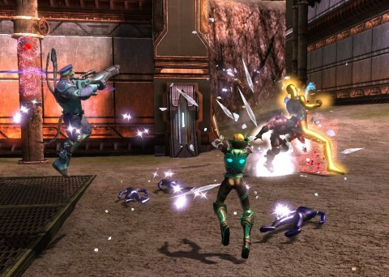
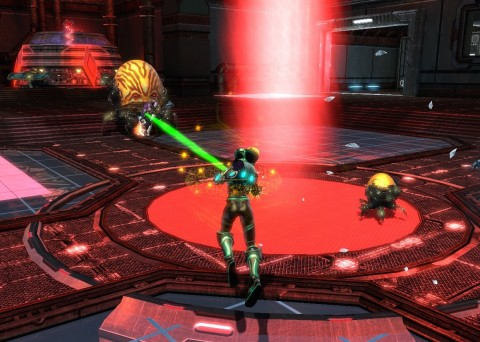

Back to: [West Karana](/posts/westkarana.md) > [2013](/posts/2013/westkarana.md) > [April](./westkarana.md)
# DCUO: Still the Walrus

*Posted by Tipa on 2013-04-22 07:06:12*

[caption id="attachment\_10830" align="aligncenter" width="480"] Return to Oolong Island[/caption]

I haven't played DCUO all week. All my gaming time has been spent on EverQuest II and other, single player games that I'll talk about this week. The DCUO grind is just getting to me. I need a change of scenery... but that just might be in the cards, pretty soon.

Last night's Tier 2 daily double was Oolong Island, hard mode. The "easy" mode version wasn't one of our favorites; it took us three sessions to get past the Tornado Tyrant the first time around, and we only beat it in the end because we pretty much leveled out of it. The follow-up encounter with the supposed boss of the instance, Chang Tzu, was relatively painless in comparison.

That all changes in hard mode.

[caption id="attachment\_10831" align="aligncenter" width="480"] Chang Tzu cracks me up with his yolks[/caption]

While all the encounters, including our favorite, the Tornado Tyrant, had some new moves, we adapted and moved through them easily enough. Oolong Island really needs to deal with its pterodactyl issue, though. A good, breeding colony of T Rex's should do the trick. Look into it, would ya, Tom Morrow?

Chang Tzu himself, though, had hatched up some new tricks. We couldn't help noticing the inactive robots standing around his lair, and hey, lookit that, we can jump right into them, making all our Robocop dreams a reality. Didn't seem to make us fight any better; they were worse than our regular powers by far.

There were adds, but they were less of an issue, now that I've figured out how to play a controller and could... control them. A little. I was doing mana regen and dps and nothing else our first time around -- then I opened up the DCUO forums and went to school.

Anyway, murder the adds -- check. Try to avoid electrified floors -- check. Shut off the computer consoles sparking like James T Kirk had just asked for Warp Factor 11 -- ch... hold on. Those HURT.

After a couple wipes, we figured out that the android suits would protect the wearer from the sparks (but not the adds they summoned). So person in android suit starts to shut off computer, group kills adds from range, android suit continues to shut down the computer. We had to do that a few times. Also, sometimes Chang Tzu would turn one of us into a mini eggman -- yolks on us, right? Once we figured out the trick with the android suits, though, we finished the fight and the instance and collected our rewards.

With half an hour or so left to the night, we went and did the Tier 1 daily double, Area 51. This is almost an old friend, now. We blew through it at speed (though not fast enough for the speed run achievement, apparently) and got our marks.

With the marks from the night, I was able to get a new T2 BP, bringing my combat rating to 52 -- just one away from 53, tier 3 and The Flash's home town, Center City. Socketing the new bp \_might\_ do the trick, but it's likely I'll need one more piece of T2. 

For the marks to do that, I'll need to defeat my nemesis in his lair.

I'll need to clip The Penguin's wings.
