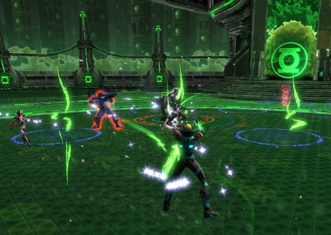
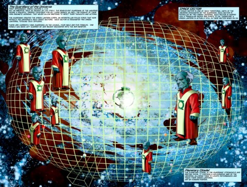
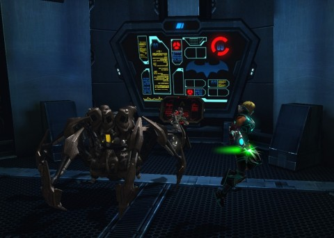

Back to: [West Karana](/posts/westkarana.md) > [2013](/posts/2013/westkarana.md) > [April](./westkarana.md)
# Team Spode at the Far Side of the Universe

*Posted by Tipa on 2013-04-29 06:54:12*

[caption id="attachment\_10838" align="aligncenter" width="480"] Oa Sciencells[/caption]

There's just something about the Guardians that I don't understand. These are the blue, gnomish creatures who, in the DC mythology, were among the first beings in the universe, and the ones tasked with keeping order in the cosmos from their planet in the center of everything. The instruments of their will are the Green Lanterns, each of whom are assigned one of the 3,600 sectors of the universe to patrol. Given that there are hundreds of billions of galaxies in the universe, meaning each single Lantern is responsible for millions of galaxies, it's odd, isn't it, that Earth alone gets FIVE Lanterns?

I'm thinking the DC writers had a little problem with the scale of the universe.

[caption id="attachment\_10840" align="aligncenter" width="480"] The Guardians of the Universe[/caption]

Anyway, these all-powerful gnomes (go gnomes!) kill the members of their own eminently replaceable Green Lantern Corps with hardly a thought, allow planets and even whole sectors to be dominated or entirely destroyed by powerful threats, and, aside from the largely autonomous Corps, prefer to keep apart from the day to day concerns of the universe. It's these amoral munchkins that have such care for the most fiendish and powerful enemies that they keep them penned up, ON THEIR CENTRAL PLANET, in a prison called the Sciencells. Here, the interstellar criminals are kept alive and healthy in perpetuity until they are allowed to escape and wreak destruction throughout the universe once again. They are now able to use the infinite power of the planet Oa, to which they were brought, in case they couldn't make it there themselves.

Criminals are breaking out -- all the time. These fiends are using the power of the Central Battery against the good people of the universe -- all the time. Millions die as a result -- all the time. How is this a good idea, Guardians? And why does anyone still respect your authority, since you clearly suck at decision making?

Unable to police their own planet, the Guardians have called upon Earth's original second string Lantern, Guy Gardner, to keep them safe from the danger they themselves created. And when things go bad in the ScienCells, Gardner doesn't call upon his fellow Green Lanterns, or the internal-affairs-ish Alpha Lanterns -- he calls upon Team Spode.

Budget superheroes with borrowed powers from the future, the Booster Golds of the universe, Team Spode.

[caption id="attachment\_10839" align="aligncenter" width="480"] Hacking the Batcave[/caption]

We started the night with the Brainiac dailies in Gotham City. There were two sub-avatars up, and while Lord Spode is pretty powerful, two avatars were too much even for him. The rest of us sped to his aid and helped take down the marauders, then completed our dailies.

The daily double Tier 2 mission was the Outer Caves. We'd just done that a week or two ago, so we decided to do one we hadn't yet tried, the Oa Sciencells. This brought us to Oa, the planet at the center of the universe, to deal with the universe's worst intergalactic threats.

These turned out to be Red Lanterns and some other minibosses I didn't recognize. The boss with a rogue ~~Lantern~~ *Guardian* named ~~Kronos~~ *Krona* who killed us a couple of times until we figured out his trick. He crouches down occasionally turns around, sending a beam of destruction that harms not only we fragile heroes, but also the dozens of adds that are also escaping the cells. All you really have to do is just get behind him as he kills the adds, then continue taking him down. Simple, really -- and since it's an arena-style instance, you don't even have to move. All the enemies come to you.

With that done, we finished up with the Outer Caves -- we just tore through that, getting a speed achievement for it. Once you know the tricks to these things, they get a lot easier.

Helped as well by Spode and Stingite being in Tier 2.5 armor from Central City. Though I got an upgrade last night (the mask, finally), my CR remains at 52, just one short of the new zone. Kaptain KY, though, eased into a couple new pieces and hit CR 51. Probably we'll be able to use next week's session to get us all into Tier 3.

It's really looking, though, like we'll need to start raiding in order to get the marks required for the super expensive Tier 3 armor. No idea how we're going to get that gear without raids.
