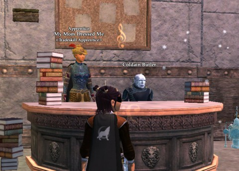
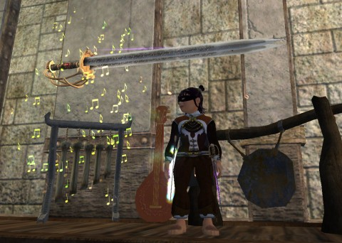
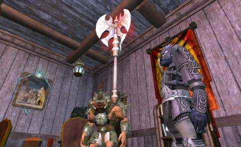
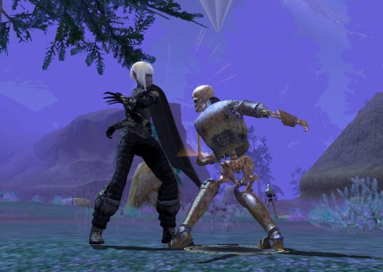

Back to: [West Karana](/posts/westkarana.md) > [2013](/posts/2013/westkarana.md) > [April](./westkarana.md)
# EQ2: Double XP Weekend Recap

*Posted by Tipa on 2013-04-30 06:16:39*

[caption id="attachment\_10846" align="aligncenter" width="480"] Passive Aggression in action[/caption]

Sure, EQ2 has its holidays and celebrations. But the events that REALLY bring Norrathians together are the Double XP Weekends. 72 hours (or so) of people finishing up old chores, dusting off alts, exploring dungeons off the beaten path... Anything can happen in a double xp weekend.

What'd I do on mine?

[caption id="attachment\_10845" align="aligncenter" width="480"] Tipa's Epic[/caption]

When I last posted about EQ2, I'd started a halfling swashbuckler to fill the empty space in my heart where a scout should be. I had Tipa, of course, but I really wanted someone more DPS-oriented than a troubadour. Of course, I could just betray to a dirge....

Which is what I did. I betrayed to a dirge. All her troubadour master-crafted spells and abilities went poof, so I took Scatterfall out to Kylong Plains and Stonebrunt Highlands to get enough rares to craft her expert abilities -- just one tier below master. I had my jeweler, Ardiana, craft those up. Then I sent Tipa out into Kunark to do the dirge epic quest. If I'd done the Epic Repercussions quest on Tipa, I could have just *bought* the Dirge epic, but I hadn't. At level 80, she was just too low.

Finished the fabled version of the epic, and started on Epic Repercussions, which separates the weapon's epic effects from the weapon and grants you the mythical version of those effects even if you've never done the mythical quest. I'd gotten a promise from a berserker friend on G+ to team up for the dungeon portions of the quest, but I'd have to hit level 85 ASAP.

But, double XP weekend. Several runs through Chelsith later, Tipa was at level 87 and had gained about 40 AA to boot. My friend and I and our two mercenary healers dominated the dungeons we needed to run -- until Vestigial Cella. That was just a little much for us. I logged in Scatterfall, my own famously crap-geared berserker, and tanked the rest of it. The next morning, I got help from a guildie in completing that instance for Tipa.

Tipa's report card for double xp weekend: eight levels, forty-something AA, and her enervated epic.

[caption id="attachment\_10844" align="aligncenter" width="480"] Scatterfall's Epic[/caption]

Being left with a cleared Vestigial Cella as a result of helping out with my friend's enervated epic was the inspiration I needed to get Scatter's done. She has the mythical version of her epic, but hasn't used it in ages as upgrades came and went. Getting those epic effects with her current weapon choices would be a good thing. Being a crap-geared berserker is no problem when running the older dungeons, especially since, typically, I only needed to kill the first boss or two in the ones before the Cella. And, my friend had shown me how to get through the Erudin Research Halls without dying so much. Dunno why I had so much trouble when I did these quests on Dera....

Scatterfall's report card: Enervated epic done, plus FOUR Sundered Frontier collection quests completed while harvesting Ulteran Diamonds for Tipa's expert abilities.

[caption id="attachment\_10847" align="aligncenter" width="480"] Teofila vamps it up[/caption]

A long time ago, I noticed that I'd gotten the Freeblood vampire race unlocked for free as some veteran reward or for being a legendary subscriber or something. And vampires eventually would get the ability to transform into a cloud of bats and fly around, which is utterly awesome. So I had to make one -- a fury. My idea was, I would do NO quests on this character except the ones that were absolutely necessary. I would level entirely by going to dungeons and grinding mobs. In one weekend, long ago, I leveled up through the Freeport newbie zones, explored the depths of Wailing Caves, and started in on Fallen Gate. Got the achievement for hitting 20 in less than two weeks, and then put the character away.

When a guildie was offering a spot in a powerleveling group to anyone in the 20s, I offered up Teofila. We blazed through Varsoon's, Nektropos Castle and Runnyeye in about an hour. Teofila's report card: an astonishing 23 levels. And now her gear and spells are soooo out of date that it will take a fair amount of work to make her viable again, especially since I deleted my sage (who would craft her spells) a long time ago to make room for new characters.

Kinda pointless, but I was getting bored running Tipa through Chelsith again and again and this was a chance to have some fun with some guildies. I camped the dirge out right there in the middle of Chelsith and went all fang and talon-y through the low level dungeons of Norrath with the vamp.

I did manage to play a little Neverwinter somewhere during the weekend -- and to go on a really good hike along the Metacomet Ridge here in Connecticut (so yes, I did get outside!). Today, though, Cobalt Scar and Siren's Grotto drop in the last game update, so.... it's going to be EverQuest II for a little longer.

Neverwinter will wait.

## Comments!

**[bhagpuss](http://bhagpuss.blogspot.co.uk/)** writes: In a typical piece of bad planning there's a very good chance that having thought about logging into EQ2 all weekend and done nothing about it, I will end up logging in next weekend instead. GU66 looks really intriguing and I was surprised to read that the explorable overland content only requires Level 90 and gear of Withering Lands quality. I'd been expecting it to be 93-95, which would have been out of my range since I have yet to buy Chains of Eternity.

So much going on right now, though. GU66, Part 3 of Flame and Frost in GW2, Neverwinter for skinflints. Why does everything always start on a Tuesday?

---

**[Tipa](https://chasingdings.com)** writes: Well, if the bar is set to level 90 gear, then maybe my casual-gear berserker and inquisitor can get groups!

---

**[Tipa](https://chasingdings.com)** writes: Forgot to mention that I got Dera her last eight AAs and brought her armorcraft to 95 as well.... I just really exploited the heck out of the double xp weekend.

---

