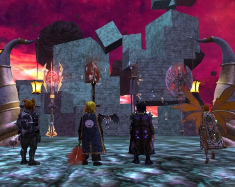
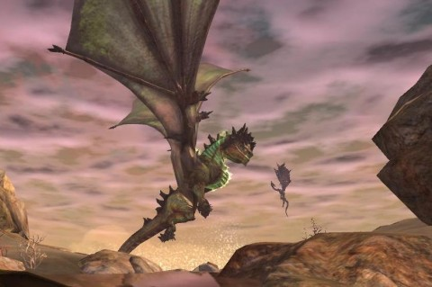

Back to: [West Karana](/posts/westkarana.md) > [2013](/posts/2013/westkarana.md) > [August](./westkarana.md)
# EQ2: Epic War

*Posted by Tipa on 2013-08-08 07:15:27*

[caption id="attachment\_10970" align="aligncenter" width="480"] Weapons of Powah[/caption]

My defiler, Etha, got her epic weapon over the weekend. It's a deadly spear with a disreputable history, an appropriate weapon for a defiler. (Etha is, of course, named after my original EverQuest character, about whom I've been sharing early, early EQ screen shots on Google+).

Etha's epic is the fourth for my characters, after Tipa's dirge epic (having previously done the troubadour epic), Scatter's berserker epic, and Dera's inquisitor epic. A good night in Skyshrine will get Etha the rest of her levels and AA, and then it'll just be grinding the Chains of Eternity and Siren's Grotto solo dungeons for gear for her.

EQ2 has, for me, become a little boring. For awhile, our guild was grouping and doing dungeons and I was having a lot of fun. A few important people left the guild, a few others stopped logging in, and now random grouping is the only option. I dislike random grouping. I've done it a bit, but it's always stressful. Today's real life surveillance society has nothing on EQ2; if you aren't measuring up, you'll hear about it -- or more likely wipe the group.

I've even found myself looking up players on EQ2U to check out their gear before grouping with them. Which means MY gear has to measure up, because people will be doing the same to me. Which means -- hours and hours grinding gear in the solo dungeons.

[caption id="attachment\_10971" align="aligncenter" width="480"] Kerafrym sizes up a snack[/caption]

The solo questlines are pretty fun, but short. The latest content dump, Darkness Dawns, brought a quest for an awesome cloak that ended with a challenging group fight (who tanked it twice for a random group? Me! Yay!) It also (we know now) set up the game's next expansion, Tears of Veeshan, by showcasing the game's Big Bad, the prismatic dragon Kerafrym, as you, the player, hand him the keys to the world's destruction. He was able to destroy the moon Luclin BEFORE you powered him up with one of those rare artifacts, the magic amplifying Tear of Veeshan. Now... all reality is on the chopping block.

Sure, we know that doughty raiders will stop Kerafrym on the brink in the expansion. But what will there be for non-raiders to do? SOE has said they will make the random dungeon finder useful. Previously, it loved serving up impossible groups that would just lead to death (like, a group of three, no healer, for a dungeon with mobs five levels above that of anyone in the party). Will this new one make balanced groups consisting of people with appropriate gear for the challenge? I dunno. WoW and Neverwinter manage it.

I get really stressed in random groups. As a tank, if anyone but me has aggro, I lose. It's my one job in a group -- keep the aggro, and have sufficient gear and appropriate abilities such that I don't overtax the healer. I'm fine with the latter, but get some wizards and assassins in the group blasting away and I sit there whapping ineffectually at a mob, using all the taunts I have available only to see it hit me once and then turn back to the wizard and all I can think is what a failure I am. The wizard or rogue could back off, sure, but it is their job to do astonishing damage -- they get graded, too, and if they're not doing THEIR best, THEY'VE failed.

Stress all around. I guess that's why I solo so much, even though I like grouping the best. And when I solo, I start leveling alts. So now I've got four.

Next up: the necro.

