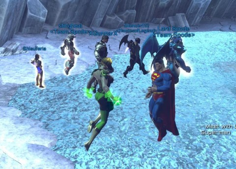
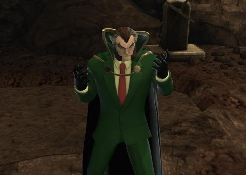
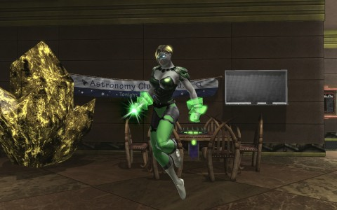

Back to: [West Karana](/posts/westkarana.md) > [2013](/posts/2013/westkarana.md) > [August](./westkarana.md)
# DCUO: The Fortress of Solitude!

*Posted by Tipa on 2013-08-19 07:03:05*

[caption id="attachment\_10975" align="aligncenter" width="480"] Hangin' with mah Supes[/caption]

Last week, we Spodians decided to shake things up a bit by, THIS week, trying to join a raid. You kinda have to raid, at some point. Almost every piece of gear costs Marks of Triumph, and the gear for the content you are doing typically requires a set number of marks. A typical Tier 3 "daily double" mission might give 150 marks; which isn't bad, except the T3 armor requires a couple thousand for each piece.

T3 raids, though, can give 500 or more marks per success. You can get the marks by grinding solo missions and joining pickup groups out of group night -- Spode and Sting went this route, and are waiting at about the combat rating cap for me and Kaptain KY to finish up with T3 so we can start on the T4 group mission(s) and be ready for the soon-to-arrive T5 missions with the next expansion.

The only solution: mixing in some raids on group night.

[caption id="attachment\_10976" align="aligncenter" width="480"] Ray Gold[/caption]

The daily double mission was The League of Assassins Stronghold, starring our fave Batman villain, Ra's al Ghul (pronounced by the voice actor, Raze-al Gool, which was unique). This is one of the easiest T3 group missions and we didn't have any issues with it. If we hadn't spent so much time trying to get the in-game voice chat straightened out, we'd have been done-and-done half an hour in to our night. 

We'd queued up for the raid FOS 3 -- Fortress of Solitude, Tier 3 -- before we'd gone on to do the mission. We were hoping to just do raiding the entire night. No immediate interest from anyone else, so we did our things in the Lazarus Pits, collected our marks, headed out to see that our forgotten queue had popped, and we were swept into the Fortress of Solitude along with four random heroes.

Superman and Lex Luthor were both there to warn us that General Zod and his pals Ursa and Nod had escaped from the Phantom Zone and were holed up in the Fortress. Supes wanted them gone from his home, while Lex figured there were more than enough Kryptonians on Earth already. Sting's wife was feeding us hints -- take care of the adds, tank the Kryptonians in the order in which they join the fight.

She might have mentioned -- don't attack minion medics when they put up their shielding or be killed, but we figured that out pretty quick.

It was pretty funny, actually. Once the random strangers had gotten themselves killed off and it was just Team Spode left alive and maybe one of the other people, we did pretty well, made it all the way to General Zod. But eventually there would be too few people left to do the job, and we'd have to start the raid off from the beginning.

We were sold on the idea of a one room raid, essentially a one fight raid, but a raid with multiple fights where a wipe didn't mean a restart might have been better for our first time out.

Then... the Incident that Killed the Raid. Some numbskull opened a vote to oust Kaptain KY. We were flabbergasted by that, totally unable to figure out why. Spode thought KY was trying to leave the raid, asked over voice if that was his plan, KY said sure, and his vote combined with the votes of the random strangers carried the day. KY was kicked, and so the rest of us left as well.

KY said later he wasn't feeling great after a long weekend, but I tell ya, that was a really crappy move by those folks. It was our first raid. There's going to be some bumps.

I spent the rest of the night hunting exobits, doing races, and working through some Atlantean invasion questline I stumbled upon, duoing with another Lantern.

[caption id="attachment\_10977" align="aligncenter" width="480"] The Teal Lantern?[/caption]

I paid station cash for green energy weapons to go along with the whole Green Lantern thing. Problem was, I play a TEAL Lantern, who represents "awkwardness" on the emotional spectrum. So for the time being, I reluctantly rejoined the Green Lantern Corps just so I could wear an outfit matching my hard light constructs. I'm the only one of Team Spode who hasn't won an aura yet, so I don't actually know what color my final outfit will be. This will do until then, though -- it would be nice if my constructs could be TEAL instead of green.

Next week, I don't imagine we'll be trying a raid again. KY and I are supposed to be hunting exobits and modding our gear to get to the magic 70 Combat Rating, which will unlock the T4 content for all of us. Spode and Sting have been there for awhile (and in fact, they are ready for T5). I did hunt quite a few exobits last night, so we'll see, maybe tonight, if I can bump my combat rating up a point or two.
## Comments!

**Lonchin** writes: Tipa, thanks for the memories, loved raiding with CE, those were the days. Be safe Hun

Lonchin
Evil in a nice way.

---

