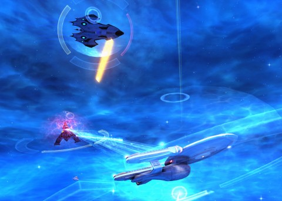

Back to: [West Karana](/posts/westkarana.md) > [2013](/posts/2013/westkarana.md) > [February](./westkarana.md)
# Star Trek Online: The Temporal Ambassador

*Posted by Tipa on 2013-02-02 13:19:00*

[caption id="attachment\_10632" align="aligncenter" width="480"] The Enterprise C and a time ship battle a Tholian fleet[/caption]

There's only so much reading about all the fun the people in the Federation News Service were having in Star Trek Online before I had to patch up, log in, and check for myself.

It's been a very long time since I last did more than just log in; since that time, the stalwart Publishers and Editors of FNS tirelessly constructed a starbase and even sent an embassy to New Romulus.

Since I've been gone, apparently the Rommies have finally found a new world to call their own. And, being Romulans, immediately set to fighting among themselves, since they don't (yet?) have the power to band together to conquer everyone else.

[caption id="attachment\_10633" align="aligncenter" width="480"] The USS Manchester approaches an anomaly[/caption]

My ship had been in space dock for the past year or so, being repaired and refitted while my bridge and duty officers took on additional training and some much needed time to reconnect with their families. To shakedown the re-fit Manchester, Starfleet ordered us to the New Romulus area to check out some mysterious anomalies.

We chased anomalies around the sector as they opened and closed until we were able to close enough on one to give it a good scan, and then ---

[caption id="attachment\_10634" align="aligncenter" width="480"] Aboard the freighter Manchester[/caption]

And then I was the captain of the Freighter Manchester, docking with a Tholian space station. The Tholians (I somehow knew) had been paid off with this section of the Beta Quadrant by the Dominion during their invasion of the Alpha Quadrant through the Bajoran wormhole. 

I was offered a free trip to the replicator by a disgruntled human after I dropped off the cargo. He seemed familiar. I spotted familiar looking faces all over the station, actually, and when I was approached at the replicator by a human who claimed to be from an alternate reality, I had a good guess why.

He introduced me to a woman who claimed that not only was she a Starfleet officer, but that she was from the \_past\_, and that she had on the way to a place even further in the past, but had been thrown to this future instead. (This character was voiced by "Southland" and "Mad Men" star Denise Crosby).

Her ship, the Enterprise C, had been dragged to this base by the Tholians. We needed to free it and bring things back to the way they ought to be. Unfortunately, a Tholian in an environment suit blocked the way -- and he had no issues with stunning me to unconsciousness when I tried to snuggle past.

Well, he WAS sexy, in a spidery sort of way. You know, for a Tholian.

[caption id="attachment\_10635" align="aligncenter" width="480"] Nobody ever checks the maintenance tubes[/caption]

I managed to convince one of the refugees to cause a distraction; I hacked through the lock console and headed into the maintenance tunnels.

The environmental controls, inexplicably put in the maintenance tunnels, could be tuned to replace the poisonous, broiling hot atmosphere in the control room with one more suitable to humanoids. These controls were in the maintenance tunnels. And could not be overridden in the control room itself. Just pointing that out. Environmental controls should always be placed in inconvenient places and unguarded.

(The maintenance tunnels were kinda fun; as I crawled through them, it filled in a "hand drawn map". There were many things besides maintenance controls in that labyrinth, and each one was another accolade.)

With the Tholians incapacitated by the retuned environment, I exited into the control room and let the rest of the merry crew in, including Tasha Yar (voiced by Denise Crosby, best known as Dr. Mary Speake in "The X-Files"). We set to work freeing the Enterprise-C without resistance. Ran down the docking tunnel, and escaped the base.

[caption id="attachment\_10636" align="aligncenter" width="480"] Enterprise C escapes the Tholian base[/caption]

Home free! Just need to get to the closest anomaly and... And then the reinforcements came, Tholian Web ships to keep us pinned down, then a flotilla of other ships and lastly a Tarantula/Recluse-class dreadnaught... We fought back, destroyed many ships. All power to weapons and shields; the Ent-C was a "[yar](http://en.wiktionary.org/wiki/yar)" ship (as was Tasha Yar, voiced by "Baywatch's" Emily Morgan). Wasn't looking forward to taking on the dreadnaught, when a mysterious, unfamiliar ship warped in and took it out for us. Together we cleaned up the rest of the ships.

It was a timeship! Come from the future to ensure the integrity of the past. The way was clear to the anomaly; the Ent-C dove in and then....

[caption id="attachment\_10637" align="aligncenter" width="480"] Aboard the Time Ship[/caption]

... and then I was beamed onto the time ship by a "Captain Walker". Who held me there until the Ent-C's return to the past reset the timeline and I found myself back on the bridge of the USS Manchester, trying to get a lock on a spatial anomaly, but... no anomalies here. 

When I reported back to Starfleet, they informed me that an "Ambassador"-class starship, the same class as the Enterprise-C, had unexpectedly been found mothballed in a distant system, and would the Federation News Service accept its loan in exchange for installing modern consoles and weapons?

Could happen....!

## Comments!

**[Ardent Defender](http://ardentdefense.wordpress.com)** writes: Hmm quite cool. And good to see that the FNS still carries on. 

I'm not really here (Adm Galo)... this is just a Subspace Echo carried via a very long and old Subspace Network Relay System. As I more than likely believe by now StarFleet Intelligence has reported Adm Galo LIA - Lost In Action on TSA Duty hot coded "Section 31" Classified. That Super Secret S31 Intelligence Mission Duty assignment I was sent on to explore and gather intelligence on highly classified particular Wormhole phenom in a rather remote and not very well charted area of deep space at the farthest reaches of the known Galaxy. 

It was never know if FNS ever got any Official StarFleet Intelligence Report on such a matter pertaining to S31 activities. As it was considered to be Classified at the very highest level of Security at StarFleet Intelligence Command.

FSN member LIA (Status & Crew Unknown).

---

**[Tipa](https://chasingdings.com)** writes: FNS is still there, and the game is F2P, just waiting for you to log in :)

---

