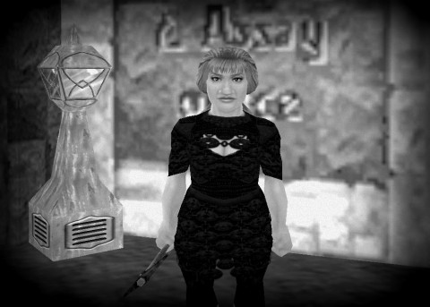

Back to: [West Karana](/posts/westkarana.md) > [2013](/posts/2013/westkarana.md) > [February](./westkarana.md)
# D&D4e: Valda Onyxheart

*Posted by Tipa on 2013-02-03 12:15:25*

[caption id="attachment\_10642" align="aligncenter" width="480"] Valda Onyxheart[/caption]

The sky above the lost city of Thunderholme was gray and crumbling. Massive chunks of granite had been ripped from the sky and thrown to smash the carved homes and markets below by illithid magics and the violence of the stone giants. Rotted carrion worm carapaces blocked the obsidian paths along which ore was brought to the now-silent foundries. The mithril-glow lamps that had once lit the city like a thousand bright stars were now dark, melted by the craven horde. Now the only light in Thunderholme came from fetid corpse-fires that cast flickering green light from between the bodies of the orcs and goblins that crowded close.

Valda Onyxheart watched from one of the hidden tunnels in which her ancestors had long ago fled the dwarven city, once the shining capital of the Thunder Peaks, now the ruin she saw before her. Beside her, her spirit companion, the basilisk Dern, rumbled uneasily. "Not now," whispered Valda. "Not yet." The hour to retake Thunderholme would come when her people returned triumphant from their hidden fortresses, their numbers renewed by the workings of Moradin and the blessing of the All-Father.

Trusting Dern to lead her true, Valda walked crouched, but with sure steps, up the cunningly wrought shaft which once brought the heat and smoke from the mighty forges of the city below to the world of the surface dwellers. The gray light of day lit the floor of the tunnel's exit; below it a tall, sheer drop guarded a grove of thorn bushes. Even now, Thunderholme guarded itself. There would be no return by this path.

Valda chewed on some rat jerky washed down with mushroom beer as she waited for the darkness to return. As the grey sky turned black, thunder rumbled among the mountain peaks as Moradin sought his lost children. It was a good omen. The rain that followed was an even better one. The noses of goblin guards would not betray them. Valda scurried down the rock face before it became too rain-slick for even dwarven hands.

Her mood improved further as she reached the Eastway and started along the road to Winterhaven, but Valda could not allow herself to forget why she'd left her kind's hidden caverns: the dead had begun to rise once more. Caught between stone skeletons from the deeper tunnels and the occupied ruins of Thunderholme, the priests and warriors of the clans were required to fight to keep the villages safe.

Only outcast Valda, always away communing with the spirits of the stone in some mossy hermitage, could be spared to summon help from the cousins who had fled Thunderholme toward the surface world instead of ever deeper to the threshold of the Underdark itself.

---

Back-story for my D&D character... whose adventures will all be recorded here :) So you might as well get to know her now. Portrait is taken in front of the bank in Kaladim. I tried to get DDO working so I could make her there, but no luck. Wouldn't connect. EverQuest, though, always did good dwarfs. After a couple of hours playing her in the Mines of Gloomingdeep, I remembered what I'd gone to EQ to do -- get a screenshot of a dwarf....

EverQuest is still awesome.
