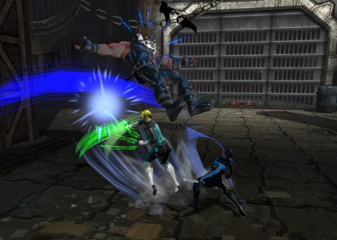

Back to: [West Karana](/posts/westkarana.md) > [2013](/posts/2013/westkarana.md) > [February](./westkarana.md)
# DCUO: Gorilla of their Dreams

*Posted by Tipa on 2013-02-04 22:18:22*

[caption id="attachment\_10647" align="aligncenter" width="480"] Bye bye Bane![/caption]

I think we're getting the hang of the game. We know how the controls work, mostly. We know our roles and how to use them, as shown by the score cards that pop up after each "On Duty" mission -- DCUO's instanced dungeons and battlefields. Kaptain KY and I, the controllers, had the high scores in power return. Stingheal, Stingite's new healer (since we discovered we didn't have one) was a healing gnome of some sort. Not sure what he is. Lord Spode just brought the hurt.

We started out the night trying to get Kaptain KY a little more XP so we could try the Gorilla Island instance (home of the Ultra-Humanite). Queen Bee was hoping for a swatting, and we did not disappoint her. That got the Kaptain his level. The appropriately-named Sting and Spode went and worked the quest line up to the instance, so we went back in and killed her MORE.

No good picture opportunities.

Still not quite enough XP, so we re-did Area 51. It went like clockwork. Being a couple of levels passed the recommended levels for the instance didn't hurt, but even with that -- we were learning the thing about teamwork, staying close together, and letting those heals and power regen flow to keep everyone up and fighting.

We did the final boss without one death -- maybe one close call, but we were all still standing -- flying? -- when Brainiac came to collect the broken circuitry of his robot army.

[caption id="attachment\_10648" align="aligncenter" width="480"] The Ultra-Humanite[/caption]

After that, Kaptain KY had slid into level 13 and we were eligible for Gorilla Island. Now, I'd heard nothing good about this instance, but if we don't fight the apes, the apes WIN. It's a WAR ON APES. It's a war on SMUGNESS. It's not so much that these apes, who are the transformed civilians and security forces of the base Gorilla Grodd invaded, seem whole-heartedly in favor of becoming apes and not having to wear clothes anymore. It's how self-satisfied they are about it, even as we're slaughtering them and fending off angry phone calls and sternly-worded tweets from the Wildlife Conservation Society about it.

Bane's followers, too -- as I slaughtered one this evening, his only regret was that he would never get the strength-enhancing Venom, now. Hey, why didn't the Bane in the latest Batman movie use Venom? He was just naturally strong, I guess. The Bane from the George Clooney Batman had to use it, though.

Now, Gorilla Island was no walk in the rain forest. These apes were pissed. First thing we had to do was destroy four teleporters that were continually porting more apes in (from where?). Then we had to ship some containers out by tossing them out the front door or anything. And then came Tiny. Tiny and weak. He must have been a transformed gnome, like Stingheal.

It got worse, though, with Bean, who grinned and leaped; got some deaths while fending off the barrels of explosives thrown down by the hundred Donkey Kongs on the catwalks. Yeah, DCUO is ALL ABOUT the bad visual puns.

Not sure if there was another boss before Mr. Humanite.

[caption id="attachment\_10646" align="aligncenter" width="480"] Spode vs Bee[/caption]

The Ultra-Humanite was another smug neo-ape who, in between shouting his superiority, walked from console to console pushing buttons. This is his superiority. To be a cubicle warrior. Who can't type very well. 

Four turrets around the area needed to be destroyed, and kept destroyed even when the Gorilla Island IT department came by to re-install Windows XP and get them running again. Elite gorillas and marksman gorillas would pop up, needing killing. Ultra-Humanite couldn't leave his cubicle, which made killing him something you might want to do ranged. It was midway through the fight before I realized all those blocking moves we were taught in the tutorial WORKED GREAT against the U.H.'s ranged attacks. Unfortunately, all my best power regen abilities were tied to melee attacks (though I have tonight added a ranged one), so I had to dart in and do some damage with the light claws to get the regen started before heading back out to keep the turrets down, take care of the adds, and do what damage I could to the U.H. I think we all died at least once, but someone was always there to keep the encounter from resetting, and in the end, we won.

Gorilla Grodd was pissed at the Ultra-Humanite for dying to such an inferior force. And it was pretty unbelievable; seriously, four under-trained heroes completely annihilating the whole place? I'm wondering just how superior these apes are. Nonetheless, in the ending cinematic, it seemed Grodd had decided to spin this as a victory for his side, somehow.

If we do this instance next week, I'll pay better attention, because I was under the impression that we had WON and his side had LOST.

[caption id="attachment\_10649" align="aligncenter" width="480"] Couch![/caption]

Last weekend, DCUO raised the drop rate of furniture for the Home Turf bases. They'd really talked up the amount of furniture that would be dropping. We were all excited to get a little more stuff in our empty, cavernous bases. Well, we did Queen Bee twice, Area 51 and Gorilla Island once each, and we got precisely one piece of furniture, the couch here that Stingheal found in some musty office on Gorilla Island.

It really does look way more comfortable than it has any right to look, though what's with that green light? Is that kryptonite? Venom? There are SO MANY green things in DCUO, and almost all of them are deadly, including the green light from my power ring.

Speaking of, and this is a bit of a rant, there are TOO MANY Green Lanterns running about. I mean, I know "in universe" that Earth is infested with Green Lanterns -- Alan Scott, Hal Jordan, John Stewart, Kyle Rayner, Gus Gardner and now Simon Baz -- because (if I remember right) Earth was, in antiquity, where life first arose, a fact the "Guardians of the Universe" kept hidden for aeons.

This might be why the "Guardians" are currently killing all the Green Lanterns to prepare for the eventual extinction of all life because these guys have SERIOUSLY lost their way. I'm unsure why the other heroes of Earth don't consider this much of a threat. Anyway.

Lots of Green Lanterns. I'm not sure where in the continuity DCUO is set; clearly it's not aware of the "New 52", since Nightwing hasn't become Red Robin. And there are no Black Lanterns or any of the other colors, and this is my rant: WHY NOT? Even though I have become the Teal Lantern, my ring still shines green, as does every other Lantern out there (except light-using villains command the yellow light).

I want to choose the color of my constructs! Also, I want a lantern emblem for my costume. [But I guess that isn't going to happen](http://forums.station.sony.com/dcuopc/posts/list.m?topic_id=43178). Maybe I can get one of those GL hoodies from the Vault.....

Anyway, Was a fun night last night, we all got things done, we're all pretty happy to be in DCUO for now. My first choice would have been The Secret World, but I'm having a great time in DCUO. I know because I want to play it outside of group nights.
## Comments!

**[stingite](http://iamstingite.blogspot.com)** writes: "Not sure if there was another boss before Mr. Humanite." -- There was! How could you forget "Furious George"?! ;) I guess he was just a speed bump in the way of Team Spode . . . thanks for the awesome write-up, Teal Lantern!

---

**[Tipa](https://chasingdings.com)** writes: Dangit, NOW I remember! Thanks :) I've been so proud of not looking up quests and missions and stuff that I haven't even done it AFTER we have done the quest or instance to get details right! *Sigh*!

---

**Euron** writes: Nightwing is not Red Robin in the New 52 universe. It works like this the first Robin Batman had was Dick Grayson, who left and became Nightwing. Then Batman took on Jason Todd, as the next Robin. Jason was killed by the Joker(and eventually came back from the dead via the Lazaras Pit that Ra's Al Ghul uses). After the death of Jason Batman tapped Tim Drake to be his next sidekick but out of respect for Jason's death Tim took the name Red Robin instead of just Robin. Tim is now on his own as Red Robin and leader of the Teen Titans. This brings us to the current Robin, Damian Wayne the 10 year old son of Bruce Wayne and Talia Al Ghul.

---

**Euron** writes: Also I wish they would include other lanterns but it would be difficult. You get to play a Sinestro Corp lantern(Yellow) if you play as a villain and that unfortunately is the rub. In the world of Lanterns, the Green and Yellow Lanterns are the only ones that really do constructs. Blue Lanterns are the bearers of Hope, and basically a super buffer. They honestly can not do much without others. Indigo Tribe work via indoctrination to instill compassion. Star Sapphires use love though they do make some constructs they more use illusion and mind manipulation. There is only one Orange Lantern because as the Orange Lantern is the emotion of Avarice Larfleeze doesn't want anymore Orange Lanterns he wants the power all to himself. Black Lanterns are simply undeath and the ring brings them back from the dead no real constructs have been shown so far. The only Red Lantern to show the ability to make constructs is Rankorr the only human Red Lantern. While Lanterns embody life the essence of life in the universe and have the power of Resurrection.

So while it would be cool to have those other Lanterns in the game, SOE would have to make each one a new power set. Because just changing the color of the current light based power set would not fit for what each one of those Lanterns would be.

---

**[Tipa](https://chasingdings.com)** writes: I'm struggling with what comic collections to pick up to get up to speed with all this. I only followed the Green Lantern books before DCUO and am WAY behind. Anyway. Thanks for the info re: Robin/Nightwing/Red Robin. Isn't the Red Hood in the New 52 an ex-Robin as well? He was, in one of the DVD movies.

---

**[Tipa](https://chasingdings.com)** writes: That's the resurrected one, right? Red Hood?

---

**[Tipa](https://chasingdings.com)** writes: We got into a long discussion about how the other lanterns would integrate into DCUO up on G+ -- https://plus.google.com/u/0/108460561201888322767/posts/H49qeEPZYCd -- I think it could work, with some alterations. 

Problem is, GL/SC-clones (including my character) are already everywhere. Branching out into other roles would be too dominating. I still would like to at least change the color of the ring and constructs -- since we aren't REAL Green Lanterns or Sinestro Corpscritters, why not?

---

**Euron** writes: Yeah Red Hood is indeed Jason Todd the former Robin. He goes by a different code than Batman. In Jason's mind what led to his death was the fact that Batman will never kill. Even those villians that are irredeamable like the Joker. So Jason carries two guns and has absolutly no problem with killing criminals. He is kinda like a cross between Batman and the Punisher. 

In the New 52 he has his own series called Red Hood and the Outlaws. Its actually very good. It got a lot of attention when it first came out because of the dipictation of Starfire. But if you actually read more than one issue you would know that Scott Lobdell actually when out of his way to make her more realistic as a alien. She processes memories different from humans and she is a badass. 

The movie Batman: Under the Red Hood is actually amazing, and worth a watch(Its on Netflix). Jensen Eckels from Supernatural(Dean Winchester) plays Jason and is perfect. 

As to collecting comics. I love the New 52 it is amazing and the stories keep getting better and better. The best way to get back into it is pick up a trade paperback of what ever series you are looking at. The first 12 issues of each serries is out now in TPB. 

I would recomend Batman written by Scott Snyder, his Court of Owls story is one of the best Batman stories ever. Batwoman is amazing as well and a very cool character. Aquaman and his series is one of the biggest suprises of the New 52 in how good it is. But overall my favorite in terms of art, story and overall tone is Wonder Woman. 

The Wonder Woman series is just amazing and hands down the New 52 Wonder Woman is awesome.

---

**[Tipa](https://chasingdings.com)** writes: I have seen the Red Hood movie; I watch every DC (and Marvel) movie that hits Netflix. Loved the All-Star Superman one.

I picked up the first few issues of Wonder Woman last night -- it wasn't what I expected for sure. Much better! Thanks for the recommendation!

---

