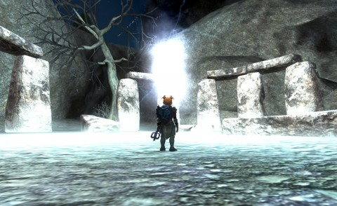
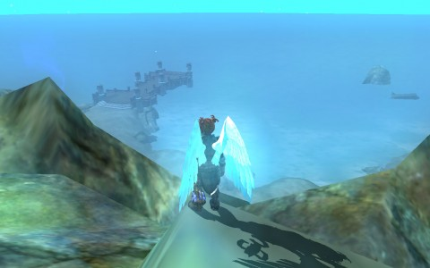

Back to: [West Karana](/posts/westkarana.md) > [2013](/posts/2013/westkarana.md) > [February](./westkarana.md)
# EQ2: Entering Ethernere

*Posted by Tipa on 2013-02-06 08:03:34*

[caption id="attachment\_10653" align="aligncenter" width="480"] Druid Ring of Doom[/caption]

My cleric, Arda (née Dera), turned level 92 a few days ago. Though this is the threshold for the new Chains of Eternity expansion, I wasn't going to repeat a mistake I made when Scatter dinged that level a couple months back: I wasn't going to leave good, experience-generating quests in the Withered Lands undone.

Though Arda had the second sip from the potion that granted her 280 AAs when she turned 90 (leaving nothing for my other alts), she still has a good ways to go to reach the 320 AA cap. With all her experience being shunted to adventure levels, it's important when she does hit level 95 that there's still enough quests left over to quickly get the remaining AAs.

Last night I finished the last of my Withering Lands quests and did my daily traipse through Skyshrine's recent past, just for fun: Arda had already gotten the best rewards from the instances when she dinged 92, since I'd been saving them from Scatter's runs. Still, it's xp, and I need to get a good feel for my mercenary in at-level dungeons.

Player power grows exponentially in the CoE expansion; it's a complete gear reset just from the quests alone, and then there's the heroic dungeon gear, and the raid gear -- typical for these sorts of games. Even with the quest gear, at 95, a player is very, very much more powerful than a player at 90, no matter what kind of gear the level 90 player has.

Scatter at 95 is more or less invulnerable to normal mobs, even level 95 mobs. I can just pull and tank a dozen 1-up and 2-up mobs with her and do pretty well without any healing; WITH a healing mercenary, it's cake.

But with Arda, she'll be the one getting uber-powerful. Her tank, the mercenary, will be getting a more linear power boost. Tests in the Dracur Prime solo instance in Skyshrine, though, have been encouraging.

[caption id="attachment\_10654" align="aligncenter" width="480"] On the Shores of Ethernere[/caption]

The CoE quest line for the good people of Qeynos involves saving local heroine, demigod, spokesmodel and avatar of Tunare, Firiona Vie, from the living death brought on by a mysterious force from the Ethernere, the celestial waiting room where the dead pause on the way to their final resting places.

Oddly, the quest line for Qeynos' traditional rivals, the city of Freeport, which struggles under the tyrannical rule of Lucan D'Lere, is identical. Arda, being a good citizen of that eastern city, watched Firiona die before her with a sense of satisfaction, and was frankly shocked when she was asked to follow Scatter to the Ethernere without the benefit of dying first and try and bring Firiona BACK to the land of the living.

Not really seeing the advantage to that.

This might be a spoiler alert, so if you care about the storyline of the Chains of Eternity expansion, you probably shouldn't read further.

When Arda made her way to the Eidolon Jungle, one of the expansions two new outdoor zones, she met there the Steward of Drinal. He's the one who keeps everyone in order while his boss, Drinal, the once-demigod, now-full fledged god, shuffles everyone to their proper destination depending on which god they follow.

Problem is, the gods have all disappeared; at least one has died (following events in Velious, Rallos Zek (god of war and of warlike races like ogres, orcs and so on) has died the real death), and others are under attack. Upshot is, no gods are taking any souls from the Ethernere, which is thereby expanding uncontrollably to take up the load and driving Drinal mad.

So it was a little weird to hear the Steward of Drinal state that the various non-passed souls walking about, the Wandering Ones, had made some sort of bargain, or had stayed hidden, in order to remain in Ethernere and not pass on.

It's only later in the quest series that he admits that nobody is passing on, which is causing issues as the land is forced to try and absorb Rallos Zek's soul instead of letting it go on to wherever gods go when they die.

So why are the first words out of his mouth a lie? The Steward is the player's guide through the expansion, eventually urging you to take on his boss -- alone. I'm thinking there's more to this story.

Anyway. Looking forward to the first new solo instance. I know exactly how they went as a tank -- pretty well, most of them. We'll see how the healer fares.

