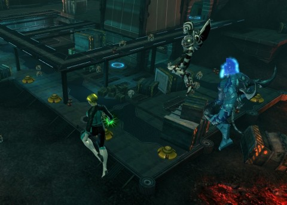

Back to: [West Karana](/posts/westkarana.md) > [2013](/posts/2013/westkarana.md) > [February](./westkarana.md)
# DCUO: No time for jokes

*Posted by Tipa on 2013-02-12 07:46:27*

[caption id="attachment\_10676" align="aligncenter" width="480"] Harlequin & Robin[/caption]

One thing I really do love about DC Universe Online is its call-outs to all the various incarnations of the characters. For instance, Robin. In recent years, the various Robins have turned into competent fighters in their own right, leading their own super groups, and in general just kicking butt.

A lot of us remember, though, Robin's original purpose -- to be kidnapped more than Princess Peach and have to be rescued, time and again, by Batman.

Harlequin's confusion when she kidnapped Robin and got Team Spode instead made for an awkward moment all around. She wanted Batman. ROBIN wanted Batman. We all kinda wondered what was keeping the big guy.

[caption id="attachment\_10677" align="aligncenter" width="480"] Get your teeth brighter with Ultra-Humanite![/caption]

We followed up our fun at the Chuckle Hut with a quick blitz through Area 51, and then a reprise of Gorilla Island. What was intended to be a quick run.

The game had other plans. We were doing fine until the Ultra-Humanite himself, but then the encounter would start early, or we'd get far, far more adds than we got last time, but we did keep at it and our last try was pretty much perfect.

There's a script going on, in the encounter, and I haven't figured out exactly what happens when, or if certain bits of the script repeat or are tied to his health or something. I know that last night, the U.H. left his little area when the game announced "The Ultra-Humanite has Joined the Fight!". I'd been thinking that we would just toss exploding barrels at him from the constantly replenishing supply around the edges, while keeping the turrets and the adds taken care of, but mostly that didn't work. What did seem to finally work was to just keep him busy, tank all the adds next to him, chuck in healing barrels, break his holds, and keep the heals and power regen flowing.

While breaking off to take care of the turrets.

[caption id="attachment\_10678" align="aligncenter" width="480"] An occult table?[/caption]

We've started rolling for "NEED" on everything, instead of "GREED". Doctor Apocrypha vented his frustration at everyone rolling for "NEED" in his instance groups, and then gave a bunch of really good reasons why people should always be rolling "NEED", when they have the opportunity, in DCUO.

Rolling "NEED" is not possible, for instance, when your role cannot use the item. Everyone needs the skill points obtained by collection complete costume sets. If someone else is rolling "NEED" all the time, you'll never get anything. These sounded like GREAT reasons to always roll "NEED", so that's what we did.

And nobody got anything they couldn't equip because of their role.

Spode got a table from Area 51, I think. I also got a table, a wire spool table, so now my base looks like some guy's dorm room. Apocrypha kindly sent me an occult table, complete with green-glowing centerpiece, so now the place is beginning to look a little more lived in. (Thanks, Doctor!)

Still no luck with the Green Lantern hoodie. A minor upgrade brought my combat rating from 12 to 13. My secondary weapon skill chain got me my first Virtualization upgrade on that line, so my Controller abilities should be a little more effective.

Target level for next week is 18, which should give us the HIVE instance on the Moon, and another instance I can't remember the name of. We're thinking of leaving the Ultra-Humanite alone from now on.
