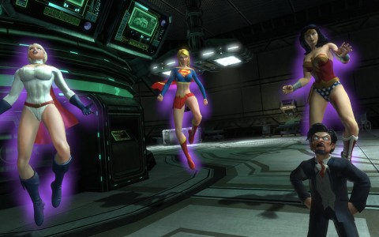
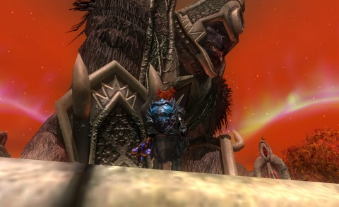

Back to: [West Karana](/posts/westkarana.md) > [2013](/posts/2013/westkarana.md) > [February](./westkarana.md)
# Game Log: EQ2, DCUO

*Posted by Tipa on 2013-02-13 08:37:30*

[caption id="attachment\_10684" align="aligncenter" width="480"] Power Girl, Super Girl, Wonder Woman[/caption]

Doctor Psycho, I don't think you're even a \_real\_ doctor. But yeah, I can see that that would be a tough name to grow up with, plus being only a foot tall doesn't help much. I thought your powers were lame, as I crawled through Metropolis General's Meta Wing, where you forced me to pummel the entire hospital's security staff while I freed the imprisoned meta-humans along the way. How did you ever capture Supergirl, anyway?

Fortunately, you remembered to put your entire plan on the various computers around the place. So you're working with Lex Luthor? And Luthor has some master plan that requires draining metahumans of their powers? Huh.

When I finally confronted you, Power Girl, Wonder Woman and Supergirl herself popped in. You, dear doctor, are about to be THRASHED.

Wait, they attacked ME? I swung a hard-light 1 ton weight around, bashing them away, then gored them with my light claws and light missiles -- they turned out to be illusions. Tricky. Clever. You're next, Doctor Psycho. If that's your real name.

I redid my character's costume; can't get a screen shot of it due to the servers being down to put in the Valentine's Day content.

I stupidly have been destroying the DCUO lock boxes when I get them. Last night, though, I saw that legendary subscribers (I am one) could open them for free. I opened the two I had yet to destroy and got two upgrades, just like that. Combat rating now 14. 

The Vault gave me a "Zoom" T-shirt, just like the Flash T-shirt with different colors.

Our current level guidance is 18, so we will have Oolong Island available to us next time we play. 

[caption id="attachment\_10685" align="aligncenter" width="480"] Arda meets Gorilla Grodd[/caption]

Grinding my way slowly through the Eidolon Jungle, again. Arda finally graduated to the Throne of Fear and Temple of the Faceless solo instances; I'm done with the Skyshrine ones for good, now. Though there was a Skyshrine xp grind group going on that needed a healer that I probably should have taken advantage of, because I'm almost up to the next Chains of Eternity zone, the Obol Plains, and I'm not even halfway through level 93.

The plan was to be done with leveling way before this, so I could focus on AAs. But, it is what it is.

Nonetheless, I'm getting some good upgrades as I go through the quests, and since, this time through, I know what all the quests are, I spend a lot less time being confused about what to do next. With time, SOE will doubtlessly add new paths through the 90s, but right now it is very linear and a copy of what I just did a month or so ago with Scatter.

Big question here is how I'll handle Wurmbone's End. The boss there can give three treasure boxes instead of one, but you have to survive a much harder fight.

One quest got my cleric a bo stick; this style of weapon gives any class sweet kung fu moves. So I made a movie ;-)

