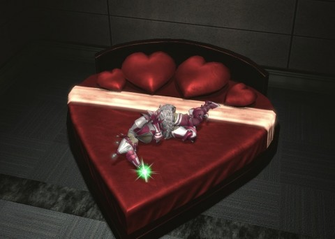

Back to: [West Karana](/posts/westkarana.md) > [2013](/posts/2013/westkarana.md) > [February](./westkarana.md)
# DCUO: Happy Valentine's Day!

*Posted by Tipa on 2013-02-14 07:23:31*

[caption id="attachment\_10689" align="aligncenter" width="480"] I've been locked in your heart-shaped box[/caption]

Happy Valentine's Day!

Logged on last night to do the Valentine's Day content that SOE patched in to DC Universe Online. There was a Valentine's quest in my journal; I completed it and got all the rewards. Which was weird. It included a silly looking clown/ballerina costume!

This morning, in my daily Vault run, I got a heart-shaped bed!

This was a sign from the DCUO gods. Or something.

I had made a really --revealing-- costume for Sunday's game, but I felt so embarrassed about it when I met up with Doctor Apocrypha that I went back to my regular costume. Maybe Power Girl can pull it off.

Hmm. In DCUO, Power Girl is Superman's cousin. Supergirl is also Superman's cousin, but in a different reality. How can they \_both\_ be in DCUO? There was a Power Girl who was not a Kryptonian, but the one in DCUO definitely is.

Anyway.

