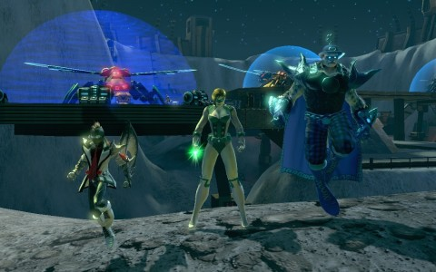

Back to: [West Karana](/posts/westkarana.md) > [2013](/posts/2013/westkarana.md) > [February](./westkarana.md)
# DCUO: Super Sunday

*Posted by Tipa on 2013-02-18 08:31:26*

[caption id="attachment\_10695" align="aligncenter" width="480"] To the Moon, Alice![/caption]

With Kaptain KY off fighting evil in Mexico this week, Team Spode was short a hero. Undeterred, we decided to make Metropolis a little bit safer by taking care of some of the "Wanted" poster quests -- the Avatar of Sin, Bizarro and the Minotaur all met their temporary ends. Before all popping up again, minutes later, proving just how ineffective heroes really are.

When you get right down to it, the exobits that turned regular humans into weapons of mass destruction echo the debate about whether arming every lawful adult in America would be a good or a bad thing. DCUO takes the position that unrestrained superpowers lead to devastation. And that's with both heroes and villains coming together to take on outside threats, like HIVE.

We ended up, after we took on the Avatar of Sin, battling extra-dimensional demons that heralded the coming of the demon Trigon via the agency of his daughter, Raven, who we defeated early in our adventures. The villain plotline has the villains undoing all this good work and turning Raven once again into a mere vessel for evil. In the instance that followed, it was really unclear to me if we were dealing with the good Raven or the evil Raven.

Then a surprise -- the voice of the good Kaptain himself on Skype! Lubed by a couple margueritas, he was flying in. We now had enough heroes to visit the hidden moon base of HIVE.

HIVE is a hive mind ruled over by the mental and pheromone coercion of Queen Bee, an alien invader who is attacking Earth from her protected Moon outpost. Both heroes and villains drive her off of Earth, but Brainiac is giving her plenty of aid to keep her in the fight.

In this four-man mission, heroes and villains take the fight to the Moon.

None of us knew anything about the fight (and arguably, still don't). We stumbled through the assault on our forward base, somehow, and then -- Kaptain KY was gone. The next step was to teleport some bee ships somewhere. That ended with a boss we easily defeated.

Last was the Queen Bee herself. She summons adds who fire snare guns that prevent anyone from moving quickly. She then plants turrets around the room which, every fifteen seconds or so, summon more adds. We eventually figured out that, like the Gorilla Island fight, someone needs to be killing these turrets while everyone else deals with the adds and kills the queen. But without KY, our damage role, we just couldn't do the killing fast enough.

Eventually we had to give up; but we probably know the fight now, and next week, when the good Kaptain is back, we should be able to complete it.

All of us but Kaptain KY dinged 20 during the adventure; we're holding at 20 for next week. The Teal Lantern's combat rating rose to 15.

[caption id="attachment\_10696" align="aligncenter" width="480"] Nurse G.[/caption]

Because I wanted to play DCUO out of group, I created a new character, the villainous Nurse Goebbels. A distant relative of one of the authors of the great tragedy of the 20th century, Nurse G. was a medical researcher seeking ways to raise human potential with purpose-built utility suits. While testing one of these suits, Nurse G. crippled herself in a horrible accident. Reduced to using a slow, prototype exoskeleton to even have any semblance of independence, she recruited street thugs to abduct people upon whom she would experiment with ever more powerful suits. With the results of her experiments and some stolen exobits, she built a super suit which allowed her incredible speed, power, mobility and healing.

I've been playing through the villain storylines along with Blameful Gecko's wide selection of villains. Many of the villain missions involve setting up situations that the hero characters will resolve, or undoing the actions of the heroes and setting things back to how they were. Really self defeating.

Because we'd done Area 51 so many times in Team Spode, I queued up to heal for a group, but things went badly. The folks didn't know how to block big attacks, didn't dodge the scripted attacks or anything. The three of them were all from the same guild, and the leader would occasionally sound like he knew what he was talking about; but they never gathered to talk strat before a fight, would randomly rush in to solo attack a boss, all these bad behaviors that reminded me so much of World of Warcraft.

When they accused me of never healing, though, I had to say SOMETHING. You just can't spam heals all the time in DCUO. You need power for the regular heal, and need to have some pretty high combo counts on the boss to set up the really big heals. But since they wouldn't taunt or anything, I died a lot.

So, I left. If you bitch at your healer, your healer will leave.

Anyway. Started doing PvP, which turned out to be pretty fun in an ordinary way. Got a lot of level 30 loot which will be handy at some point in the future.

Nurse G. is level 19, CR 15. And I have no level limits for her :)

## Comments!

**[Keith Guirao](http://GameMavens.co)** writes: Hi Tipa:

My name is Keith I'm a web developer and a fellow gamer. I play mainly on xbox.

I'm developing a platform that will help video game bloggers like yourself get more exposure. You will essentially be part of this site's beta testing and if you would like to continue after, you can be part of the platform moving forward.

This beta testing round will basically take your content (with credit towards you of course) and publish it as a "feed" into GameMavens.co. Right now, I'm targeting MMO video game bloggers so if you know other MMO bloggers, please let me know. This will really be beneficial for all of you as what this platform will be really doing is empowering the blogger.

I'd really like to chat with you on Skype or via email to see if you are interested in being one of the first few blog websites to be part of this project. There is no cost for you.

Thanks,
Keith

kggraphix@gmail.com

P.S. The website (GameMavens.co) isn't existent yet because I'm currently developing the landing page but I assure you that I do own that domain.

---

**[Tipa](https://chasingdings.com)** writes: No thank you, but I wish you all the best luck with your new site, and many kudos and thanks for asking!

---

**[Egat](http://www.orcpawn.com)** writes: Love the new look here! You remind me that I need to get back to my blog, I've been far too busy lately to make new posts.

---

**[Tipa](https://chasingdings.com)** writes: Was such nostalgia, running back to WK to take that header picture, since I couldn't find the sources for the ones I used to use...

Hey yeah, you DO need to write more!!!

---

