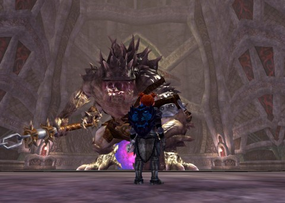

Back to: [West Karana](/posts/westkarana.md) > [2013](/posts/2013/westkarana.md) > [February](./westkarana.md)
# EQ2: Twoo Luv and the Nerfbat

*Posted by Tipa on 2013-02-19 07:39:18*

Well, mostly, this post is to test how my usual article heading picture can replace the header image, which is cool. Secondly, yes, I am NOT ONLY playing DC Universe Online, though from looking at the past few posts, it certainly looks as though I am.

It's just that Arda is basically retracing Scatter's steps from a couple months back. It's the grind to 95, and all the fun content the first time is just stuff you gotta do the second time.

[caption id="attachment\_10705" align="aligncenter" width="480"] Cleric vs Monster[/caption]

While the solo instances are fun, they are kinda ridiculous in that there's your character, and you're easily whomping really huge mega bosses. Then when you finally see them in the group dungeons and they are a thousand times more powerful, you just have to step back and wonder just how much the game is coddling you.

It's coddling you a lot, but SOE realizes (correctly) you're probably not leveling in a group, and these solo instances do give fairly decent loot so there's a good incentive to repeat them. Well, to repeat the BEST one.

The BEST one was, until recently, Wurmbone End, which had a boss that would drop THREE loot boxes if you could defeat it in its challenge mode, helped a lot by the little nuke charms that dropped from the other minibosses in the level, similar to how one of the Sleeper's Tomb bosses needs a specific charm to defeat it in a prior solo dungeon.

Players would grab a partner and just sprint to the end of the dungeon and kill only the boss, using the charms to take 60-90% of its health in challenge mode. Five minutes of work for three boxes of loot.

SOE came down HARD on that, as hard as they came down on Dungeon Maker leveling. They're STILL nerfing DM PLing, actually -- they fixed the issue where vitality wasn't removed until you left the dungeon, which was letting people get 200% XP pretty much all the time in them. I don't know anyone who still goes to Dungeon Maker instances, now that they've removed the xp (previously nerfed) and everything else. Here's hoping Neverwinter doesn't decide to nerf their Foundry.

Anyway. Wurmbone End. SOE made it so you had to kill two minibosses before you could kill the boss, which wasn't really unreasonable. But they made it so that the nuke charms that dropped in the zone specifically to kill the boss -- wouldn't work on the boss in challenge mode. Since the boss can't be killed SOLO in challenge mode WITHOUT the nuke charms by someone who reached the instance in the normal course of leveling, the entire instance has become pointless, except as part of the Chains of Eternity signature quest line.

The new instance for loot runs is Dreadcutter, a small ship instance near the end of the signature quest. Only one loot box, but it only takes five minutes to run, too.

EVERYONE expects it to be the next instance to be nerfed.

I guess I should take my Valentine's Day decorations down. I think I'll keep the little Burynai in their love seat, though... they're sweet :)

## Comments!

**[Tipa](https://chasingdings.com)** writes: Okay, the custom header image only displays when on the single page. Good to know.

---

**[Tipa](https://chasingdings.com)** writes: I think my strategy now will be to have custom headers for each game, but then have a regular lead image for the main page.

---

**[bhagpuss](http://bhagpuss.blogspot.co.uk/)** writes: SOE are crazy. Before the Dungeon Maker launched, what everyone who had any interest in it at all wanted was a combination of the full EQ2 house-building toolset plus a similar user-friendly set of scripting and dialoging tools. The only people interested in the thing were decorators and roleplayers.

Instead of giving us that they gave us a half-baked, half-working, highly restrictive dungeon crawl construction kit into which they baked a whole colony of bugs. The roleplayers and decorators tried to make the best of it, begged for it to be turned into what hey thought it was going to be and eventually gave up in disgust or despair. Meanwhile a few ne'er-do-wells and chancers found a cartload of exploits and proceeded to exploit them.

The Dungeon Maker Hall Of Fame became a Midden of Infamy and still SOE blithely ignored it until the new crafted gear from the recent expansion turned the hum of exploitation into a roar that even SOE's famous cloth-ears could hear. At which point they finally fixed the exploits they should have fixed long, long ago, leaving yet another SOE innovation that could have been a wonderful addition to the game but which will now languish unused and forgotten by everyone, players and devs alike.

They follow this self-destructive pattern over and over again. It wears me out.

---

