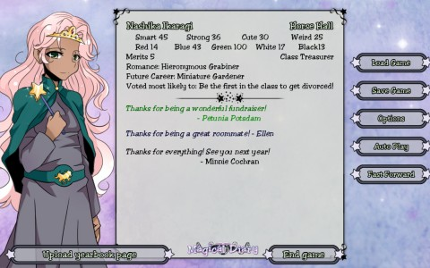
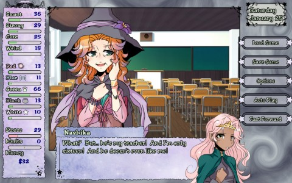
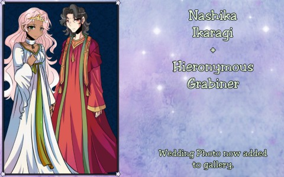

Back to: [West Karana](/posts/westkarana.md) > [2013](/posts/2013/westkarana.md) > [February](./westkarana.md)
# Magical Diary

*Posted by Tipa on 2013-02-21 07:47:32*

[caption id="attachment\_10714" align="aligncenter" width="480"] Yearbook, Freshman Year at Iris Academy[/caption]

Stop me if you've heard this one. A child living in our modern world discovers she has magical powers and is invited to attend a wizard school and become part of a magical community hidden from the mundanes.

Magical Diary is basically about a year in the life of a student of Hogwart's, where there are no Dark Ones and no Harry Potter. But it does have, you know, *boys*. And proms. And school clubs. And also the exams are held in dungeons.

A lot of times, I don't know where I first heard about a game, but this time it's pretty clear... Jane Smith (if that's her REAL NAME...) [started posting](https://plus.google.com/108839098650920765119/posts) about this intriguing little [\_otome\_](http://en.wikipedia.org/wiki/Otome_game) (o-toe-meh) game on G+, and everything she said about it was strange. As it was on sale for $3.75 on Steam, it was a great impulse buy. And it's everything I thought it would be.

[caption id="attachment\_10715" align="aligncenter" width="480"] An existential crisis[/caption]

At 13, you were playing with your friends when you suddenly levitated! You couldn't repeat it, and both you and your friends just explained it away and forgot about it -- until some wizards came to your home and offered you the Choice -- to attend the Iris Academy in Vermont and become a full-fledged witch, or to lose your undeveloped powers and forget about magic forever -- literally magically forget.

Naturally, you choose magic, and find yourself in the cloistered halls of Iris Academy, a co-ed boarding school in the Green Mountains where the magical and non-magical communities have come to some sort of understanding (demons wandering the local shopping mall, for instance, do not panic the locals).

Your goal, for your first year, is to learn about magic, survive the exams, deal with your two roommates (Virginia, from a magical family, and Ellen, a ~~mudblood~~ wild seed like yourself) and sort out the various relationship dramas you'll be pulled into. It IS an otome game, after all, and this is high school, and you'll almost certainly be in one or more relationships during the year. Who you hook up with depends entirely on the sorts of classes you take, after school activities in which you take part, and so on.

[caption id="attachment\_10716" align="aligncenter" width="480"] Not as creepy as it looks.[/caption]

Based on the Steam achievements, the path my first year took (which was heavily influenced by events over which I had little control) is just one of many stories that can be told in Magical Diary. Around you, your fellow students are working through their own separate stories of which you might not be a part (like, why DID that the door to that boys' room suddenly catch on fire? Why did Damien get expelled? What was the reason for Virginia's sudden 'illness'? What is the school's secret society?)

There's a hundred, well, at least a dozen stories in Iris Academy. They're pretty cool stories, too. There was the time me and a boy were racing through a dungeon and the one who got to the exit first would get 5 merits. He kept using Breeze to push me out of the way, but I got him with a Slow -- didn't slow him down -- but then I noticed we were passing some plants so I used Entangle to make them root him in place.

And then... well, you should play the game yourself, and find out!

## Comments!

**[bhagpuss](http://bhagpuss.blogspot.co.uk/)** writes: Jeromai at Why I Game also mentioned this one. It looks very intriguing, as does Ballpoint Universe. This is the stuff I need on my Tablet, though, where I might well play it. Once I'm in front of the PC, too many options present themselves.

Speaking of Tablets, pictures on West Karana aren't displaying on my device (7" generic Chinese thing running Jellybean). They used to before your New Look (which is fantastic, by the way). Had the same problem with The Egg Baron though and I don't think he's changed anything so it's probably my not-very-good Tablet...

---

**Tipa** writes: I haven't looked at the new layout on my iPad, but am on my iPhone at the moment and it looks okay. If possible, could you send me a screenshot so I can determine if it is something I can ask about?

Magical Diary would be a perfect tablet game. I wonder why that hasn't happened?

---

**Tipa** writes: K, got some friends on G+ to look at the site on Android tablets, and the site is incorrectly using the mobile theme. I'll see if I can get that fixed. 

Thanks for letting me know!

---

**[Tipa](https://chasingdings.com)** writes: It SEEMS to be a user agent problem; browsers on some Android tablets are sending that they are both "Android" and "Mobile", incorrectly. Thanks to advice from Pete Smith, I played around with sending different User Agent strings to the theme and it worked as expected.

---

