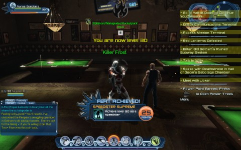

Back to: [West Karana](/posts/westkarana.md) > [2013](/posts/2013/westkarana.md) > [February](./westkarana.md)
# Things to do in DCUO when you're dead.

*Posted by Tipa on 2013-02-25 23:05:39*

[caption id="attachment\_10733" align="aligncenter" width="480"] Ding! 30![/caption]

Just like in the original Guild Wars, the road to level cap in DC Universe Online is pretty much an extended tutorial ahead of the real game. As in Rift, the instances you get while leveling are just rough sketches of the instances as they appear at max level, when you get a chance at the REAL fight. And better loot.

I started Nurse Goebbels (please, feel free to report this name I now regret) (and it should have been Nurse Mengele anyway) (I was trying to think of something really villainous, but I kinda went too far). Anyway, I started Nurse G as an outlet for DCUO game play when I couldn't play my Team Spode main, Teal Lantern. We have leveling restrictions in place so that people with a lot of time to play don't outlevel people with little time to play.

She shot to ~~60~~ **30**. The last instance was a fight against Brother Eye, the sentient downed Batman satellite that was designed to kill all superheroes, but upgraded itself to kill all humans. I was having real issues with the final encounter, but Seeker Elru saved the day, I dinged all over the place, and headed up to the Hall of Doom to start my ascension to the upper ranks of super villainy.

[caption id="attachment\_10734" align="aligncenter" width="480"] Nurse G and Seeker Elru[/caption]

Well, it's just been a whirlwind. When I turned 30, Seeker Elru took me around to some of the two person content; acceptable because we won't be doing such in Team Spode. I don't want to see anything Team Spode will see before we get to it as a group. Anyway, you do the Tier 1 duos and Tier 1 4 mans to get enough gear to do the Tier 1 solo challenge dungeons.

But before all that could happen, I would have to Learn 2 Play, Noob.

[caption id="attachment\_10735" align="aligncenter" width="480"] The villains give the Sinestro Corps a hand[/caption]

Problem with soloing is, you don't have to worry about anyone but yourself. As such, my powers were mostly oriented toward keeping enemies away from myself so that I could mow them down with my pistols, which would charge up that same attack and my self heals.

Seeker Elru suffered through that for a few instances. Tonight, he delicately started talking about different power combos, and maybe, since my dps sucked so much, I should adopt the healing role and let him do the killing.

This worked out really well, and I soon had enough reputation currency to buy my first piece of Tier 1 armor, the boots from the Mr. Freeze set. I did what I could with them -- I honestly don't want Nurse G to have to run around in heeled boots at super sonic speeds -- but the crystals sticking out of the back of the calves made them hideous. I'm wearing them, but you just can't see them.

Now that I've got healing working, I'll probably try to pick up the 4 man instances I've already completed with Team Spode -- Area 51, Gorilla Island and The HIVE -- and do some Legends PvP for additional PvP gear.

After I L2P a healer, I'm going to have to figure out damage as well.

## Comments!

**[bhagpuss](http://bhagpuss.blogspot.co.uk/)** writes: You could try reporting yourself. Mrs Bhagpuss once gave an EQ character a name that had unfortunate implications she was unaware of when she picked it. She petitioned against herself and a very helpful GM immediately changed it for her. SOE in-game customer service is by some margin the best I've experienced in any MMO, although under the new F2P regimen I guess you'd have to be subscribed to get the benefit. 

The whole level thing in DCUO mystifies me (if only because I've made absolutely no effort to learn how it works). In beta I think I got 20. The PvP-world character I played when the game went live is 19, which was as far as I got before something else turned up and distracted me. On my current revisit my new PvE-world character is 9. She has to get to 12 so she can get a base and relax in the Valentine Tub she got from the Joker's House of Fun.

I hear people in chat lfg for levels up to 80 or so and you say Nurse G is now 60. What does that mean in a game with a level cap of 30?

---

**[Tipa](https://chasingdings.com)** writes: Nurse G is just 30, the level cap. Once you're at the level cap, content is gated by a secondary stat, combat rating, which is analogous to WoW's gear score. Nurse G's combat rating is also around 30; the next bit of content opens up at a CR of 40 or so.

---

