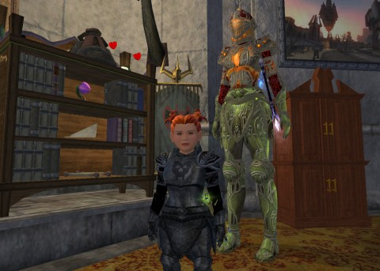
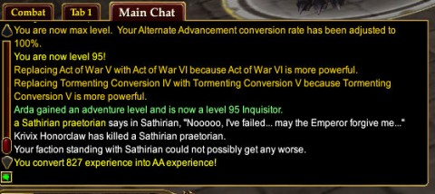
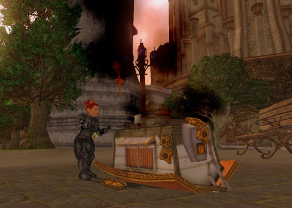

Back to: [West Karana](/posts/westkarana.md) > [2013](/posts/2013/westkarana.md) > [February](./westkarana.md)
# EQ2: Leveling done, time to level. Also, some DCUO.

*Posted by Tipa on 2013-02-28 08:20:32*

[caption id="attachment\_10742" align="aligncenter" width="480"] Haffer and Haffikin[/caption]

I was thinking that EverQuest II's double xp days last weekend would be enough to push Arda up to level 95, the current level cap. I had xp potions running. I was working through the last of the Chains of Eternity signature quest. You'd think that finishing up the content for the latest expansion would leave you at the level cap.

But, noooo.... I ended up at level 94. I hadn't done as much xp grinding as Scatter had, you see, so I had a fair bit to go. These last levels are hell levels, taking vast amounts of experience -- that's problem #1. Problem #2 is that each kill in every expansion since Kunark gives only a very tiny amount of experience. Evidently, SOE thought they were being too generous in Kunark and decided to ramp things back a lot.

This means Kunark is the only place to grind experience, and it means that everyone is in Kunark for the powerleveling, now that the Dungeon Maker PLing has been nerfed, nerfed twice and then nerfed again.

Power leveling is going to happen; it's just a permanent fixture of the MMO landscape since before EverQuest I, probably. At least people in Dungeon Maker dungeons weren't bugging anyone else.

[caption id="attachment\_10741" align="aligncenter" width="480"] Finally![/caption]

Sebilis is the place for power leveling; everyone goes there now. Whereas a kill in a CoE dungeon with all bonuses might net you 150 xp, a much faster kill in Sebilis will net you 1200 xp -- and that's with a mercenary up.

Since I was there for the express purpose of leveling myself, I guess I can't really rant at people who are there for the same reason. But when you see someone running around with a full group on autofollow, and two of them are necros with their pets up, and there's a merc or two in the mix, and they are killing everything as fast as they can run -- or the raid geared berserker who is pulling entire dungeon levels at once to AE them for the characters he is leveling, well... I'm just not that good.

I was forced to leave Sebilis and head to the second best leveling dungeon, Chelsith. It's an instanced dungeon, so no other people, the mobs don't hit as hard, so no need for a merc, and the experience is still three or four times the xp in CoE. I accidentally killed a boss, though, so I had a lockout timer by the time I was through.

I headed back to Sebilis. The place was still cleared out, but I had got there just in time to take on someone's repops before they came through again. And that was enough to level me.

[caption id="attachment\_10740" align="aligncenter" width="480"] Wagon trouble[/caption]

I did the CoE loot dungeon du jour, Dreadcutter, netting a bracelet upgrade and a research time quickener. Then, with xp potion ticking away, I started crafting. Got up to level 88 armorer.

Arda is 95/303/88 -- I need 17 more AAs and seven more crafting levels to max her out. And then, I'm going to try and heal for a dungeon group.

Top picture: Arda with her hafferkin -- this manikin shows what her armor would look like if she weren't wearing blackened vanguard plate as her appearance armor. And this shows why she does that. Might be better if it were all one pattern.

Bottom picture: Evan Furchtgott, a friend from Google+, has been designing things for the SOE Player Studio. His first design, [a tinkered gnomish autowagon](https://plus.google.com/107756584030623598910/posts/b94N2bHzAuj), just appeared in the EQ2 Marketplace, and of course I had to have it. It's not a mount -- which would have been REALLY neat -- but it IS a lot of fun.

It CAN just sit there... or it can be attacked and explode, or run around in circles, or be pulled back and zoom off like one of those old mechanical toys. It's really clever :) I didn't have any room to put it in Arda's inn room -- all she has is the two room basic model, and one of the rooms is reserved for her exciting Freport city quest recreation. The other room is a bit crowded.

So she took her new wagon to Scatter's home. It's the large Qeynos home and it allows access to an emptied version of a lot of South Qeynos (you can't enter any buildings, and the world is missing pieces toward the edges, but it's South Qeynos and you can put stuff in it). It looks great on the walkway outside Scatter's home, outside the forest she's made of her lawn.

[caption id="attachment\_10743" align="aligncenter" width="480"] Green Lantern hoodie![/caption]

And in DCUO news, I finally got the Green Lantern hoodie from the Vault, so now Teal Lantern can look a little more authentic. Though I did have to change her colors from actual teal to green in order to match the hoodie.

This is the only way to get to wear the Green Lantern symbol.

## Comments!

**Zygwen** writes: Arn't instanced zones resetable after and hour and a half now if you have killed a boss? So the Chelsith lockout isn't too bad.

I usually do a bit of Chelsith, Chardok and Seblis when grinding xp. Seblis being the most fun what with all those Shadowknights dispelling, fearring and harm touching you..

---

**[Tipa](https://chasingdings.com)** writes: Nah, Chelsith lockout isn't bad; in fact it was ready to go before I logged out. I just wanted to use up the XP potion. I'll have to visit Chelsith many more times to finish up my AAs....

I was thinking of Chardok, but you have to fight down past the red gate to get the same sort of XP you can get by just heading into Chelsith. And being more careful than I was around bosses. Durn muck beast.

---

