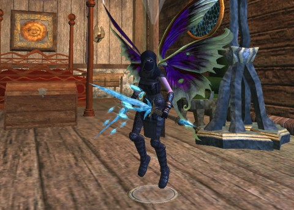

Back to: [West Karana](/posts/westkarana.md) > [2013](/posts/2013/westkarana.md) > [January](./westkarana.md)
# EQ2: Levels for Platinum

*Posted by Tipa on 2013-01-07 08:01:02*

[caption id="attachment\_10562" align="aligncenter" width="480"] "DM PLing"[/caption]

How the heck, you might ask, is a solo Arasai assassin in her 60s, no mercenary, no mentor, hitting dozens of at-level mobs while tanking thousands of points of damage and being continually self-healed?

Welcome to the wonderful world of "DM Powerleveling", an EverQuest 2 mechanism where someone creates a new character, levels it to 20 through normal ways, and then ends up, in a few hours, with a maxed out character.

EQ2 has always had a thriving ecosystem of powerlevelers who would, for a fee, take your character to a dungeon and kill everything while your character reaped the benefits. This got a bit of a boost when SOE removed the grouping penalty, so that the powerleveled character got the full XP for all kills, even though grouped.

That was Part 1 of the puzzle. Part 2 is Dungeon Maker. A couple years ago, SOE released the Age of Destiny expansion, which brought both mercenaries and player-created dungeons. These Dungeon Maker (DM) dungeons were meant, apparently, to allow players to try their hands at level design, with all the tools necessary to dress up dungeons, plan encounters, add bosses, and make fun little short adventures for people. There would even be loot at the end in items bought with Dungeon Maker Marks.

I've played through a couple of those. But since you can get experience in these dungeons, most DM dungeons are meant to provide the most XP for the least time possible.

The powerlevelers started leaving behind their open dungeons, moved right into DM dungeons.

[caption id="attachment\_10563" align="aligncenter" width="480"] Brightknife, the DM PL'd[/caption]

The third part to the puzzle came with the Chains of Eternity expansion. CoE introduced "Tradeskill Prestige" abilities, which allow max level crafters to enjoy a variety of new abilities, such as an innate "salvage" to recover rare crafting components from no-trade gear, mass production to craft up to 20 items at once, and "experimentation", to add stats and procs to crafted armor, jewelry and weapons.

The procs you can add are Augmented Blessing -- which procs a heal when you are hit or hit someone else -- and Augmented Smite -- which procs a short damage-over-time on your attacker when you are hit or hit someone else. With mastercrafted items, you can place both these procs on every piece of gear a character might use.

With a full set of experimental gear, it is nearly impossible to be killed doing non-heroic content. DM PLers are max level -- which makes you very tough to kill when mentored down anyway -- and equipped in full sets of experimental gear. They form a group of low levels, everyone mentors to the lowest level, then they run DM dungeons tuned for maximum XP gain. The party leader tanks a hundred mobs at a time, and the stacking procs take care of the killing and the healing.

My main, Scatter, had gone down the resource tracking, goblin summoning, salvage tradeskill prestige line. During the recent double XP weekend, I leveled Tipa to max tailor. For her tradeskill prestige, I chose experimentation. Dera (Arda), my armorer, made a set of armor for Brightknife. Dora (Ardiana), my jeweler, made a set of jewelry. Tipa made the cloak and charms and added Augmented Smite and Augmented Blessing to everything through experimentation.

Then I sent Brightknife into some DM dungeons... alone. I'd been leveling her fairly legit through normal dungeons, soloing with a merc. I did the revamped Kaladim through her thirties, dabbled in the Obelisk of Fear and Klak'anon for a few levels, got to near fifty. Then this last weekend, I gained twenty levels in a couple hours, taking breaks to do quests I wanted to do. Then I went back in to get a lot of AA levels, with adventure level locked at 70.

In the new EQ2, people start playing their characters at 90 -- or even PL straight to 95 and start their career there. As fast as I did solo DMs, in a group, led by a maxed out character, levels come even faster.

[caption id="attachment\_10564" align="aligncenter" width="480"][ in a totally legit Unrest group")](../../../uploads/2013/01/EverQuest2-2013-01-05-16-12-56-95.jpg) My inquisitor Dera (Arda) in a totally legit Unrest group[/caption]

Just include this picture to show that there are people still doing regular groups. Dera is my armorer; I was making armor for Brightknife when I read someone trying to put together an Unrest group. Though Dera is 80, I mentored down and healed for the group and had a lot of fun. Even dinged 81, totally legit. Dera has never been PL'd, but probably will be soon.

SOE has, with recent expansion, almost entirely removed the leveling game. With so many people offering powerleveling, the prices have plummeted and you can now expect to gain a near max level character for just a couple hundred plat, or less if you look for people offering PL spots for free to fill out a group.

The pre-DM PL game still exists, but had been dealt a huge blow with the addition of mercenaries already. When any character can self-PL at a steady pace (powerleveling gear is easily available on the broker if you don't have crafters), or be PL'd by others at dizzying speed, there's little reason to do things legit except to dabble in favorite zones or quests. The gear resets at 90 in Withered Lands and again at 92 in Chains of Eternity mean you can just stop at those places and get decent gear.

Experimental armor is pretty awesome for regular adventuring, too. Brightknife doesn't even need an experience-draining mercenary as she sets out doing quests in Kunark while I level Dera and Dora up enough to make her next set of armor and jewelry.

EQ2 has become a very different game. There's no reason now not to just allow you to start a new alt at level 90 with 280 AA if you have a max level character. They've essentially already done it.

How do I feel about PLing? Well, as a participant, I guess I can live with it. I leveled all my characters (until now) totally legit. I just leveled Scatter to 95/320 through normal questing, grouping and raiding. I did every quest, dotted every 'i', crossed every 't'. 

When it came to leveling my next character, I really didn't want to go through it all again, so soon. I did the cloud mount and crafted leaper mount quests because I wanted to do them. I ignored all the other quests because I didn't need them. I'm in Kunark now because I choose to pause there and gain some more AA while I level up the crafters necessary for the next leap.

Either SOE will nerf experimental armor and DM dungeons, or kiss the pre-90 game goodbye. Can't have both.

## Comments!

**Terr** writes: sure you can have both. some people want the pre-90 content and some people want to PL to the end game. It's perfectly fine to have both.

---

**[Tipa](https://chasingdings.com)** writes: Should people have the choice to skip all earlier content? Shouldn't SOE just put "PL to 90/280" in their cash shop instead?

---

**Terr** writes: I don't think there should be an option to skip it, no. I think there should be an option to start a new character at say 60 or something for people with a max level character. As for AA.. it's easy enough to get anyway; I don't see a need for purchasing it.

---

**[bhagpuss](http://bhagpuss.blogspot.co.uk/)** writes: SoE have a history of unintended consequences following new game features. One of my runs in EQ ended not long after the introduction of Monster Missions, which offered similar overpowered xp gain opportunities and similarly led to the wholesale disappearance of players into a handful of instances.

Eventually that got fixed but it took several botched fixes and a few months. Monster Missions themselves disappeared into history once the unfair and unexpected advantages were removed because few people, if anyone, actually enjoyed them for the purpose they were intended. 

The question here is whether the outcome you describe is indeed unintended. It almost certainly is. While I think there is a body of opinion within SoE that's in favor of an Instant Level 90 button or similar, the fires are still smoldering from the last time it was mooted (by Smokejumper I think) a couple of years back. It may come, and this could be part of the softening-up process, but I doubt it. looks like typical poor lack of forethought to me.

I find it weird that people would want to skip the vast and largely excellent range of 1-90 content just to get to the far more restrictive and duller level 90-92 stuff. I will refrain from consigning 93-95 to that pile only because I haven't bought the expansion and haven't yet seen it, but of course it is the tedium of 90-92 that has been instrumental in making me feel I can easily do without another three levels if it's going to more of that.

On the other hand, if people really want to pay to avoid content I can't see any reason why SoE shouldn't take their money. I'd be fine with them selling Levels directly through the SC Store. They could sell them in packs of 10 with a saving for buying the whole 95 in one go. And yes, I would go all the way to max level and AAs.

I think the reason it hasn't happened and may never happen is that there's a very reasonable concern that SoE would make less money overall by doing this than they would by having people hang around long enough to level up. If leveling up itself becomes something that not only can be done in a few hours but commonly is done that way, then that caveat is removed, leaving them with the choice of slowing the leveling back down or making some money out of people while they are still around.

---

**[Tipa](https://chasingdings.com)** writes: Well, it's clear this is something players want. There is a lot of content in the lower levels which is still there and still phenomenal, but good luck finding other people to do it with unless you've joined a locked level guild which is specifically trying to do the old content.

It's hard to spend a lot of time working toward level 50 gear as when the game was new, for instance, when all new gear is just a level away. All the Shadow Odyssey repeatable dungeons are empty because the gear you get from them is obsolete the moment you step into the Great Divide.

If you're going to put in a lot of time and work toward armor sets and gear and leveling up your green adornments, you're going to want to do it in the latest expansion. So why SHOULDN'T SOE help people get there, take a little coin and let people instant-level to 50, 60, 70, 80 or 90? 

People who want to come up the regular way still totally have that option.

I wouldn't pay for this because for me, the fun IS in the leveling. But the game isn't the same as it was in 2004. I can't get groups for old content. The only possible way is to solo through. And soloing is inherently dull.

---

**Terr** writes: Ah, I love to solo :)

---

**[Jaffa](http://dailyanimals.net)** writes: I like soloing too :)

Which is fortunate because the game I really prefer to play is grouping with people that are not over-geared for the content, and thanks to easy availability of raid gear through SLR that doesn't exist at any levels.

---

**Zygwen** writes: Thanks for the tip. my warden can finally solo moderately well. Took half a night to make all that experimental gear though.

---

**Jonathan** writes: This post sounds so odd to me. As a fairly new EQ2 player (the wife and I have been playing, off and on, for a year or so, splitting time with GW1 and now GW2) we aren't really seeing any of this. We are in a small guild, with a number of people leveling and doing the content. We go out in the world, and it isn't crowded by any means, but we do see plenty of people. We have chosen to do things in a different area (in our 40s) because an area is being a bit over farmed at the moment.

We've just been busy running dungeons (sometimes with friends, sometimes with mercs, sometimes a mix), doing quests, finishing zones, enjoying the lore. I suppose we could do DM dungeons, but it isn't like we've run out of things to do.

EQ2 seems to still be a fun game to me. Sure, there is stuff in the cash shop. I suppose I could buy a krono, sell it, grab a ton of experimental gear and rush past the entire game. But off hand, I can't quite imagine why I'd want to skip the "game" part of the game.

---

**[Tipa](https://chasingdings.com)** writes: The whole game is there for people to enjoy, I think it's great :)

---

