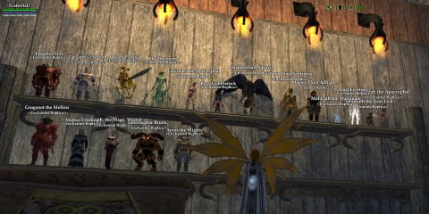

Back to: [West Karana](/posts/westkarana.md) > [2013](/posts/2013/westkarana.md) > [January](./westkarana.md)
# EQ2: Paths to the Past

*Posted by Tipa on 2013-01-09 08:16:10*

[caption id="attachment\_10568" align="aligncenter" width="480"] Norrathian track lighting[/caption]

I leveled very quickly, once I got my mercenary, and I only did the dungeons that I could do "molo" (merc + solo) and for which I had quests, so all the KoS group instances, plus Karnor's, Chelsith and Chardok back in Kunark.

EverQuest 2 gives you a reason to go back to all the dungeons you may have missed with their "Paths to the Past" timeline. Every day is a different legacy dungeon. You have a quest to kill a boss in that dungeon, usually the end boss but not always, for which you can buy a little plushie of the boss to put in your home. Also, each run will have plenty of loot to sell for money, and if you need levels or AA, well, there's a chronomage right next to the quest giver who will temporarily level you down, for a fee, so the dungeon's denizens are worth XP and drop loot.

So I've been more or less addicted to these for some time. First thing I do every night is find out what the dungeon of the day is, chrono down to an appropriate level, and head out to kill and slay.

Last night's dungeon was Poets Palace in the Shimmering Citadel, a mystic castle that floats high above the Sinking Sands.

One does not simply walk into Poets Palace. One must do the lengthy access quest, first. So that took a couple of hours. And then Poets Palace itself has a separate access quest for each of the four floors within. One involves moving a couple dozen clay statues from one room to another room.

Anyway, mentored down, Poets Palace was no trouble at all. I even saw other people doing the access quest and heading in, as the chronotask is the same for everyone. Plenty of loot to sell (I now have more than 800 plat saved, largely from selling collection items and loot gathered during these trips).

I didn't get the chance to level any alts because the PP run took so long, but it was fun. And, as they suggest, nostalgic. I can remember a time when people made groups for this dungeon. Someone who had done the access quest and could zone people right in to PP had a highly marketable skill :)

## Comments!

**[pkudude99](http://nomadicgamer.wordpress.com)** writes: I remember doing the access quest on my inquisitor back in the day. Took a while, but was plenty engaging. The quests for each floor were kind of annoying, though.

---

**Wlad** writes: I always seem to return to eq2, I guess as soon as I get bored with TSW I'll head back. 

They should just reskin eq2 and update the engine but leave the content and mechanics alone and just rerelease the game. It would blow the current crop of mmo's out of the water.

Wlad

---

