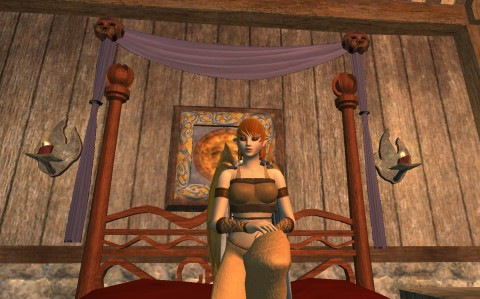

Back to: [West Karana](/posts/westkarana.md) > [2013](/posts/2013/westkarana.md) > [January](./westkarana.md)
# EQ2: SOE fixes "DM Powerleveling"

*Posted by Tipa on 2013-01-11 08:20:03*

[caption id="attachment\_10573" align="aligncenter" width="480"] Don't cry for me, powerleveler[/caption]

Powerleveling has always existed in EverQuest 2, but never so much as when the "perfect storm" of player-made dungeons tuned for powerleveling and armor that could simultaneously heal the player while killing anything that hit it came on the scene with the release of the Chains of Eternity expansion.

Leveling a character, for many, became nothing more than zoning into a DM dungeon, running around to get everything hitting you, and running out a couple minutes later, a level higher -- AND with "Dungeon Maker Marks" to spend on armor, weapons and other goodies.

This has also been an issue in PvP; attacking someone wearing new "experimental" armor with melee attacks would quickly end in death to the attacker. Similarly in PvE, where dungeons that previously wanted friends, could now be done entirely solo.

While this did spark a new renaissance amongst armorers, who finally had found a market for their wares, everyone was waiting for SOE's response.

It's come, and is on the test server now.

 * Augmented Blessing and Augmented Smite no longer stack proc chance. They now increase in effectiveness for each similar effect you wear.

 * Augmented Blessing and Augmented Smite no longer proc in PVP combat.

 * Augmented Blessing and Augmented Smite's “On Damage Received” effect can now only trigger once every 15 seconds.

Instead of a dozen separate healing and damage procs, there will be one proc for healing and one proc for damage, and they will fire once every fifteen seconds. The amount of healing or damage in that proc will be proportional to the number of items with Augmented Blessing or Augmented Smite on them. And neither proc will work in PvP.

This will end DM PLing, because the hordes of attackers will likely kill you in the first couple seconds, well before the heal can proc. And the smite will likely proc against only one attacker.

Experimental armor in PvP and PvE will become simply another tool in the toolbox. PvPers will return to their fabled dungeon gear. PvE characters leveling will almost certainly continue to want experimental gear to make leveling easier.

It's a good solution.

There was panic on the channels as everyone tried desperately to get their powerleveling down before this change goes live.

Soooo.... last night, after the daily chronotask (Stormfeather's Roost), I raised Brightknife to about level 74 and 140-ish AA. I'll get her to 80, and that will be good enough. I'll have two characters to level. She'll go through Moors of Ykesha, a zone I mostly skipped with Scatter, and Dera will head straight to Paineel.

