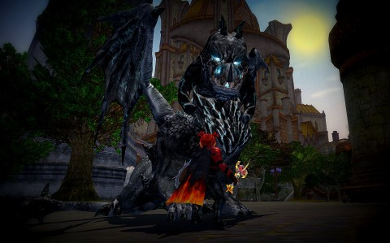

Back to: [West Karana](/posts/westkarana.md) > [2013](/posts/2013/westkarana.md) > [January](./westkarana.md)
# EQ2: Shifting Focus

*Posted by Tipa on 2013-01-13 10:54:53*

[caption id="attachment\_10577" align="aligncenter" width="480"] Epic![/caption]

First thing Arda/Dera did when she wrested her epic back from the villainous blacksmith who wanted the weapon for himself was go to Qeynos and start killing them dragons. Even though she betrayed the Shining City and pledged her loyalty to the Dread Lord of Freeport long ago.

Anyway, dragons. Must die. Wherever they are found.

I've been leveling my assassin, Brightknife, when not playing Scatterfall. Assassins are fun classes, but they are group classes. Assassins stealth, and then unleash absolutely astonishing damage, flickering in and out of stealth several times a second.

You can't do that when you're soloing. Even using a tank mercenary, like a SK or a paladin, isn't really the same thing. Assassins were made for groups. I was powerleveling her to where she would be able to get groups, and probably still will.

But inquisitors are just more FUN. By wading into dungeons with a tank merc, she spends all her time working on her group role; keeping the tank alive, doing damage, keeping off the top of the aggro list.

Anyway, was doing broker stuff with Scatter when I got a tell from a friend asking if I was busy, or might like to tank the Overking in Chardok and Phara Dar in Veeshan's Peak for his SK mythical.

It's not a huge thing to tank these things at 95, but I hadn't done the Overking since Clan of Shadows, and I just remembered we had to tank two ghosts way far from each other and kill them simultaneously, which isn't something the two of us were really prepared to do.

So, we killed some golems and then aggro'd the Overking.

Every. Single. Mob. In that dungeon. Ran right for us.

Did I tank all that? I tanked all that. The OK died, and then we all died, but we got the cheevs for Flawless Victory :) And Short Handed, and Sense of Urgency. My friend had a friend who could summon us straight to Phara Dar, the last normal boss in Veeshan's Peak, so that's where we went. He was a brigand, and I managed to keep aggro on Phara almost all the time, so I was feeling pretty good about myself.

I talked with one of the main tanks in the guild, and he's telling me that if I want to get to tanking current content, I'm going to need to start farming raid zones for money and start buying loot from raids -- the SLR -- Selling Loot Rights -- that is the means by which non-raiders gear up for group content.

Healers and DPS classes can be effective without raid gear. But, not tanks.

Anyway. So I logged in my Inquisitor and started on her epic. There was some groundwork to do, some languages I had to learn, but it only took a few hours to get her Fabled epic. Now for the three raids to turn that into the Mythical. After which I have to start the long process of getting rid of it.

Mythical epic weapons can be broken apart, once. The useful buffs and effects get written into the spell book, and the weapon itself turns into a pretty appearance weapon and you get a version that can go on the wall of your house as well.

The quest to get the weapon was such good experience -- requiring fighting to the heart of Chardok and a solid hour of mob grinding in the bottom of Sebilis -- that Dera hit level 85, and is now ready to follow Scatterfall into the Great Divide. This is the first stop on the way to 95, and gear being less important for healers than for tanks, it's possible I'll be able to find groups more readily.

I also am slowly leveling Etha the Defiler, mostly by having her tag along with Scatterfall as she solos old Kingdom of Sky raids. She's on another account for now.

It was fun to take half an hour each day and do some self-powerleveling for Brightknife in the Dungeon Maker dungeons, but that's going away, and tanking instances is never going to be her role in a group. For now, though, I'm moving her third back in the alt camp, behind Dera and Etha.

I like tanking, it's a real rush when it goes well. Leveling through CoE, though, didn't leave me with the gear to do group instances. I won't be able to stop mobs from killing the group if they have the good gear and I don't.

Healing has always been fun for me.

## Comments!

**[bhagpuss](http://bhagpuss.blogspot.co.uk/)** writes: Following the fix to Dungeonmaker PLing I would dearly love to see SLR fixed too. It doesn't affect me directly but I've been in the "it's an exploit" camp since I first heard about it. If the stuff was meant to be sold to people who weren't there when it dropped it would, surely, be tradeable. 

How many years did it take SoE to get around to fixing the KEI exploit? That no-one ever thought was an exploit? They got to it in the end and things were better because of it. Maybe one day we'll see patch notes saying that SLR is going away too. I doubt it, somehow, but it's pretty to think so.

---

