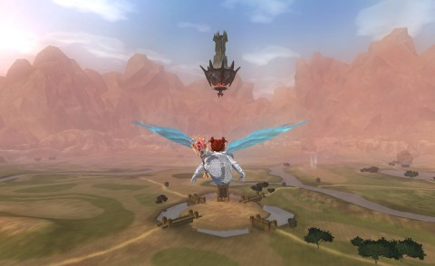

Back to: [West Karana](/posts/westkarana.md) > [2013](/posts/2013/westkarana.md) > [January](./westkarana.md)
# EQ2: An Angelic Presence

*Posted by Tipa on 2013-01-16 08:43:23*

[caption id="attachment\_10591" align="aligncenter" width="480"] Divine judgement has come upon you[/caption]

Mel Pence may look [all dark and purpley](https://plus.google.com/104824679101375705172/posts/G1xatuDJ2dJ) in her evil looking armor, but when Dera reached level 86 while doing random dungeons with an illusionist, well, there were these ice wings I got from a Legends of Norrath loot card. And those icy wings didn't really match her dark, functional armor, so I picked up some shining armor from the Freeport city merchants and flew her up into the skies of the Commonlands.

She is the Inquisitor Incarnate. And she is bringing the wrath of Karana to your home. (Well, of course she worships the God of Storms. What other deity so embodies uncontrolled fury?)

Anyway. What is holding up her body and her legs in this shot? I just don't get how wings work. It's fun swooping around among the Ulteran Spires and, of course, the Great Divide quests pretty much require the ability to fly. Level 87, never powerleveled.

Last night's chrono task was the Estate of Unrest, a mission I'd been kinda dreading as this is an adventure that requires at least three people -- two people in the mansion itself, and three people for the fight against the Festering Hag in the dungeon.

The mansion requires two levers to be pulled simultaneously and they are nowhere near each other. The hag imprisons someone at each 20% of health taken off, and at least one person has to be devoted to freeing the ones who get trapped, while the others keep the hag busy.

I would need some help. You'd think there'd be a lot of people working on the chrono tasks, but there weren't. People were still recovering from the Dungeon Maker Powerlevel nerf. There was no DM PLing going on last night -- none. Sometimes someone would log in and ask how bad it was. Bad, they'd say.

Anyway, I do have a second account. I'd re-activated it solely to move Dera, Etha and Dora off onto my main account, but it's proven such a benefit to have the occasional second character around that I haven't gotten to it, yet. (Well, I did move Dera).

That was the deal last night. I brought Etha along as my "plus one". Etha was the one who cooked the meal and played the piano as I fought off the zombie hordes. Etha pulled her lever as I pulled mine, then ran, pulling her zombies to me to defeat.

We both got imprisoned by the Hag, though. I thought if I killed her really fast.... but no. Luckily I retained aggro and she came right for me in my cell and I killed her, but both of us were locked in. I gated to the guild hall and flew back, freed Etha, and we continued on to meet Garanel without any further issue.

Even mentored down to level 75, a level 95 character is pretty formidable. It didn't take more than fifteen seconds to dispatch Bugaboo, the x2 creature that shambles around the estate.

Anyway, total success, though it took three hours to go through the entire Estate. Etha leveled from 73 to 75.

Tonight, back to Dera again. She's so close to 90, where she'll get my second and last dose of Touch of the Steward, and instantly raise to 280 AAs. Also at 90, I'll be able to start random dungeons with her again. That will have her at the high end of the level 80-90 dungeons, and everything will be easier to kill. Spend 90 in dungeons, then off to the Withered Lands to start the climb to 95.
