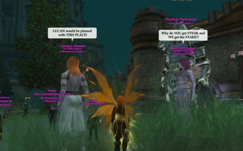

Back to: [West Karana](/posts/westkarana.md) > [2013](/posts/2013/westkarana.md) > [January](./westkarana.md)
# EQ2: A Simple Plan

*Posted by Tipa on 2013-01-23 08:03:58*

[caption id="attachment\_10601" align="aligncenter" width="480"] Inspiration![/caption]

When I level up a character, I get bored if I do the same things, go the same places as another character. There's too much stuff in EverQuest 2 to ever do the same thing twice. Sure, there's people who want their character to get to the top level as soon as possible, but I'm not a raider, there's nothing waiting for me at the end game. For me, the journey truly is the reward.

I had Dera doing the Shadow Odyssey signature quest line. I eventually got to a point where I'm required to do a number of TSO dungeons that I couldn't solo (wondering if the mentoring trick still works), but before that point, I got sent into a standard Freeport inn room. Dera has the exact same room, and I thought it would be cool to make her inn room into a copy of this one. I took pictures of everything.

Camped to Scatter to have her start making the furniture. Problem was, I couldn't find a recipe that would make either of the two kinds of bookcases they had there. Thinking this was faction furniture, I logged Dera back in and headed to the furniture shop in Freeport. The only bookcase they had there was "A Small Freeport Bookcase" which, oddly, didn't have a preview. A warning advised me to re-patch.

So I did. And it wanted to re-patch all 14 gigs of the game. I left that running and went to bed.

Next morning, logged in to check and there was STILL no appearance for that bookcase. Buying furniture requires having completed the new city quest that provides that as a reward. That night was spent running around Freeport, killing stuff in all the hamlets that new characters no longer call home and gaining favor with the Lucanic Knights and other less savory organizations. Having finally completed the quest that rewards the bookcase, I ran to Dera's home and placed it to see what I had.

I had nothing. This bookcase doesn't even have a model. The forums concur; some update in the last few months removed the pointers to the model for the bookcase. [EQ2 Furniture](http://eq2furniture.com/) showed that even when it did have a model, it wasn't the one I was looking for. Decorating my room to match an NPC's room just wasn't going to happen. Great excuse, though, for doing some of those city quests. They're all level adjusted, so they give a small amount of experience even to level 90 characters.

[caption id="attachment\_10602" align="aligncenter" width="480"] Occupy Qeynos?[/caption]

Blackscale Sepulcher was last night's [chronotask](http://eq2.wikia.com/wiki/Path_of_the_Past_Timeline). This was always a fun one to do back in the day, having to tank multiple mobs for an extended period of time while killing placeholders. It's a lot easier now. I don't even bother with mercenaries on these things; I last summoned mine to kill the two group mob in Unrest, Bugaboo, while mentored below its level. I didn't really need it.

Anyway, while on the way to add the new boss plushie reward to my collection in my house in South Qeynos, there was this crowd of people right outside my house. And they were talking. To each other. In words that I could hear. I was floored, because I almost NEVER see people in South Qeynos at all, much less conversing out in the open. I dashed in and placed the plushie, came right back out and they were STILL THERE.

Turned out they were a group of Freebloods (PC vampires) who were protesting being denied food and drink at "The Spider", an inn thereabouts (likely a player inn, as this section of South Qeynos is purely residential). The Freebloods were likening the hatred, fear and intolerance as more befitting Freeport than Qeynos, and that Queen Antonia had offered the bloodsuckers asylum as long as they remained good citizens.

In game lore, Qeynos residents are being hammered by excessive taxes used to fund the city's reconstruction and various conflicts throughout Norrath. Seeing a good metaphor in the Freeblood for high taxes bleeding the people dry, I strongly objected to the further burden of sharing our fine city with vampires. I suggested they move back to their caves in Nektulos Forest, which really pissed them off. They insisted they'd been good Qeynos citizens before being transformed into Freeblood.

TT and QQ, off to Nektulos with you all. Not wanting to share my home with a vampire bar.

## Comments!

**[Stargrace](http://mmoquests.com)** writes: LOVE that EQ2 has this still. There's a lot of RP taverns in Norrath (and yes, The Spider is one). There used to be a channel for RP, the /join RM - the Raven Mythic was a virtual tavern where people could roleplay in channel, but a lot of the old timers left and I'm not sure if it's still running these days. So glad to hear about this!

---

**Lysari** writes: Ha! The Spider is one of the longest running bars on AB. It's every Tuesday night in SQ under thespider and it's run by the guild Vagabond Knights. It's really funny about the protest, I'm glad there is still public RP going on sometimes.

The Spider has a long standing no vampires policy dating to before Freebloods were in the game. I had wondered if they were keeping the policy going. /grins

---

