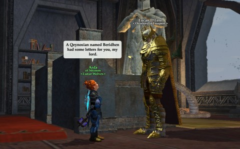
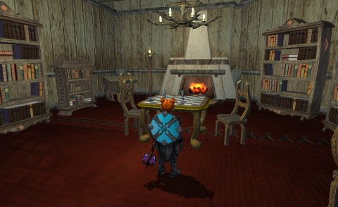
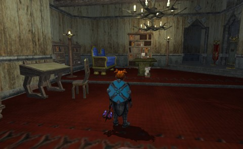

Back to: [West Karana](/posts/westkarana.md) > [2013](/posts/2013/westkarana.md) > [January](./westkarana.md)
# EQ2: A Simple Plan, Revisited

*Posted by Tipa on 2013-01-27 11:26:43*

[caption id="attachment\_10606" align="aligncenter" width="480"] Reporting to Lucan[/caption]

Last post, I talked about trying to re-create the inn room from some missing NPC in Arda's Freeport inn room. I couldn't find all -- or almost any -- of the furnishings available by crafting or on the broker. And then, there was a bookcase that might have been needed that had no appearance. Thursday's patch restored the appearance for that bookcase, but it was nothing like what I needed. Undeterred, I decided to do the best I could with what I had, and finish the Freeport city quest lines for completeness' sake.

The quests are pretty fun, a lot of them. There's the stealth one where you have to remain unseen by any of the patrolling guards, which requires memorizing the exact paths and timing of about ten iksar. Any mistake, and you start over. Even get to have a few meetings with Lucan, help (or kill) a new lich warrior you help create, wear lots of disguises, and essentially become a respected minion in Sir Lucan's court.

[caption id="attachment\_10607" align="aligncenter" width="480"] Picking on the rat[/caption]

While working on these quests, some Qeynosians were shouting about trying to deliver some letters to Lucan. I was dubious; and a little angry, since I'd just passed a group of Qeynosians going through the city and killing the epic guards. I couldn't figure out how Lucan would look kindly on people who would kill his guards in order to deliver some letters, and said so.

Eventually I came across the bewildered Qeynosians, huddled in the city registrar's office, hoping the Gorowyn ambassador could convey the messages. The ambassador, being an NPC, wasn't being as cooperative as anyone had hoped.

[caption id="attachment\_10608" align="aligncenter" width="480"] And then someone started a guild and all hell broke loose.[/caption]

I knew I'd be seeing Lucan again soon, and I could only point out that he was in a rather desperate mood, what with just being returned from his unwilling sojourn at the hands of some doomed kidnappers, then having Soulfire-thief Opal Darkbriar stirring things up in Freeport while he was detained, and then having a troll demigod causing trouble in the outer precincts... 

The messages, from what I could understand, were about a child with a claim to the thrones of both Freeport and Antonica hoping to unify the two human cities against a Thexian war that involved, somehow, Najena and her ex-lover, Mayong Mistmoore, that would take back Neriak from the Arisai and... well, Kyle Bale was in there somewhere, and then it got even more muddied. Wasn't Mistmoore involved with Tserrina Syl'Tor at one point? Guy's a regular vampire gigolo.

I couldn't see Lucan again until I finished a couple quests, so I didn't offer to take the messages myself (though I did mention them when I did see him). Luckily, a Lucanic Knight came by and offered to take the messages, and that was that. Norika distributed celebratory cookies and fireworks and then went off to celebrate at the Jade Tiger, where apparently many cups were raised to the memory of the gone but not forgotten Bloodhaze Inn.

Anyway, with the quests completed, I had access to all the city-specific furniture, including a chair that had been used throughout the NPC inn room which could be crafted, but could also be bought. The desks were craftable. Bookcases were a total loss, but I could make do with others. The divan I could make was a slightly different color. The table in the center of the room was once available to players but no longer was, so I used a similar table. The chess set they had was not available, so I did the Chess Pieces collection quest from Butcherblock to get a substitute. I farmed rough pearls in the Pillars of Flames for two-three hours to get enough to make the light posts. And they STILL didn't make enough light, so I had to make some chandeliers. The carpeting I DID find, and WAS able to craft, so that was a win. The fireplace is another substitute. In the end, the new place looks LIKE the NPC place... good enough for (Freeport) government work....

Here's the NPC room:

And here's my "inspired by" room:

You can visit the room, if you like, at the Jade Tiger's Den Inn, Basic Room 01, name of Arda. Or you can look it up in House Ratings as "Inspired by TSO Signature Quest", owner Arda. Thanks in advance if you decide to rate it highly :)
