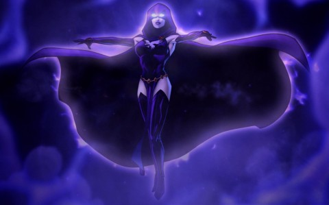

Back to: [West Karana](/posts/westkarana.md) > [2013](/posts/2013/westkarana.md) > [January](./westkarana.md)
# DCUO: A Slippery Slope

*Posted by Tipa on 2013-01-28 08:22:50*

[caption id="attachment\_10618" align="aligncenter" width="480"] Aboard Brainiac's ship in Area 51[/caption]

Move over, Justice League. It's time for Team Spode to take the stage. It was time for those old guys to take early retirement anyway, since they apparently just hide away in police stations when they're not being captured and controlled by supervillains. They are USELESS. No WONDER they let the Earth get destroyed in the future. The world was shouting, "Where is the Justice League?". But the Justice League was shouting, "Where is TEAM SPODE?"

Shhhhh, it's okay. We're here now.

We left off last week having defeated The Scarecrow for Lord Spode and Kaptain KY, our two Tech heroes. This week, Stingite and I had done our first storyline so that we were ready for my Meta boss, Gorilla Grodd (aided by The Flash), and Stingite's Magic boss, Faust (aided by Zatanna).

We were trying to be so, so very careful about making sure everyone was inside the final room before the boss slammed the doors shut. Shouldn't the boss have done that before ANY of us got in the room? If they all have unbreakable barriers at their command, why would they ever let us get near them?

Why, because who would they promise to destroy while letting loose an evil cackle of evil if they didn't have any witnesses?

[caption id="attachment\_10620" align="aligncenter" width="480"] Farming Kryptonite in Area 51[/caption]

Once that was complete, we all were eligible for the next mission. Since we ended up in Chinatown, that meant our next mission would be a Magic one -- involving the Teen Titans.

Naturally, the Teen Titans were being useless. Worse, they were being \_evil\_. They were being controlled by the demon Trigon through his daughter, Raven, whose costume looks like the guy's costume from Assassin's Creed. We had to take on Cyborg, Starfire and Nightwing, defeat a lot of demons, then re-assemble Raven's psychic self so that she could overthrow her dad's influence and re-emerge as White Raven, whose costume even more closely resembled the guy's from Assassin's Creed.

[caption id="attachment\_10621" align="aligncenter" width="480"] Raven[/caption]

We'd all leveled to ten or so by now (Lord Spode to 12, because he couldn't stop playing. Game is a success!). We all had gained our secondary roles. All DCUO characters have the damage role from the start, but you soon get your secondary role. Mine was "controller", which was odd, because I thought I was going to be the healer. Nope, my job is to return power to my teammates and debuff or entrap enemies.

I didn't know any of this going into our first group mission, Area 51. The interface to do this was like a dungeon finder group in Rift; you choose your role and queue up, and then you're placed into a mission. In today's, Brainiac had invaded Area 51 in order to extract new technology from the aliens held in that secret base.

The place was being powered by four immense Kryptonite crystals, but before we ever saw those, we had to clear out several outlying facilities, reprogram Brainiac's androids, free soldiers and turn off the defense grids. Each facility was guarded by a final boss. Stingite had the great idea to gather far above him, then drop down as a group and bring the hurt. And this we did.

Each boss was tough to start, but we'd figure out the strats quickly enough. Kryptonite in such large quantities is harmful even to those who are not Superman, but we managed to crush it and flush the shards into the local water table so no worries there.

Last fight was the toughest, the android commander of the Brainiac ship sent to perform the alien extraction. A lot of Spoda Cola was drunk. I had to rely on my Light Gun to do damage while avoiding the various attacks, but he'd pull me in anyway. If I'd known that my Light Claws would restore power to the group as a controller, I'd have melee'd more. There was some sort of power drain going on there. Maybe that was the Kryptonite.

[caption id="attachment\_10622" align="aligncenter" width="480"] New hats![/caption]

He was no match for Team Spode in the end. Back at HQ, we all got new hats and a lot of other upgrades. My costume turned a little... unfortunate... and you guys will never get to see it. Let's just say that ... well, Kaptain KY's powers would not be needed. He was busy silenty grooving to Zatanna's butt, anyway.

So, catch phrases. They're a thing, I guess. We found out that Kaptain KY's catchphrase is, "Right behind you!". Still working on mine, but I think it might be, "MY EYES ARE UP HERE!" Yeah, gotta work on the costume.

Next week, we should have the Meta and Tech quests to do, and then another Vault mission. Van't wait!

## Comments!

**[bhagpuss](http://bhagpuss.blogspot.co.uk/)** writes: I patched DCUO up a couple of days back in anticipation of the Home Turf DLC later this week. Haven't played for about a year. Still haven't, because after the patching finished and I went to log in the servers were down for maintenance.

I really enjoyed beta and the first few weeks after launch. Team Spode's adventures are whetting my appetite. Looking forward to playing again.

---

**[Tipa](https://chasingdings.com)** writes: Well lemme know what your character name is so I can friend ya.

---

