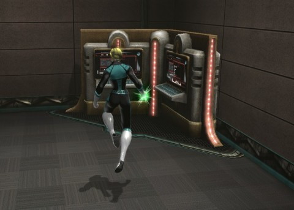

Back to: [West Karana](/posts/westkarana.md) > [2013](/posts/2013/westkarana.md) > [January](./westkarana.md)
# DCUO: Home Turf

*Posted by Tipa on 2013-01-30 07:49:13*

[caption id="attachment\_10627" align="aligncenter" width="480"] The Mainframe in the Membrane[/caption]

The "Home Turf" downloadable content dropped in DC Universe Online yesterday, bringing housing to the hordes of heroes and villains of Metropolis and Gotham City. It opens up at level 12, so the first order of the day was getting to level 12 (luckily, this week's level cap in Team Spode).

There's not much you can initially do in the base. "Oracle" gave me three pieces of furniture to place, a wall clock, a table for the floor, and a ceiling lamp, which fit into LotRO-style "hooks". Oracle said that after all the hooks are filled, I'd be able to place additional bits of furniture anywhere I liked, similar to EQ2's housing.

Everyone gets the "Dive" style of base. Subscribers or those who pay get two additional styles, "Gothic", and the Art Deco one I chose. Inside is a "Mainframe" that you can pay to enable missions and stuff, a dispenser that sells consumables, and a generator that can accept upgraded batteries.

Eric Redman wrote a bit about [his first base PvP battle](https://plus.google.com/113866940190428695218/posts/9tSEt5zGpxK), but I haven't bought any of the Mainframe options yet. [Doctor Apocrypha](https://plus.google.com/105458202710353981776/posts/GnzeWGqJKWY) and I tried to visit each other's bases, couldn't find the entrance. The good Doctor eventually discovered that you have to turn on the base entrances individually. I'd gone to Gotham City to visit his base, but, unable to find it, had warped back to mine in Metropolis before he made his discovery.

I'd have gone back, but that would have meant a trip through the Watchtower, and that place is so incredibly confusing; I avoid it as much as possible.

[caption id="attachment\_10628" align="aligncenter" width="480"] Queen Bee[/caption]

I'd been flying around Metropolis doing the Booster Gold exploration stuff, and happened upon an invasion by Queen Bee's drones. Needing the experience, I flew down and lent a hand. Plenty of heroes were helping out, and I went through the quest series pretty quickly.

I think this ends at another instance event. The fight with the Teen Titans against Raven and Trigon was pretty fun; hoping this turns out the same. Saving it all for Sunday night.

When I dinged 12, I unlocked some new content (aside from the Home Turf stuff), but I didn't check back to see if that was a new four person instance. Otherwise, we may end up doing Area 51 again -- and we probably should, anyway, since that instance dropped a metric crapload of loot, and more loot is always good. We're just rolling "greed" on everything for now.

I bought all the new skills and traits for the leveling we did Sunday, and set up my damage and controller layouts. Next time we go to Area 51, I'll be ready with the power regen and the debuffing; those are locked and loaded. It took me too long to figure out that the "trolls" people were looking for for instance groups were con-*troll*-ers like myself. I've apparently happened on a useful group role. Stingite has the healing role, as he did in Diablo 3, but I hope healing in DCUO is a little more effective.

Most of the people LFG would include what looked like their level, but when someone calls themselves an "88" whatever, that's quite a bit past the level cap of 30. Turns out that after you hit the level cap, you start accruing combat rating levels. Like in the original Guild Wars, apparently, the leveling game in DCUO is only an extended tutorial for the real game that starts at the level cap.

Spode says he's not level 13 yet, which is Spode-code for "the next kill will make me level 13". I'm right at the beginning of the level, so I can still finish up some of the missions that are threatening to go gray and stop giving experience sometime this week.

## Comments!

**Blamefulgecko** writes: Yep! One big huge tutorial! Then you'll be shotgun'd in the face with a ton of instanced content!

---

